# Flink


# 概述

* 是一个分布式大数据处理引擎,可以对有限的数据流和无限的数据流进行有状态计算
* 有限数据流:有限不会改变的数据集合,批处理,离线计算,如Hadoop
* 无限数据流:源源不断,可以进行实时计算,流式计算,如Spark
* 其他流式框架:strom,jstrom,spark streaming
* Flink生态

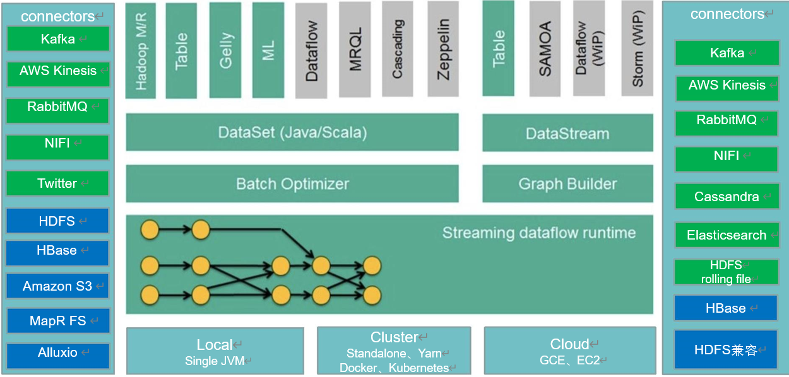


# 特性

* 提供有状态计算,支持状态管理,支持强一致性的数据语义,支持Event time,WaterMark对消息乱序处理
* 支持批处理和数据流程序处理
* 优雅流畅的支持java和scala
* 同时支持高吞吐量和低延迟
* 支持事件处理和无序处理通过SataStream API,基于DataFlow数据流模型
* 在不同的时间语义(事件时间,摄取时间,处理时间)下支持灵活的窗口(时间,滑动,翻滚,会话,自定义触发器)
* 仅处理一次的容错担保
* 自动反压机制
* 图处理(批)机器学习(批)复杂事件处理(流)
* 在dataSet(批处理)API中内置支持迭代程序(BSP)
* 高效的自定义内存管理,和健壮的切换能力在in-memory和out-of-core中
* 兼容Hadoop的MR和Storm
* 集成YARN,HDFS,HBase和其它Hadoop生态系统的组件
* 未来:批计算的突破,流处理和批处理无缝切换,界限越来越模糊,甚至混合.多语言支持;完善MachineLearing算法库,同时Flink也会向更成熟的机器学习,深度学习去集成
* Flink VS Spark

| 底层API  | RDD                                   | Process Function   |
| :------- | :------------------------------------ | :----------------- |
| API      | Spark                                 | Flink              |
| 核心API  | DataFrame/DataSet/StructuredStreaming | DataStream/DataSet |
| SQL      | Spark SQL                             | Table API & SQL    |
| 机器学习 | MLlib                                 | FlinkML            |
| 图计算   | GraphX                                | CEP                |
|          |                                       |                    |

# 应用场景

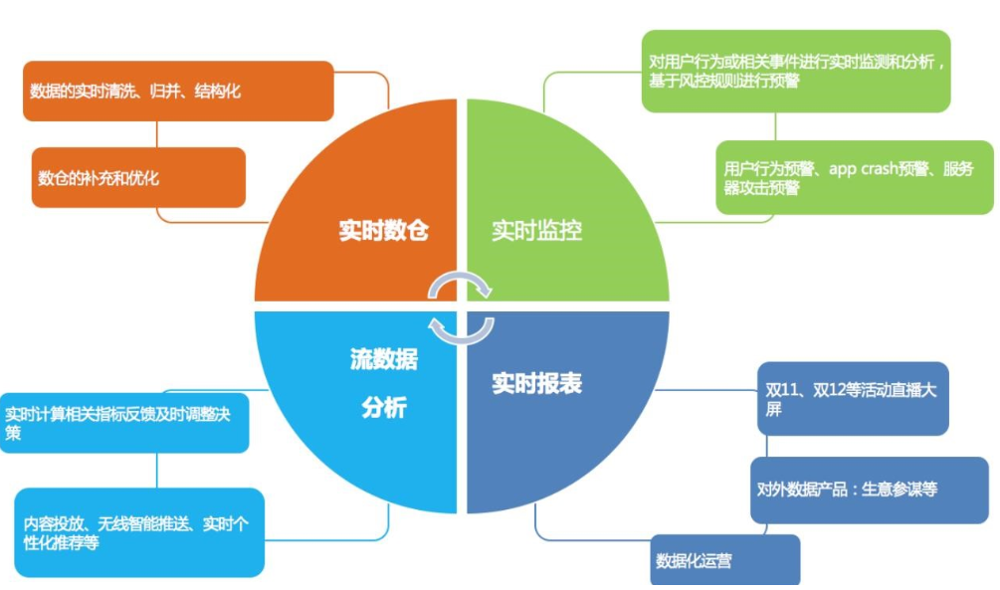


## Event-driven Applications

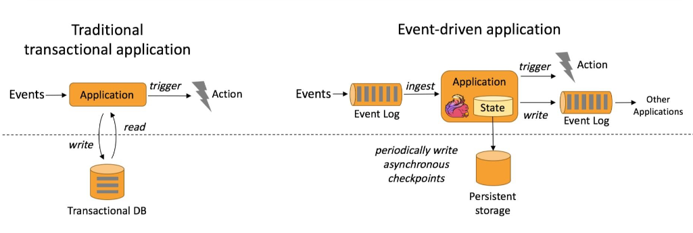

* 事件驱动
  * 欺诈检测(Fraud  detection)
  * 异常检测(Anomaly  detection)
  * CEP:复杂事件处理
  * 基于规则的告警(Rule-based  alerting)
  * 业务流程监控(Business  process  monitoring) 
  * Web应用程序(社交网络)


## Data Analytics  Applications

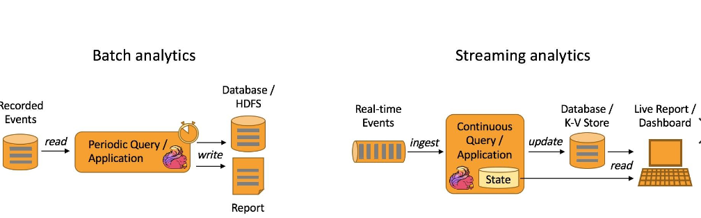

* 分析
  * 周期性查询
  * 连续性查询


## Data Pipeline  Applications

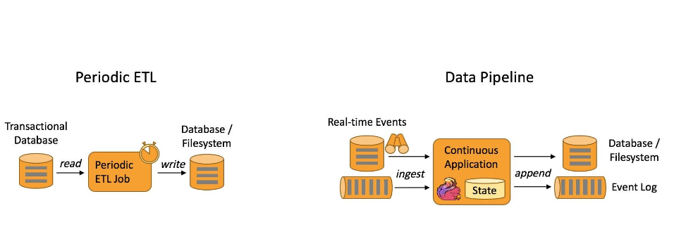

* 管道式ETL:PeriodicETL,DataPipeline


# 核心

* Flink架构: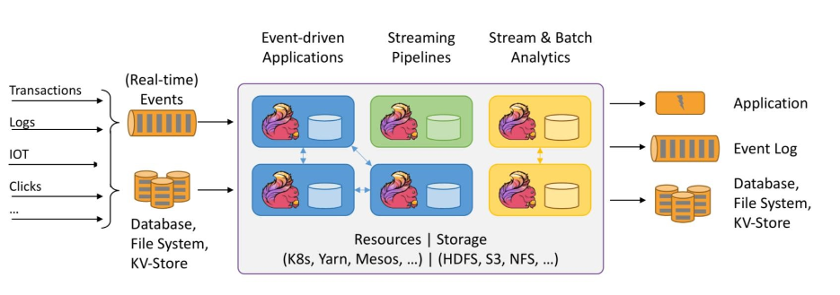
* Flink核心组件

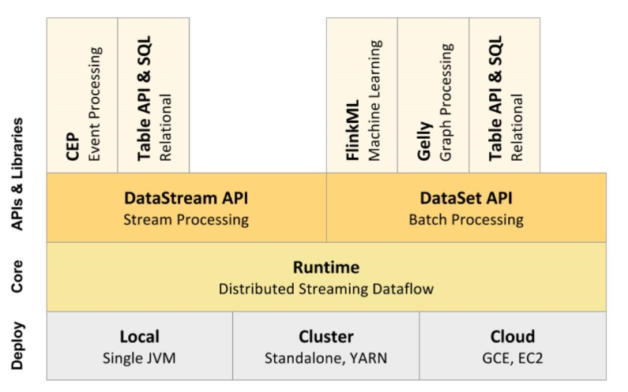

* Client:发送请求

* JobManager:master节点

* TaskManager:slave节点,是一个进程,他下面运行的task是线程,每个task/subtask(线程)下可运行一个或者多个operator,即OperatorChain

  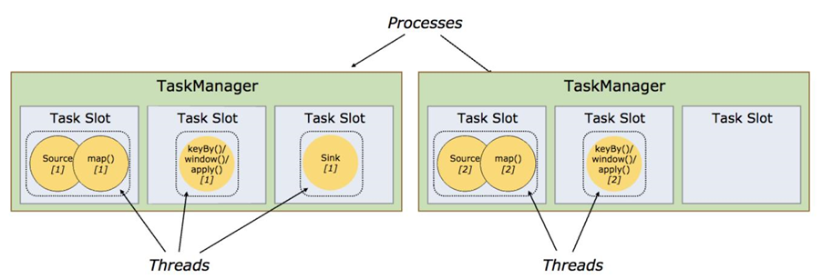

  * Task是class,subtask是Object(类比学习)
  *  一个TaskManager通过Slot(任务槽)来控制它上面可以接受多少个task(仅限内存托管,目前CPU未做隔离),Slot均分TaskManager所托管的内存
  * 同一个TaskManager中的task共享TCP连接(通过多路复用)和心跳消息,它们还可以共享数据集和数据结构,从而减少每个任务的开销
  * 一个TaskManager有N个槽位不只能接受N个Task,还有共享槽位  

* Akka:角色间的通信

* Netty:数据的传输

* 为了更高效地执行,Flink会尽可能地将operator的subtask链接(chain)在一起形成task

* Slots:任务槽

* Job:

* Task&subtask:

* Operator:

* Parallelism

* OperatorChain:操作链

  * 减少线程切换
  * 减少序列化与反序列化
  * 减少数据在缓冲区的交换
  * 减少延迟并且提高吞吐能力
  * 没有禁用Chain
  * 上下游算子并行度一致
  * 下游算子的入度为1(下游节点没有来自其他节点的输入)
  * 上下游算子在同一个slot  group(后面紧跟着就会讲如何通过slot  group先分配到同一个solt,然后才能  chain)
  * 下游节点的chain策略为ALWAYS(可以与上下游链接,map,flatmap,filter等默认是ALWAYS)
  * 上游节点的chain策略为ALWAYS或HEAD(只能与下游链接,不能与上游链接,Source默认是HEAD)
  * 上下游算子之间没有数据shuffle(数据分区方式是forward)
  *   OperatorChain的行为可以通过编程API中进行指定
  * 可以通过在DataStream的operator后(如someStream.map(..))调用startNewChain来指示从该operator开始一个新的chain(与前面截断,不会被chain到前面)
  * 调用disableChaining()来指示该operator不参与chaining(不会与前后的operator chain一起)
  * 通过调用StreamExecutionEnvironment.disableOperatorChaining()来全局禁用chaining
  * 设置Slot group,例如someStream**.**filter().slotSharingGroup(“name”)
  * 调整并行度

* 共享Slot

  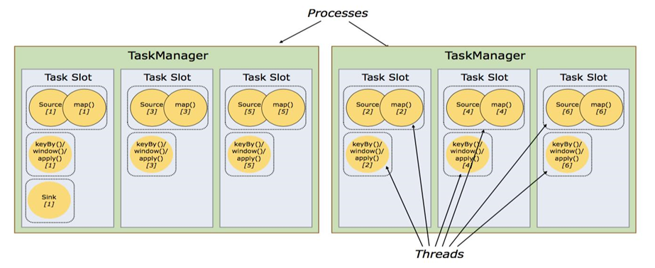

  * 默认情况下,Flink允许subtasks共享slot,条件是它们都来自同一个Job的不同task的subtask,结果可能一个slot持有该job的整个pipeline.允许slot共享有以下两点好处
  * Flink集群需要的任务槽与作业中使用的最高并行度正好相同(前提,保持默认SlotSharingGroup).也就是说不需要再去计算一个程序总共会起多少个task了
  * 更容易获得更充分的资源利用
  * 如果没有slot共享,那么非密集型操作source/flatmap就会占用同密集型操作  keyAggregation/sink一样多的资源
  * 如果有slot共享,将基线的2个并行度增加到6个,能充分利用slot资源,同时保证每个  TaskManager能平均分配到重的subtasks

* SlotSharingGroup:Flink实现slot共享的类,它尽可能地让subtasks共享一个slot

  * 保证同一个group的并行度相同的sub-tasks共享同一个slots
  * 算子的默认group为default(即默认一个job下的subtask都可以共享一个slot)
  * 为了防止不合理的共享,用户也能通过API来强制指定operator的共享组,比如:someStream.filter().slotSharingGroup("group1");就强制指定了filter的slot共享组为group1
  * 根据上游算子的group和自身是否设置group共同确定一个未做SlotSharingGroup设置算子的SlotSharingGroup是什么
  * 适当设置可以减少每个slot运行的线程数,从而整体上减少机器的负载

* CoLocationGroup:强制

  * 保证所有的并行度相同的sub-tasks运行在同一个slot
  * 主要用于迭代流(训练机器学习模型)


## DataSet/DataStream

* DataSet是批处理API
* DataStream是流处理API
* 表示Flink  app中的分布式数据集
* 包含重复的,不可变数据集
* DataSet有界,DataStream可以是无界
* 可以从数据源,也可以通过各种转换操作创建


## TableAPI和SQL

* SQL构建在Table之上,都需要构建Table环境
* 不同的类型的Table构建不同的Table环境
* Table可以与DataStream或者DataSet进行相互转换
* Streaming SQL不同于存储的SQL,最终会转化为流式执行计划


## 运行模型

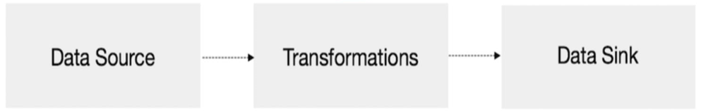

* 构建计算环境,决定采用哪种计算执行方式
* 创建Source,可以多个数据源
* 对数据进行不同方式的转换,提供了丰富的算子
* 对结果的数据进行Sink,可以输出到多个地方

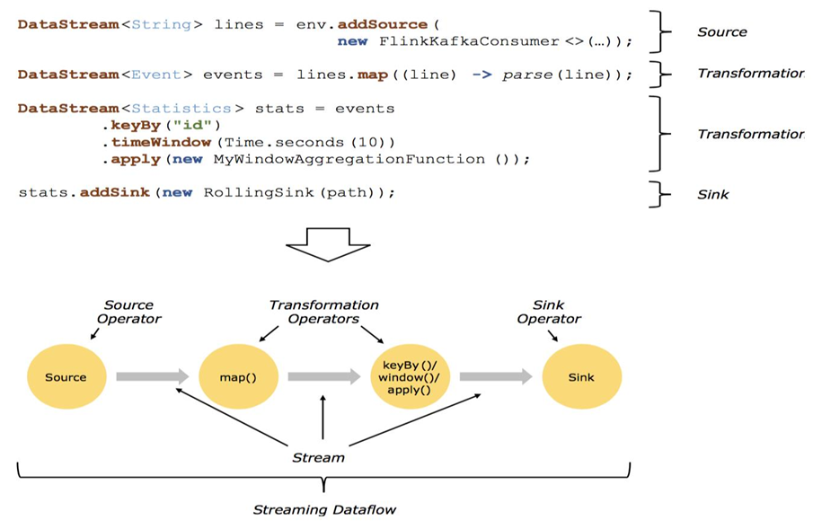


## 算子间数据传

* One-to-one streams:保持元素的分区和顺序
* Redistributing streams
  * 改变流的分区
  * 重新分区策略取决于使用的算子
  * u keyBy() (re-partitions by hashing the key)
  * u  broadcast()
  * u rebalance() (which re-partitions randomly)


## StateFul

* state一般指一个具体的task/operator的状态
* OperatorState:跟一个特定operator的一个并发实例绑定,整个operator只对应一个state
* KeyedState:基于KeyedStream上的状态,这个状态是跟特定的key绑定的,对KeyedStream流上的每一个key,可能都对应一个state
* 原始状态和托管状态:Keyed State和Operator State,可以以两种形式存在:原始状态和托管状态(Flink框架管理的状态)
* State Backend(rocksdb + hdfs)


## Flnk的执行计划


## Graph

* StreamGraph
  * 根据用户代码生成最初的图
  * 表示程序的拓扑结构
  * 在client端生成
* JobGraph
  * 优化streamgraph
  * 将多个符合条件的Node  chain在一起
  * 在client端生成
* ExecutionGraph
  * JobManger根据JobGraph生成,并行化
* 物理执行图
* 实际执行图,不可见


## StreamGraph

* 通过Stream API提交的文件,首先会被翻译成StreamGraph
* StreamGraph的生成的逻辑是在StreamGraphGenerate类的generate方法,而这个generate的方法又会在StreamExecutionEnvironment.execute方法被调用
* env中存储List<StreamTransformation<?>
* StreamTransformation
  * 描述DataStream之间的转化关系
  * p包含StreamOperator/UDF
  * OneInputTransformation/TwoInputTransform/ SourceTransformation/SinkTransformation/SplitTransformation等
* StreamNode/StreamEdge:通过StreamTransformation构造


## StreamGraph转JobGraph

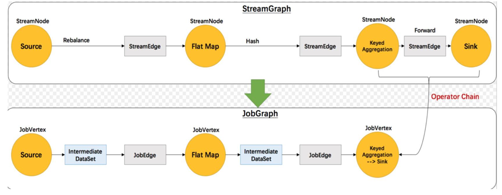


## JobGraph

* StreamNode->JobVertex
* StreamEdge->JobEdge
* 将符合条件的StreamNode chain成一个JobVertex
* 没有禁用Chain
* 上下游算子并行度一致
* 下游算子的入度为1(也就是说下游节点没有来自其他节点的输入)
* 上下游算子在同一个slot  group下游节点的 chain策略为ALWAYS(可以与上下游链接,map,  flatmap,filter等默认是ALWAYS)
* 上游节点的chain策略为ALWAYS或HEAD(只能与下游链接,不能与上游链接,Source默认是  HEAD)
* 上下游算子之间没有数据shuffle(数据分区方式是 forward)
* 根据group指定JobVertex所属SlotSharingGroup
* 配置checkpoint
* 配置重启策略


## JobGraph转ExecutionGraph

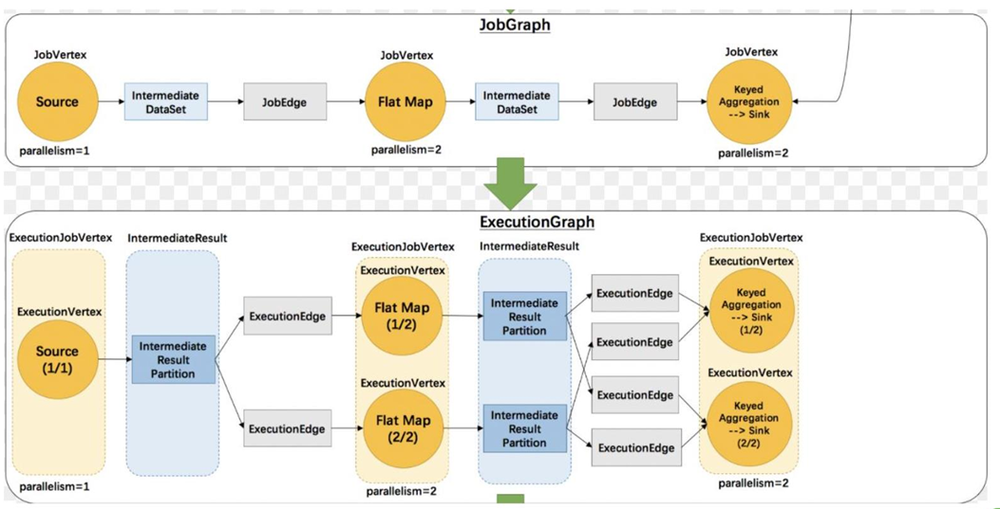


## ExecutionGraph


## DataStreamContext


## DataSource

* 内置数据源
  * 基于文件
  * 基于Socket
  * 基于Collection
* 自定义数据源
  * 实现SourceFunction(非并行的)
  * 实现ParallelSourceFunction
  * 继承RichParallelSourceFunction


## Transformation

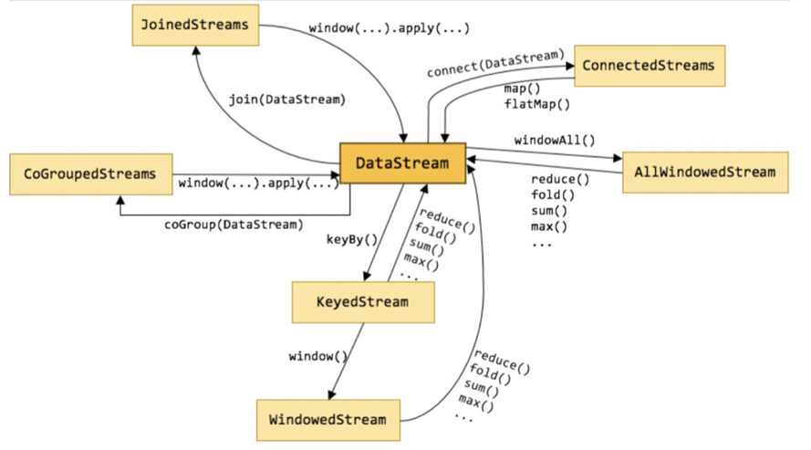

* Operators/操作符/算子
* 将一个或多个DataStream转换为新的DataStream


## DataSink

* 自定义Sink需要实现SinkFunction接口或者继承RichSinkFunction


# 安装


# 编程


## 概述

* 获取执行环境(execution  environment)
* 加载/创建初始数据集
* 对数据集进行各种转换操作(生成新的数据集)
* 指定将计算的结果放到何处去
* 触发APP执行


## 惰性计算

* Flink APP都是延迟执行的
* 只有当execute()被显示调用时才会真正执行
* 本地执行还是在集群上执行取决于执行环境的类型
* 好处:用户可以根据业务构建复杂的应用,Flink可以整体进优化并生成执行计划


## 指定Key

* 需要指定key:join,coGroup,keyBy,groupBy,Reduce,GroupReduce,Aggregate,Windows
* Flink编程模型的key是虚拟的,不需要创建键值对


## Tuple

* 是包含固定数量各种类型字段的复合类,Flink Java API提供了Tuple1-Tuple25
* Tuple的字段可以是Flink的任意类型,甚至嵌套Tuple

* 按照指定属性分组

  ```java
  DataStream<Tuple3<Integer,String,Long>>  input = // [...];
  KeyedStream<Tuple3<Integer,String,Long>,Tuple> keyed = input.keyBy(0);
  ```

* 按照组合键进行分组

  ```java
  DataStream<Tuple3<Integer,String,Long>>  input = // [...];
  KeyedStream<Tuple3<Integer,String,Long>,Tuple> keyed=input.keyBy(0,1);
  ```

* 特殊情况:嵌套Tuple  

  ```java
  DataStream<Tuple3<Tuple2<Integer,Float>,String,Long>> input=// [...]
  KeyedStream<Tuple3<Integer,String,Long>,Tuple> keyed = input.keyBy(0);
  ```

* 这里使用KeyBy(0)指定键,系统将会使用整个Tuple2作为键(整型和浮点型的)

* 如果想使用Tuple2内部字段作为键,可以使用字段来表示键


## RichFunction

* 非常有用的四个方法:open,close,getRuntimeContext和setRuntimecontext
* 这些功能在参数化函数,创建和确定本地状态,获取广播变量,获取运行时信息和迭代信息时非常有帮助

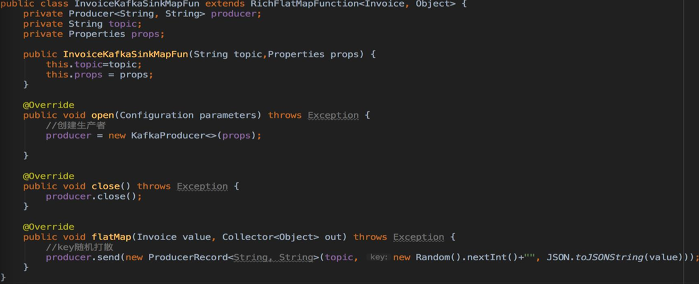


## 累加器

* 在自定义的转换操作里创建累加器对象: 

  ```java
  private IntCounter numLines = new IntCounter();
  ```

* 注册累加器对象,通常是在rich  function的open方法中.还需要定义累加器的名字  getRuntimeContext().addAccumulator(“num-lines”,  this.numLines);

* 在operator函数的任何地方使用累加器,包括在open()和close()方法中

  ```java
  this.numLines.add(1);
  ```

* 结果存储在JobExecutionResult里

  ```java
  JobExecutionResult JobExecutionResult =env.execute("Batch Java");
  myJobExecutionResult.getAccumulatorResult("num-lines");
  ```

* 自定义累加器需要实现Accumulator或SimpleAccumulator


# 迭代运算

* 当前一次运算的输出作为下一次运算的输入(当前运算叫做迭代运算)
* 不断反复进行某种运算,直到达到某个条件才跳出迭代


## 流式迭代

* 没有最大迭代次数
* 需要通过split/filter转换操作指定流的哪些部分数据反馈给迭代算子,哪些部分数据被转发到 下游DataStream
* 基于输入流构建IterativeStream(迭代头)
* 定义迭代逻辑(map  fun等)
* 定义反馈流逻辑(从迭代过的流中过滤出符合条件的元素组成的部分流反馈给迭代头进行重  复计算的逻辑)
* 调用IterativeStream的closeWith方法可以关闭一个迭代(也可表述为定义了迭代尾)
* 定义终止迭代的逻辑(符合条件的元素将被分发给下游而不用于进行下一次迭代)


##   Controlling Latency

* 控制延迟
* 默认情况下,流中的元素并不会一个一个的在网络中传输,这会导致不必要的网络流量消耗,而是缓存起来,缓存的大小可以在Flink的配置文件,ExecutionEnvironment,设置某个算子上进行配置(默认100ms)
* 好处是提高吞吐,坏处是增加了延迟
* 为了最大吞吐量,可以设置setBufferTimeout(-1),这会移除timeout机制,缓存中的数据一满就会被发送
* 为了最小的延迟,可以将超时设置为接近0的数(例如5或者10ms)
* 缓存的超时不要设置为0,因为设置为0会带来一些性能的损耗


# Flink集成Yarn

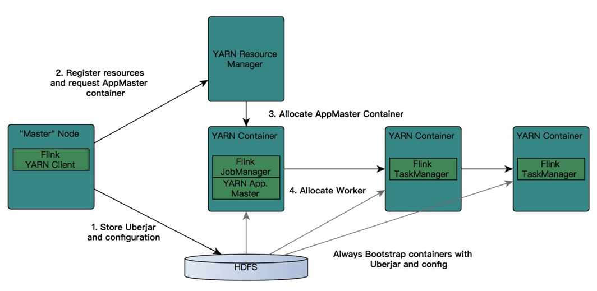


# Checkpoints

* 备份,在某一时刻,将所有task的状态做一个快照(snapshot),然后存储到State Backend
* 轻量级容错机制
* 保证exactly-once语义
* 用于内部失败的自动恢复
* 基本原理(面试经常问)
  * 通过往source 注入barrier
  * barrier作为checkpoint的标志
* 无需人工干预


# Savepoint

* 流处理过程中的状态历史版本
* 具有可以replay的功能
* 外部恢复(应用重启和升级)
* 两种方式触发
  * Cancel with savepoint
  * 手动主动触发
* savepoint可以理解为是一种特殊的checkpoint,savepoint就是指向checkpoint的一个指针,需要手动触发,而且不会过期,不会被覆盖,除非手动删除
* 正常情况下的线上环境是不需要设置savepoint的,除非对job或集群做出重大改动的时候,需要进行测试运行


# 案例


## 欺诈检测

* 假设你是一个电商公司,经常搞运营活动,但收效甚微,经过细致排查,发现原来是羊毛党在薅平台的羊毛,把补给用户的补贴都薅走了,钱花了不少,效果却没达到
* 可以做一个实时异常检测系统,监控用户的高危行为,及时发现高危行为并采取措施,降低损失
* 系统流程
  * 用户的行为经由app上报或web日志记录下来,发送到一个消息队列里去
  * 然后流计算订阅消息队列,过滤出感兴趣的行为,比如:买,领券,浏览等
  * 流计算把这个行为特征化
  * 流计算通过UDF调用外部一个风险模型,判断这次行为是否有问题(单次行为)
  * 流计算里通过CEP功能,跨多条记录分析用户行为,比如用户先做了a,又做了b,又做了3次c,整体识别是否有风险
  * 综合风险模型和CEP的结果,产出预警信息