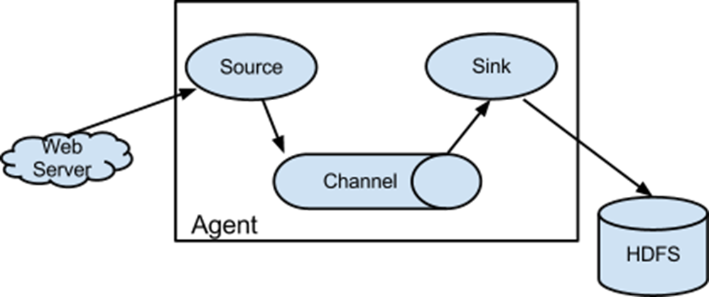
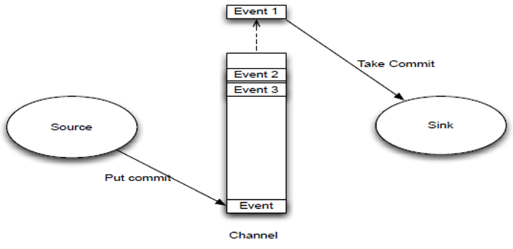

# Flume


# 概述

* 提供一个分布式的,可靠的,对大数据量的日志进行高效收集,聚集,移动的服务
* Flume基于流式框架,容错性强,主要用于在线实时分析,但是只能在linux下运行
* Flume,Kafka用来实时进行数据收集,Spark,Storm用来实时处理数据,impala实时查询
* 本质上是将本地或网络数据进行处理后放到hdfs,kafka或其他需要进一步处理数据的程序中


# 核心

* Agent:Flume运行的主体部分,包含source,channel和sink
* Source:用于采集数据,source是产生数据流的地方,同时source会将产生的数据流传到channel
* Source传输数据到Channel中间还会进行一个put数据事务流程的推送事件
  * doPut:将Source传输的批数据写入临时缓冲区putList中
  * doCommit:检查channel内存队列是否足够合并
  * doRollback:channel内存队列空间不足,回滚数据;若足够,将数据推送给channel
* Channel:用于桥接Sources和Sinks,类似于一个队列
  * Memory Channel:基于内存缓存,在不需要关心数据丢失的情况下使用
  * File Channel:持久化的channel,系统宕机不会丢失数据
* Channel将数据推送给Sink也会经历类似put数据的事务流程,可以称为take事务的拉取事件
  * doTake:先将数据取到临时缓冲区takeList
  * doCommit:如果数据全部发送成功,则清除临时缓冲区takeList
  * doRollback:数据发送过程中若出现异常,回滚将临时缓冲区takeList中的数据归还给channel内存队列
* Sink:从Channel收集数据,将数据写到目标源,源可以是一个Source,也可以是HDFS,HBase,Kafka,Logger等
* Event:传输单元,Flume数据传输的基本单元,存在于channel中,以事件的形式将数据从源头送到目的地
* Source监控某个文件或数据流,数据源产生新的数据,拿到该数据后,将数据封装在一个Event中,并put到channel后commit提交,channel队列先进先出,sink去channel中拉取数据,写到HDFS中
* 
* 


# 安装部署

* JDK安装,配置环境变量

* 上传解压flume压缩包,修改flume-env.sh.template为flume-env.sh

* 修改flume-env.sh,添加java_home

  ```shell
  export JAVA_HOME=/app/java/jdk1.8
  ```

* 新建一个目录jobconf,将所有的任务都统一放在里面

* 复制一个flume-conf.properties.template到jobconf中,并改名为flume-test.conf


# 单源单通道单sink

* MemeryChannel的TransactionCapacity默认是100,也就是sink会在收到100条数据后再去提交事务,可能会出现稍微的延迟,若是将该值减少,可能会出现异常
* sink的batchsize就是配置每次从channel拉取的event数据条数,这些数据会放入到channel的一个双向队列(takeList)中,而该队列大初始大小默认是TransactionCapacity的值
* 若TransactionCapacity减少到10,而BatchSize不减少,那么takeList中则放不下所有的数据,抛出异常
* TransactionCapacity的值在不小于BatchSize的值时才能正常运行
* bin/flume-ng agent []:运行配置文件
  * --conf conf/:表示flume配置文件存储在conf/目录中
  * --name a1:表示个agent起名为a1,配置文件中的名字也需要叫a1
  * --conf-file jobconf/flume-test.conf:flume本次启动读取的任务配置文件是当前目录下的jobconf目录下的flume-test.conf文件
  * -Dflume.root.logger==INFO,console:-D表示flume运行时动态修改flume.root.logger参数属性值,并将控制台日志打印级别设为为Info级别,日志级别包括log,info,warm,error


## 监听本地端口

* 根据官网上的例子将必要的配置复制到flume-test.conf中,使用telnet往flume监听端口中发信息,并将信息输出到控制台,详见[官网文档](http://flume.apache.org/releases/content/1.9.0/FlumeUserGuide.html)

* 运行:flume-ng agent --conf conf/ --name a1 --conf-file jobconf/flume-telnet.conf -Dflume.root.logger==INFO,console

  ```shell
  # a1为当前的agent名称,取名随意,多个任务不可重复
  a1.sources = r1 # a1的source,sink,channel名称,取名随意,多个任务不可重复
  a1.sinks = k1
  a1.channels = c1
  
  # 描述资源信息,每一种都有固定写法,若是从zk来,则写法不同,见官方文档
  # 本地资源配置如下,type是资源的来源,bind的是ip,port是端口
  a1.sources.r1.type = netcat
  a1.sources.r1.bind = localhost
  a1.sources.r1.port = 44444
  # kafka资源配置
  # a1.sources.r1.type = org.apache.flume.source.kafka.KafkaSource
  # a1.sources.r1.channels = channel1
  # a1.sources.r1.batchSize = 5000
  # a1.sources.r1.batchDurationMillis = 2000
  # a1.sources.r1.kafka.bootstrap.servers = localhost:9092
  # a1.sources.r1.kafka.topics = test1, test2
  # a1.sources.r1.kafka.consumer.group.id = custom.g.id
  
  # 将得到的数据打印到控制台
  a1.sinks.k1.type = logger
  
  # 内存中存储数据,数据可能会丢失
  a1.channels.c1.type = memory
  a1.channels.c1.capacity = 1000
  a1.channels.c1.transactionCapacity = 100
  
  # source和sink通过那个channel对接,可以写多个
  a1.sources.r1.channels = c1 # c1 c2 c3
  a1.sinks.k1.channel = c1
  ```


## 监听Hive日志

* 监听上传Hive日志文件到HDFS,在jobconf文件新建flume-hdfs.conf

* 运行:flume-ng agent --conf conf/ --name a1 --conf-file jobconf/flume-hdfs.conf

  ```shell
  a2.sources = r2
  a2.sinks = k2
  a2.channels = c2
  # 执行的是命令模式,一般都是使用tail
  a2.sources.r2.type = exec
  # 执行监听的命令
  a2.sources.r2.command = tail -F /app/hive/logs/hive.log
  # 执行shell脚本的绝对路径,固定写法
  a2.sources.r2.shell = /bin/bash -c
  
  # 从官方文档上查看类型
  a2.sinks.k2.type = hdfs
  # hdfs路径,同时加上flume文件上传到hdfs的目录
  a2.sinks.k2.hdfs.path = hdfs://192.168.1.146:8020/flume/%Y%m%d/%H
  # 上传文件的前缀
  a2.sinks.k2.hdfs.filePrefix = hive-logs-
  # 是否按照时间滚动文件夹
  a2.sinks.k2.hdfs.round = true
  # 多少时间单位创建一个新的文件夹
  a2.sinks.k2.hdfs.roundValue = 1
  # 重新定义时间单位
  a2.sinks.k2.hdfs.roundUnit = hour
  # 是否使用本地时间戳
  a2.sinks.k2.hdfs.useLocalTimeStamp = true
  # 积攒多少个Event才flush到HDFS一次
  a2.sinks.k2.hdfs.batchSize = 1000
  # 设置文件类型,可支持压缩
  a2.sinks.k2.hdfs.fileType = DataStream
  # 多久生成一个新的文件,单秒s
  a2.sinks.k2.hdfs.rollInterval = 600
  # 设置每个文件的滚动大小,单位字节
  a2.sinks.k2.hdfs.rollSize = 134217700
  # 文件的滚动与Event数量无关
  a2.sinks.k2.hdfs.rollCount = 0
  # 最小冗余数
  a2.sinks.k2.hdfs.minBlockReplicas = 1
  
  a2.channels.c2.type = memory
  a2.channels.c2.capacity = 1000
  a2.channels.c2.transactionCapacity = 100
  
  a2.sources.r2.channels = c2
a2.sinks.k2.channel = c2
  ```
  
  

## 监控整个目录

* 新建flume-dir.conf

* 运行:flume-ng agent --conf conf/ --name a1 --conf-file jobconf/flume-dir.conf

* 不要在被监控的目录中创建并持续修改文件

* 上传完成的文件会以.completed结尾,.tmp后缀纪委文件没有上传

* 被监控目录每600ms扫描一次变动

  ```shell
  a3.sources = r3
  a3.sinks = k3
  a3.channels = c3
  # 定义source类型为目录,固定写法
  a3.sources.r3.type = spooldir
  # 定义监控的目录
  a3.sources.r3.spoolDir = /app/upload
  # 是否有文件头
  a3.sources.r3.fileHeader = true
  # 定义文件上传的后缀
  a3.sources.r3.fileSuffix = .COMPLETED
  #忽略所有以.tmp结尾的文件,不上传
  a3.sources.r3.ignorePattern = ([^ ]*\.tmp)
  
  a3.sinks.k3.type = hdfs
  a3.sinks.k3.hdfs.path = hdfs://192.168.1.146:8020/flume/upload/%Y%m%d/%H
  #上传文件的前缀
  a3.sinks.k3.hdfs.filePrefix = upload-
  # 是否按照时间滚动文件夹
  a3.sinks.k3.hdfs.round = true
  # 多少时间单位创建一个新的文件夹
  a3.sinks.k3.hdfs.roundValue = 1
  # 重新定义时间单位
  a3.sinks.k3.hdfs.roundUnit = hour
  # 是否使用本地时间戳
  a3.sinks.k3.hdfs.useLocalTimeStamp = true
  # 积攒多少个Event才flush到HDFS一次
  a3.sinks.k3.hdfs.batchSize = 1000
  # 设置文件类型，可支持压缩
  a3.sinks.k3.hdfs.fileType = DataStream
  # 多久生成一个新的文件
  a3.sinks.k3.hdfs.rollInterval = 600
  # 设置每个文件的滚动大小
  a3.sinks.k3.hdfs.rollSize = 134217700
  # 文件的滚动与Event数量无关
  a3.sinks.k3.hdfs.rollCount = 0
  # 最小冗余数
  a3.sinks.k3.hdfs.minBlockReplicas = 1
  
  a3.channels.c3.type = memory
  a3.channels.c3.capacity = 1000
  a3.channels.c3.transactionCapacity = 100
  
a3.sources.r3.channels = c3
  a3.sinks.k3.channel = c3
  ```
  


# 单源多通道多sink

* 将flume日志通过多个通道,多个sink处理,新建一个flume-hives.conf,flume-hdfs.conf
* 运行
  * flume-ng agent --conf conf/ --name a4 --conf-file jobconf/flume-hives.conf
  * flume-ng agent --conf conf/ --name a6 --conf-file jobconf/flume-hdfs.conf

```shell
# flume-hives.conf
a4.sources = r4
a4.sinks = k4 k5
a4.channels = c4 c5
# 将数据流复制给所有channel
a4.sources.r4.selector.type = replicating
# 执行的是命令模式,一般都是使用tail
a4.sources.r4.type = exec
# 执行监听的命令
a4.sources.r4.command = tail -F /app/hive/logs/hive.log
# 执行shell脚本的绝对路径,固定写法
a4.sources.r4.shell = /bin/bash -c

# 将数据直接导入到hdfs中
a4.sinks.k4.type = hdfs
# hdfs路径,同时加上flume文件上传到hdfs的目录
a4.sinks.k4.hdfs.path = hdfs://192.168.1.146:8020/flume/%Y%m%d/%H
# 上传文件的前缀
a4.sinks.k4.hdfs.filePrefix = hive-logs-
# avro是一种跨平台的序列化和RPC框架,此处模拟会传给另外一个agent:a6
a4.sinks.k5.type = avro
a4.sinks.k5.hostname = 192.168.1.146
a4.sinks.k5.port = 8803

# 多个channel
a4.channels.c4.type = memory
a4.channels.c4.capacity = 1000
a4.channels.c4.transactionCapacity = 100
a4.channels.c5.type = memory
a4.channels.c5.capacity = 1000
a4.channels.c5.transactionCapacity = 100

a4.sources.r4.channels = c4 c5
a4.sinks.k4.channel = c4
a4.sinks.k5.channel = c5
```

```shell
# flume-hdfs.conf
a6.sources = r6
a6.sinks = k6
a6.channels = c6

# 此处接收a5的数据源,type,hostname,port都必须和a5一样
a6.sources.r6.type = avro
a6.sources.r6.bind = 192.168.1.146
a6.sources.r6.shell = 8083

# 将从a5接收的数据源再传输到hdfs中
a6.sinks.k6.type = hdfs
a6.sinks.k6.hdfs.path = hdfs://192.168.1.146:8020/flume/%Y%m%d/%H
a6.sinks.k6.hdfs.filePrefix = flume-log-

a6.channels.c6.type = memory
a6.channels.c6.capacity = 1000
a6.channels.c6.transactionCapacity = 100

a6.sources.r6.channels = c6
a6.sinks.k6.channel = c6
```


# 单源单通道多sink

* 将flume日志通过单数据源单通道sink组进行处理,新建一个flume-group1.conf
* 运行:
  * flume-ng agent --conf conf/ --name a7 --conf-file jobconf/flume-group.conf
  * flume-ng agent --conf conf/ --name a9 --conf-file jobconf/flume-group1.conf
  * flume-ng agent --conf conf/ --name a10 --conf-file jobconf/flume-group2.conf

```shell
# 主数据源配置
a7.sources = r7
a7.channels = c7
a7.sinkgroups = g7
a7.sinks = k7 k8

a7.sources.r7.type = netcat
a7.sources.r7.bind = localhost
a7.sources.r7.port = 12345

a7.sinkgroups.g7.processor.type = load_balance
a7.sinkgroups.g7.processor.backoff = true
a7.sinkgroups.g7.processor.selector = round_robin
a7.sinkgroups.g7.processor.selector.maxTimeOut = 10000

a7.sinks.k7.type = avro
a7.sinks.k7.hostname = 192.168.1.146
a7.sinks.k7.port = 12346
a7.sinks.k8.type = avro
a7.sinks.k8.hostname = 192.168.1.146
a7.sinks.k8.port = 12347

a7.channels.c7.type = memory
a7.channels.c7.capacity = 1000
a7.channels.c7.transactionCapacity = 100

a7.sources.r7.channels = c7
a7.sinkgroups.g7.sinks = k7 k8
a7.sinks.k7.channel = c7
a7.sinks.k8.channel = c7
```

```shell
# 接主数据源的下一级配置1
a9.sources = r9
a9.sinks = k9
a9.channels = c9

# 此处接收a5的数据源,type,hostname,port都必须和a5一样
a9.sources.r9.type = avro
a9.sources.r9.bind = 192.168.1.146
a9.sources.r9.shell = 12346

# 将从a5接收的数据源再传输到hdfs中
a9.sinks.k9.type = logger

a9.channels.c9.type = memory
a9.channels.c9.capacity = 1000
a9.channels.c9.transactionCapacity = 100

a9.sources.r9.channels = c9
a9.sinks.k9.channel = c9
```

```shell
# 接主数据源的下一级配置2
a10.sources = r10
a10.sinks = k10
a10.channels = c10
# 此处接收a5的数据源,type,hostname,port都必须和a5一样
a10.sources.r10.type = avro
a10.sources.r10.bind = 192.168.1.146
a10.sources.r10.shell = 12347

# 将从a5接收的数据源再传输到hdfs中
a10.sinks.k10.type = logger

a10.channels.c10.type = memory
a10.channels.c10.capacity = 1000
a10.channels.c10.transactionCapacity = 100

a10.sources.r10.channels = c10
a10.sinks.k10.channel = c10
```


# 多数据源汇总

```shell
# 主数据源配置
a7.sources = r7
a7.channels = c7
a7.sinks = k7

a7.sources.r7.type = exec
a7.sources.r7.command = tail -F /app/hive/logs/hive.log
a7.sources.r7.shell = /bin/bahs -C

a7.sinkgroups.g7.processor.type = load_balance
a7.sinkgroups.g7.processor.backoff = true
a7.sinkgroups.g7.processor.selector = round_robin
a7.sinkgroups.g7.processor.selector.maxTimeOut = 10000

a7.sinks.k7.type = avro
a7.sinks.k7.hostname = 192.168.1.146
a7.sinks.k7.port = 12346

a7.channels.c7.type = memory
a7.channels.c7.capacity = 1000
a7.channels.c7.transactionCapacity = 100

a7.sources.r7.channels = c7
a7.sinks.k7.channel = c7
```

```shell
# 另一个并行数据源
a10.sources = r10
a10.sinks = k10
a10.channels = c10

a10.sources.r10.type = netcat
a10.sources.r10.bind = 192.168.1.146
a10.sources.r10.shell = 12347

# 将从a5接收的数据源再传输到hdfs中
a10.sinks.k10.type = avro
a10.sinks.k10.hostname = 192.168.1.146
a10.sinks.k10.port = 12348

a10.channels.c10.type = memory
a10.channels.c10.capacity = 1000
a10.channels.c10.transactionCapacity = 100

a10.sources.r10.channels = c10
a10.sinks.k10.channel = c10
```


# Flume监控Ganglia