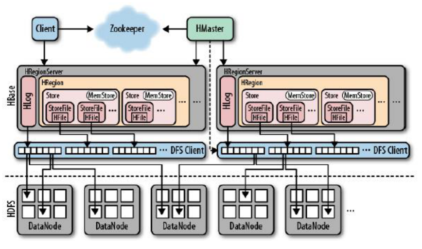
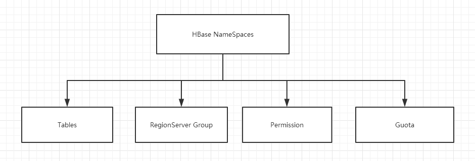
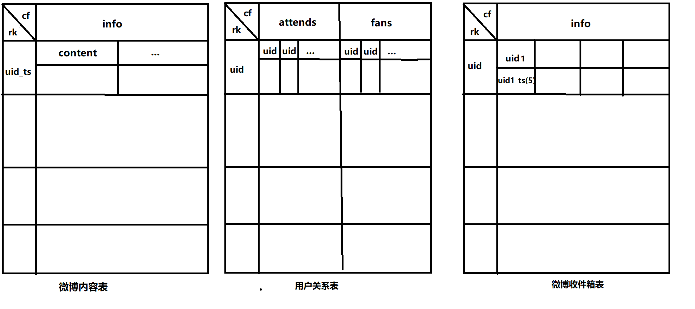

# HBase


# 概述

* 是一个高可靠,高性能,面向列的,可扩展的分布式开源数据库,适用于非结构化数据的存储
* 高可靠性:HBase非常稳定
* 高性能:可以存储上亿或十亿级别的数据,可以实现毫秒级别的查询
* 面向列:数据是按照列存储,列簇必须在创建表的时候就指定
* 可扩展:可以很方便的添加或删除一个节点,包括RegionServer和HDFS
* 海量存储:适合存储PB级别的数据,在PB级别的数据存储的情况下,能在几十到百毫秒内返回数据
* 稀疏:主要是针对Hbase列的灵活性,在列族中,可以指定任意多的,在列数据为空的情况下,不会占用存储空间
* NameSpace:可以理解为关系型数据库的数据库
* Table:类似为数据库中的表.必须是在文件路径中合法的名字,会映射在HDFS上的文件
* Row:在表里面,每行代表一个数据对象,每行都是一个行键(Row Key)进行唯一标识.行键可以是任何类型,在库中以字节存储
* RowKey:唯一标识,类似于主键,不可更改,只能删除后重新插入
* Column:列由Column family和Column qualifier组成,访问数据时用冒号(:)分割开
* Column family(CF):类似传统数据库的字段名,又称为列簇.和传统字段不同的是,CF中存储的数据类似于键值对,而其中的键值就是ColumnQualifier(CQ或Key),可以有多个CQ.这就相当于CF下又有字段,而真正的值则是存储于CQ下.一个表中可以有多个CF,也可以只有一个CF,需要根据实际情况而定.例如:userinfo{"username":"ddd","email":"12@ali.com"},password{"pwd":"123456"}.其中userinfo就是一个CF,其中的username是CQ,ddd是值(CellValue).password是另外一个CF
* Column qualifier:列簇中的数据通过列标识来进行映射,可以认为是key,如上个例子中的userinfo中的username,email
* Cell:每一个行键(rowkey),CF和CQ共同组成一个单元,值可以是任意类型,以字节存储
* Timestamp:每个值都会有一个timestamp,作为该值特定版本的标识符

  * 插入数据时若不指定该值,则默认为当前时间戳
  * 查询时若不指定时间戳,默认查询最新版本的值
  * Timestamp由HBase进行单独维护,默认只会维持3个版本的数据
* HBase中的数据类型只有一种:byte[]
* HBase与传统的关系型数据库的区别在于:

  * HBase处理的数据为PB级别,而传统数据库处理的一般是GB,TB数据
  * HBase只处理字节数据,而传统数据库的数据类型很丰富
  * HBase只支持单行ROW的ACID
  * HBase只支持rowkey的索引
  * HBase的吞吐量是百万级别/每秒,传统数据库数千/每秒
* HBase是基于HDFS系统进行数据存储,类似于Hive,但在Hadoop上提供了类似于Bigtable的能力
* 适合于非结构化数据的存储,如图片等,适合用来进行大数据的实时查询
* HBase提供了对数据的随机实时读写访问功能
* HBase内部使用哈希表,并存储索引,可将在HDFS中的数据进行快速查找
* HBase不适用于有join,多级索引,表关系复杂的数据模型
* HBase由Java Api(提供查询),Hmaster,RegionServer和自带的zk组成


> RowKey	|		Timestamp		|			CF1				|				   CF2
>
> ​														 |col1	| 	col2		|			col1   |	 col2 |
>
> ----------------------------------------------------------------------------------------------------------------------------------
>
> rowkey1			timestamp1		value1		value2		value1		value2
>
> ​							timestamp2		value3		value4		value3		value4


# 应用场景

* 半结构化或非结构化数据:对于数据结构字段不够确定或杂乱无章很难按一个概念去进行抽取的数据适合用HBase.比如文章的tag信息,就会不断的增加,删除
* 记录非常稀疏:RDBMS的行的列数是固定的,值为null的列浪费了存储空间.HBase为null的Column不会被存储,这样既节省了空间又提高了读性能
* 多版本数据:Rowkey和Columnkey定位到的Value可以有任意数量的版本值,因此对于需要存储变动历史记录的数据,用HBase就非常方便了.业务上一般只需要最新的值,但有时可能需要查询到历史值
* 超大数据量:当数据量越来越大,RDBMS数据库撑不住了,就出现了读写分离策略,通过一个Master专门负责写操作,多个Slave负责读操作,服务器成本倍增.随着压力增加,Master撑不住了,这时就要分库了,把关联不大的数据分开部署,一些join查询不能用了,需要借助中间层.随着数据量的进一步增加,一个表的记录越来越大,查询就变得很慢,于是又得搞分表,比如按ID取模分成多个表以减少单个表的记录数.采用HBase就简单了,只需要加机器即可,HBase会自动水平切分扩展,跟Hadoop的无缝集成保障了其数据可靠性(HDFS)和海量数据分析的高性能(MapReduce)


# 特性

* 对小文件支持比较好,对大文件的支持无法满足
* 因HBase的设计,会发生比较耗时的compact和split操作,文件存储会比较频繁的触发这些操作
* 不适合复杂的检索功能
* 将大文件直接存储到HDFS,HBase只存储索引信息,可解决第一个问题
* 将HBase的memstore尽量调大,避免文件上传频繁flush,需要根据业务来设定,缓解compact和split带来的问题
* 关闭自动major compact功能,改为手动合并,或写脚本处理
* 将hbase-site.xml中的region的容量设置大一些,建表时预先分区
* HBase本身根据字典排序,用户自行在文件夹文件名上做处理
* 通过rowkey设计使其支持起始文件检索,文件前缀匹配等
* 对象存储本身并不需要复杂的检索操作
* 对配置文件中的相关配置进行特殊处理:
  * hbase.regionserver.handler.count:rpc请求线程数,默认是10
  * hbase.hregion.max.filesize:当region的大小大于设定值后就开始split
  * hbase.hregion.majorcompaction:majorcompaction的执行周期,默认是1天执行一次
  * hbase.hstore.compaction.min:每个store里的storefile总数超过该值,触发合并操作
  * hbase.hstore.compaction.max:一次最多合并多少个storefile
  * hbase.hstore.blockingStoreFile:region中的store里的storefile超过该值时,则block所有的写请求执行compaction
  * hfile.block.cache.size:regionserver的blockcache的内存大小限制
  * hbase.hregion.memstore.flush.size:mmestore超过该值将执行flush,默认128M
  * hbase.hregion.memstore.block.multiplier:若memstore的大小超过flush.size*multiplier,会阻塞该memstore的写操作
* 常用优化:预先分区,rowkey优化,column优化,scheme优化
* 预先分区:HBase在建表的时候默认只会在一个resionserver上建立一个region分区,可以在建表的时候预先创建一些空的region,根据rowkey来设定region的起始值和结束值,有目的的进行数据存储,减少region的split操作.同时可以将频繁访问的数据放在多个region中,将访问比较少的数据放在一个或几个region中,合理分配资源
* rowkey优化:利用hbase默认排序特点,将一起访问的数据放在一起,也就是一个CF中;防止热点问题,避免使用时序或单调的递增递减等.热点就是在集群中,大量的请求访问单个或少量几个数据,大量的访问是的这些服务器超出自身的处理能力,从而导致整个集群的性能下降.尽量减少rowkey字节数,尽量短
* rowkey必须唯一,如果不唯一,会被覆盖
* rowkey必须订场,建议是8byte的倍数
* rowkey是二进制字节流,理论长度不超过64k,越短越好,不超过100字节
* rowkey散列原则:高位字段散列,可以化解写入时的数据倾斜,散列值只要保证在同时刻唯一即可
* column优化:字段尽量短,一张表里的CF尽量不要超过3个
* schema优化:
  * 宽表:列多行少,每行存储的数据多,事务更好,因为hbase只支持行事务,不支持其他类型事务
  * 高表:列少行多,每列存储的数据多,查询来说,高表更好.但是开销更大,因为rowkey更多,region更多
* 写优化策略,同步提交或异步提交;WAL优化,是否必须,持久化等;Scan缓存设置,批量获取;BlockCache配置是否合理,HFile是否过多
* HBase在HDFS中默认有2个目录:default和hbase,其中hbase存放系统表,default存放用户表
  * hbase中的namespace表:存放所有的命名空间信息
  * hbase中的meta表:存放数据库所有的region信息的rowkey范围


# 架构

* HBase架构,见HBase.pptx-01
* Client:包含了访问Hbase的接口,另外Client还维护了对应的cache来加速Hbase的访问
* Zookeeper:通过ZK来做master的高可用,RegionServer的监控,元数据的入口以及集群配置的维护等工作
  * 保证集群中只有1个master在运行,如果master异常,会通过竞争机制产生新的master提供服务
  * 监控RegionServer的状态,当RegionSevrer异常时,通过回调的形式通知MasterRegionServer上下线信息
  * 存储元数据的统一入口地址
* HMaster:主要职责如下
  * 为RegionServer分配Region
  * 维护整个集群的负载均衡
  * 维护集群的元数据信息
  * 发现失效的Region,并将失效的Region分配到正常的RegionServer上
  * 当RegionSever失效的时候,协调对应Hlog的拆分
* HRegionServer:直接对接用户的读写请求,是真正的“干活”的节点
  * 管理master为其分配的Region
  * 处理来自客户端的读写请求
  * 负责和底层HDFS的交互,存储数据到HDFS
  * 负责Region变大以后的拆分
  * 负责Storefile的合并工作
* HDFS:为Hbase提供最终的底层数据存储服务,同时为HBase提供高可用,HLog存储在HDFS上
  * 提供元数据和表数据的底层分布式存储服务
  * 数据多副本,保证的高可靠和高可用性


# 核心

* HMaster:中央节点
  * 将Region分配给RegionServer
  * 监控,协调RegionServer的负载均衡并维护集群状态,处理RegionServer故障转移
  * 维护表和Region的元数据,但是不参与数据的输入/输出过程
  * 多个Hmaster可以共存,但同时只会有一个Master在运行,其他处于待机状态
  * HBase启动时,会将所有表,Region信息(region开始key和结束key,所在regionserver的地址等)全部加载到HMaster中
* RegionServer:区域服务调度,实际数据处理
  * 维护Master分配给他的Region,处理对这些Region的请求
  * 负责切分正在运行的逐渐变的过大的Region,保证查询效率
  * 每个RegionServer只会处理一个CF数据,当CF数据值达到某个阀值时,会划分更多的Region来存储CF数据
  * 维护HLog,执行压缩
  * 运行在DataNode上,数量可以与DataNode数量相同
* Write-Ahead logs:HBase的修改记录,当对HBase读写数据时,数据不是直接写进磁盘,它会在内存中保留一段时间,保留时间以及数据量阈值可以设定.但把数据保存在内存中可能有更高的概率引起数据丢失,为了解决这个问题,数据会先写在一个叫做Write-Ahead logfile的文件中,然后再写入内存中.所以在系统出现故障的时候,数据可以通过这个日志文件重建
* Region:是HBase存储的最小单元,HBase的基本单位,表的分片,HBase表会根据RowKey值被切分成不同的Region存储在RegionServer中,一个RegionServer中可以有多个不同的Region
* Store:每个Region中都会包含一个或多个Store,用来接收和访问数据,HFile存储在Store中,一个Store对应HBase表中的一个列族
* MemStore:每个Store中都会存在一个MemStore,是数据在内存中的实体,而且是有序的.当内存中的数据达到一定值之后,会创建一个Storefile,并将内存中的数据转入到Storefile中
* Storefile:由MemStore创建,是数据最终在HBase中的存储的位置.Storefile是HFile的一层封装,HFile是HDFS的基础,此时数据就将存储到HDFS中
* HLog:存在于每个RegionServer中,只有一个,是为了保证内存中的数据不丢失而存在,类似于Mysql的bin.log.数据会先在HLog中写入更新操作的日志,之后才会在MemStore中写入数据
* HFie:磁盘上保存原始数据的实际的物理文件,是实际的存储文件.StoreFile是以Hfile的形式存储在HDFS的

* HBase启动
  * 将自己注册到zk(zookeeper)的backup节点中,因为开始时会有多个HMaster节点,需要进行抢占才能成为活动的HMaster
  * 抢占完成之后会将该节点从backup节点中删除,此时HMaster才会开始初始化一些数据,之后HMaster将等待RegionServer汇报
  * 此时RegionServer在zk中注册,并向HMaster汇报,HMaster就会存储可以使用的RegionServer信息,同时开始分配任务
  * 对所有RegionServer(包括已经失效的)数据进行整理,分配Region和Meta信息,将这些信息交给zk
* RegionServer失效
  * HMaster将失效的RegionServer上的Region分配到其他节点
  * HMaster更新hbase:meta表以保证数据正常访问
* HMaster失效
  * 集群模式下,由zk中处于backup状态的其他HMaster节点推选一个转为Active状态
  * 非集群模式下,HMaster挂了,数据仍旧能正常读写,因为是由RegionServer来完成,但是不能创建删除表,也不能更改表结构
* HBase架构




## RowKey

* 行键,与NoSQL数据库一样,RowKey是用来检索记录的主键
* 可以是任意字符串
* 最大长度是64KB,实际应用中长度一般为10-100bytes
* 在HBASE内部,RowKey保存为字节数组
* 存储时,数据按照RowKey的字典序(byte order)排序存储
* 设计RowKey时,要充分排序存储这个特性,将经常一起读取的行存储放到一起,位置相关性
* 访问HBASE table中的行,只有三种方式
  * 通过单个RowKey访问
  * 通过RowKey的range(正则)
  * 全表扫描


## ColumnFamily

* 列族:HBASE表中的每个列,都归属于某个列族
* 列族是表的schema的一部分,而列不是
* 必须在使用表之前定义
* 列名都以列族作为前缀,例如courses:history,courses:math都属于courses 这个列族


## Cell

* 由{rowkey,column Family:columu,version}唯一确定的单元
* cell中的数据是没有类型的,全部是字节码形式存贮


## TimeStamp

* HBase中通过rowkey和columns确定的为一个存贮单元称为cell
* 每个Cell都保存着同一份数据的多个版本,版本通过时间戳来索引
* 时间戳的类型是64位整型
* 时间戳可以由HBase在数据写入时自动赋值,此时时间戳是精确到毫秒的当前系统时间,也可以由客户显式赋值
* 如果应用程序要避免数据版本冲突,就必须自己生成具有唯一性的时间戳
* 每个Cell中,不同版本的数据按照时间倒序排序,即最新的数据排在最前面
* 为了避免数据存在过多版本造成的的管理负担,HBase提供 了两种数据版本回收方式
  * 一是保存数据的最后n个版本
  * 二是保存最近一段时间内的版本,比如最近七天
  * 用户可以针对每个列族进行设置


## NameSpace

* 命名空间



* Table:表,所有的表都是命名空间成员,即表必属于某个命名空间.若没有指定,则在default默认的命名空间中
* RegionServer Group:一个命名空间包含了默认的RegionServer Group
* Permission:权限,命名空间能够定义访问控制列表ACL(Access Control List).例如增删改查等操作
* Quota:限额,可以强制一个命名空间可包含的region的数量


## 读数据

* 见**HBase.pptx-02**
* Client先访问ZK,从ZK中获取meta表所在的位置信息,即找到这个meta表所在HRegionServer的地址
* 根据namespace,表名和rowkey在meta表中找到对应的Region信息
* 找到这个Region对应的Regionserver,Client对Regionserver发起请求
* 查找对应的Region
* 先从自己的MemStore找数据,如果没有,再到BlockCache(加速读内容缓存区)里面读
* BlockCache还没有,再到StoreFile上读(为了读取的效率)
* 如果是从StoreFile里面读取的数据,不是直接返回给客户端,而是先写入BlockCache,再返回给客户端


## 写数据

* 见**HBase.pptx-03**
* Client先访问ZK,找到Meta表,并获取Meta表信息
* 确定当前将要写入的数据所对应的RegionServer服务器和Region
* Client向HregionServer发送写请求
* HRegionServer将数据写到HLog,为了数据的持久化和恢复
* HRegionServer将数据写到内存(MemStore)
* 如果Hlog和Memstore均写入成功,则这条数据写入成功
* 反馈Client写成功
* 当MemStore的大小达到一定值后,flush到StoreFile并存储到HDFS
* 当StoreFile越来越多,会触发Compact合并操作,把过多的StoreFile合并成一个大的StoreFile
* 当StoreFile越来越大,Region也会越来越大,达到阈值后,会触发Split操作,将Region一分为二
* 因为内存空间是有限的,所以说溢写过程必定伴随着大量的小文件产生


## Flush

* HBase写入数据时,先写入到MemStore中
* 当MemStore数据达到阈值,默认是128M,将数据刷到硬盘保存为HFile,同时将内存中和HLog中的历史数据
* 将数据存储到HDFS中,在HLog中做标记点


## Compact

* 当HFile小文件太多时会执行Compact操作进行合并,而HFile的数量越少,检索的时间就越快越短
* 当数据块达到4块,HMaster触发合并操作,Region将数据块加载到本地,进行合并
* Compact又分为Minor Compaction和Major Compaction
* Minor Compaction:选取一些小的,相邻的StoreFile将他们进行合并成一个更大的StoreFile.理论上就是HFile
* Major Compaction:将所有的StoreFile合并,同时还会清理无意义的数据,被删除的数据如下:
  * TTL过期数据
  * 版本号超过设定版本号的数据
* Compact默认是开启的,大小为10G,可以因为业务的需求而关闭,然后自行设计合并操作
* 何时会执行Compact:当MemStore中内容被Flush到磁盘时,用户执行shell命令Compact,Major_Compact或调用了相关的API,hbase后台周期性触发检查
* 当HregionServer宕机后,将HregionServer上的hlog拆分,然后分配给不同的HregionServer加载,修改.META
* HLog会同步到HDFS


## Split

* 当Region的大小达到某个阀值时,会执行Split操作
* 将大的Region分割成多个小的Region分配给不同的HRegionServer管理
* Compact和Split操作会消耗大量的性能,所以频繁的操作这2个方法会严重降低程序的性能


# 安装

## 单机版

* 下载解压HBase安装包到/app/hbase中

* 配置Java环境变量

* 进入conf目录,配置hbase-site.xml文件

  ```xml
  <!-- 指定hbase的数据目录,若不设置,默认在/tmp目录下 -->
  <property>
  	<name>hbase.rootdir</name>
  	<value>file:///app/hbase/data</value>
  </property>
  ```

* 启动:bin/start-hbase.sh

* jps查看进程:HMaster,HRegionServer

* Web访问ip:16010


## 集群

* 在单机版基础上还需要增加其他[配置](http://abloz.com/hbase/book.html#hbase_default_configurations)

* 集群依赖于Hadoop,ZK集群,先将Hadoop,ZK集群搭建成功

* 下载HBase压缩包,解压到指定目录,修改hbase-env.sh

  ```shell
  # jdk路径
  export JAVA_HOME=/app/java/jdk1.8.0
  # 给hbase分配的内存空间,若是JDK8以上,需要移除下面2个参数
  # export HBASE_MASTER_OPTS="$HBASE_MASTER_OPTS -XX:PermSize=128m ..."
  # export HBASE_REGIONSERVER_OPTS="$HBASE_REGIONSERVER_OPTS..."
  # 是否使用hbase自带的zk,true表示使用,false使用自己搭建的zk集群,最好使用自己搭建的集群
  export HBASE_MANAGES_ZK = false
  ```

* 修改hbase-site.xml,在configuration标签添加如下:

  ```xml
  <!-- 指定hbase在hdfs上的根目录,集群写集群的NN地址,hbase目录在启动时自动在hdfs中创建 -->
  <property>
      <name>hbase.rootdir</name>
      <!-- 伪分布式模式下可以写hdfs的地址 -->
      <!-- <value>hdfs://localhost:9000/hbase</value> -->
      <!-- 集群模式下填写hadoop集群地址 -->
      <value>hdfs://cluster/hbase</value>
  </property>
  <!-- 指定hbase是否以集群的方式运行 -->
  <property>
      <name>hbase.cluster.distributed</name>
      <value>true</value>
  </property>
  <!-- 0.98后的新变动,之前版本没有.port,默认端口为60000 -->
  <property>
      <name>hbase.master.port</name>
      <value>16000</value>
  </property>
  <!-- 若不使用自带的zk,需配置zk集群地址,多个用逗号隔开 -->
  <property>
      <name>hbase.zookeeper.quorum</name>
      <value>localhost:2181</value>
  </property>
  <!-- <property>
   <name>hbase.zookeeper.property.clientPort</name>
   <value>2181</value>
  -->
  </property>
  <!-- 指定zookeeper的存储路径 -->
  <property>
      <name>hbase.zookeeper.property.dataDir</name>
      <value>/app/zookeeper/datas</value>
  </property>
  <!-- memstore的内存刷新大小,默认128M,可以设置成256M,单位为字节 -->
  <property>
      <name>hbase.hregion.memstore.flush.size</name>
      <value>268435456</value>
  </property>
  <!-- 最大storefile大小,超过这个大小,hbase将开始合并storefile,而存储这个storefile的region将被切割,默认是10G -->
  <property>
      <name>hbase.hregion.max.filesize</name>
      <value>10737418240</value>
  </property>
  <!-- region中所有storefile的major compactions时间间隔,默认1天,0表示禁用这个功能 -->
  <property>
      <name>hbase.hregion.majorcompaction</name>
      <value>0</value>
  </property>
  <!-- 当时间不同步时,可以设置该值更大点,但最好是将时间同步-->
  <property>
      <name>hbase.master.maxclockskew</name>
      <value>180000</value>
  </property>
  ```

* 配置regionservers:其他服务器的ip或主机名

* 将Hadoop的core-site.xml和hdfs-site.xml复制到hbase的conf目录下,或者建立软连接

* 将HBase目录整个传输或复制到其他服务器相同目录下

* 启动hbase:进入hbase/bin下,

  * sh start-hbase.sh,或者下面2个命令依次执行
  * hbase-daemon.sh start master
  * hbase-daemon.sh start regionserver
  * 会显示启动了zk,master,regionserver

* jps:显示HMaster,HRegionServer,HQuorumPeer

* 若集群之间时间不同步,会抛出ClockOutOfSyncException异常,需要进行时间同步

* 进入到hbase的命令行:./hbase shell,进入控制台后,执行status,会显示当前hbase的状态

* 启动成功后,可以通过ip:port访问管理页面,默认端口是16010


## 配置

**hbase-site.xml**


# HA

* 直接在集群的某个服务器中使用master命令启动即可实现HA

* bin/hbase-daemon.sh start master:以master的方式启动hbase

* 关闭HBase集群,如果没有开启则跳过此步:bin/stop-hbase.sh

* 在conf目录下创建backup-masters文件:touch conf/backup-masters

* 在backup-masters文件中配置高可用HMaster节点:echo linux02 > conf/backup-masters

* 将整个conf目录scp到其他节点

  ```shell
  scp -r conf/ linux02:/opt/modules/cdh/hbase-0.98.6-cdh5.3.6/ 
  scp -r conf/ linux03:/opt/modules/cdh/hbase-0.98.6-cdh5.3.6/
  ```

* 打开页面测试查看:http://linux01:16010    


# HBaseShell

* bin/hbase shell:进入hbase控制台
* help:查看帮助命令
* list:查看存在那些表
* list_namespace:查看所有的命名空间,类似于MySQL中的数据库
* list_namespace_tables 'tablename':查看命名空间中所有的表
* create 'tablename','列名1','列名2','列名...':创建表
* create_namespace 'ns1':创建一个命名空间,行键rowkey是命名空间的名称
* exist 'tablename':查看表是否存在
* desc 'tablename':查看表的描述信息
* describe 'student':查看表结构
* alter 'tablename',NAME=>'列名3',VERSION=>2:添加一个CF
* alter 'tablename',{NAME=>'列名',METHOD=>'delete'}:删除列
* alter 'tablename' 'delete'=>'cfname':删除列
* put 'tablename','rowkey','cfname:key','值':添加或更新记录
* get 'tablename','rowkey'[,'cfname:key']:查看指定行/指定列簇:列的记录
* count 'tablename':查看表中的记录总数
* deleteall 'tablename','rowkey':删除某行全部数据
* delete 'tablename','rowkey','cfname:key':删除某列数据
* disable 'tablename':屏蔽表
* is_enabled/is_disabled 'tablename':检查表是否启用或禁用
* truncate 'tablename':清空表数据,需要先屏蔽表
* drop 'tablename':删除表,先要屏蔽该表
* scan 'tablename':查看所有记录
* scan 'tablename',{STARTROW=>'rowkey',STOPROW=>'rowkey'}:查询指定区间内的记录
* scan 'tablename',{STARTROW=>'rowkey',LIMIT=>1,VERSIONS=>1};查询指定条数的记录,STARTROW, STOPROW,LIMIT,VERSION不能用小写
* scan 'tablename',['cfname:key']:查看某个表某个列中所有数据
* status 'hostname':显示服务器状态


# JavaAPI

* 详见**paradise-study-hbase/src/main/com/wy/example/example01**


# MapReduce

* 通过HBase的相关JavaAPI,可以实现伴随HBase操作的MR过程
* 例如使用MR将数据从本地文件系统导入到HBase的表中,从HBase中读取原始数据后使用MR做数据分析
* 需要配置HBase和Hadoop的环境变量,同时在hadoop-env.sh中配置hadoop_classpath
* bin/hbase mapredcp:查看HBase的MR任务执行
* 自定义HBase-MR,见**paradise-study-hbase/src/main/com/wy/example/Fruit\*.java,HDFS\*.java**


# Coprocessor

* HBase的协处理器,为用户提供类库和运行时环境,使代码能够在HBase RegionServer和Master上运行
* 协处理器分为系统协处理器和表协处理器
* 系统协处理器:全局加载到Regionserver托管的所有表和region上,针对整个hbase集群
* 表协处理器:用户可以指定一张表使用协处理器,只针对一张表
* Observer(观察者):类似于传统数据库的触发器
  * RegionObserver:提供客户端的数据操作事件钩子:get,put,delete,scan
  * MasterObserver:提供DDL类型的操作钩子,如创建,删除,修改数据表等
  * WALObserver:提供WAL相关日志操作钩子
  * 应用:安全性,在执行get或put之前,通过preGet或prePut方法检查是否允许该操作
  * 引用完整性约束:HBase不支持关系型数据库中的引用完整性约束概念,即外键,可以使用协处理器增强这种约束
  * 二级索引:可以使用协处理器来维持一个二级索引
* Endpoint(终端):动态的终端有点像存储过程,是动态RPC插件的接口,他实现的代码被安装在服务器,从而能通过hbase rpc唤醒
* 调用接口,他们的实现代码会被目标RegionServer远程执行


# 节点管理


## Commissioning

服役,当启动regionserver时,regionserver会向HMaster注册并开始接收本地数据,开始的时候,新加入的节点不会有任何数据,平衡器开启的情况下,将会有新的region移动到开启的RegionServer上。如果启动和停止进程是使用ssh和HBase脚本,那么会将新添加的节点的主机名加入到conf/regionservers文件中。


## Decommissioning

* 退役,就是从当前HBase集群中删除某个RegionServer,这个过程分为如下几个过程

* 停止负载平衡器:hbase> balance_switch false
* 在退役节点上停止RegionServer:hbase> hbase-daemon.sh stop  regionserver
* RegionServer一旦停止,关闭维护的所有Region
* Zookeeper上的该RegionServer节点消失
* Master节点检测到该RegionServer下线
* RegionServer的Region服务得到重新分配
* 该关闭方法比较传统,需要花费一定的时间,而且会造成部分Region短暂的不可用
* 另一种方案
  * RegionServer先卸载所管理的Region:graceful_stop.sh  <RegionServer-hostname>
  * 自动平衡数据
  * 和之前的2~6步一样


## 版本的确界

* 版本的下界:默认的版本下界是0,即禁用.row版本使用的最小数目是与生存时间(TTL Time To Live)相结合的,并且我们根据实际需求可以有0或更多的版本,使用0,即只有1个版本的值写入Cell
* 版本的上界:默认的版本上界是3,也就是一个row保留3个副本(基于时间戳的插入).该值不要设计的过大,一般的业务不会超过100.如果Cell中存储的数据版本号超过了3个,再次插入数据时,最新的值会将最老的值覆盖


# 集成HIVE


## 对比


### Hive

* 数据仓库:Hive的本质其实就相当于将HDFS中已经存储的文件在Mysql中做了一个双射关系,以方便使用HQL去管理查询
* 用于数据分析,清洗:Hive适用于离线的数据分析和清洗,延迟较高
* 基于HDFS,MR:Hive存储的数据依旧在DataNode上,编写的HQL语句终将是转换为MapReduce代码执行


### HBase

* 数据库:是一种面向列存储的非关系型数据库
* 用于存储结构化和非结构话的数据,适用于单表非关系型数据的存储,不适合做关联查询,类似JOIN等操作
* 基于HDFS,数据持久化存储的体现形式是Hfile,存放于DataNode中,被ResionServer以Region的形式进行管理
* 延迟较低,接入在线业务使用
* 面对大量的企业数据,HBase可以直线单表大量数据的存储,同时提供了高效的数据访问速度


## 集成

* 若HBase和Hive的包有冲突,可能需要重新编译hive-hbase-handler-1.2.2.jar之后使用

* 后续可能会在操作Hive的同时对HBase也会产生影响,所以Hive需要持有操作HBase的Jar,那么接下来拷贝Hive所依赖的Jar包或使用软连接的形式

  ```shell
  export HBASE_HOME=/home/admin/modules/hbase-1.3.1
  export HIVE_HOME=/home/admin/modules/apache-hive-1.2.2-bin
  ln -s $HBASE_HOME/lib/hbase-common-1.3.1.jar $HIVE_HOME/lib/hbase-common-1.3.1.jar
  ln -s $HBASE_HOME/lib/hbase-server-1.3.1.jar $HIVE_HOME/lib/hbase-server-1.3.1.jar
  ln -s $HBASE_HOME/lib/hbase-client-1.3.1.jar  $HIVE_HOME/lib/hbase-client-1.3.1.jar
  ln -s $HBASE_HOME/lib/hbase-protocol-1.3.1.jar $HIVE_HOME/lib/hbase-protocol1.3.1.jar
  ln -s $HBASE_HOME/lib/hbase-it-1.3.1.jar $HIVE_HOME/lib/hbase-it-1.3.1.jar
  ln -s $HBASE_HOME/lib/htrace-core-3.1.0-incubating.jar $HIVE_HOME/lib/htrace-core-3.1.0-incubating.jar
  ln -s $HBASE_HOME/lib/hbase-hadoop2-compat-1.3.1.jar $HIVE_HOME/lib/hbase-hadoop2-compat-1.3.1.jar
  ln -s $HBASE_HOME/lib/hbase-hadoop-compat-1.3.1.jar $HIVE_HOME/lib/hbase-hadoop-compat-1.3.1.jar  
  ```

* hive-site.xml中修改ZK的属性

  ```xml
  <property>
      <name>hive.zookeeper.quorum</name>
      <value>linux01,linux02,linux03</value>
  </property>
  <property>
      <name>hive.zookeeper.client.port</name>
      <value>2181</value>
  </property>
  ```

* 建立Hive表,关联HBase表,插入数据到Hive表的同时能够影响HBase表

  * 在Hive中创建表同时关联HBase

    ```mysql
    CREATE TABLE hive_hbase_emp_table(empno int,ename string,job string,mgr int,
    hiredate string,sal double,comm double,deptno int)
    STORED BY 'org.apache.hadoop.hive.hbase.HBaseStorageHandler'
    WITH SERDEPROPERTIES ("hbase.columns.mapping" = ":key,info:ename,info:job,info:mgr,info:hiredate,info:sal,info:comm,info:deptno")
    TBLPROPERTIES ("hbase.table.name" = "hbase_emp_table");
    ```

  * 完成之后,可以分别进入Hive和HBase查看,都生成了对应的表

  * 在Hive中创建临时中间表,用于load文件中的数据

    ```mysql
    CREATE TABLE emp(empno int,ename string,job string,mgr int,hiredate string,sal double,comm double,deptno int) row format delimited fields terminated by '\t';
    ```

  * 向Hive中间表中load数据

    ```mysql
    hive> load data local inpath '/home/admin/softwares/data/emp.txt' into table emp;
    ```

  * 通过insert命令将中间表中的数据导入到Hive关联HBase的那张表中

    ```mysql
    hive> insert into table  hive_hbase_emp_table select * from emp;
    ```

  * 查看Hive以及关联的HBase表中是否已经成功的同步插入了数据

    ```mysql
    # Hive
    hive> select * from  hive_hbase_emp_table;
    # HBase
    hbase> scan ‘hbase_emp_table’;
    ```

* 在HBase中已经存储了表hbase_emp_table,然后在Hive中创建一个外部表来关联HBase中的这张表,使之可以借助Hive来分析HBase这张表中的数据

  * 该案例需要完成上一步操作

  * 在Hive中创建外部表

    ```mysql
    CREATE EXTERNAL TABLE relevance_hbase_emp(empno int,ename string,job string,mgr int,hiredate string,sal double,comm double,deptno int)
    STORED BY 'org.apache.hadoop.hive.hbase.HBaseStorageHandler' 
    WITH SERDEPROPERTIES ("hbase.columns.mapping" =":key,info:ename,info:job,info:mgr,info:hiredate,info:sal,info:comm,info:deptno") TBLPROPERTIES  ("hbase.table.name" = "hbase_emp_table");
    ```

  * 关联后就可以使用Hive函数进行一些分析操作了

    ```mysql
    hive>select * from relevance_hbase_emp;
    ```


# 集成Sqoop

* 利用Sqoop将HBase中的数据和RDMS进行数据转存

* 将RDBMS中的数据抽取到HBase中

* 配置sqoop-env.sh,添加如下

  ```shell
  export HBASE_HOME=/home/admin/modules/hbase-1.3.1
  ```

* 在MySQL中新建一个数据库db_library,一张表book

  ```mysql
  CREATE DATABASE db_library;  CREATE TABLE db_library.book(  id int(4) PRIMARY KEY NOT NULL  AUTO_INCREMENT,   name VARCHAR(255) NOT NULL,   price VARCHAR(255) NOT NULL);
  ```

* 向表中插入一些数据

  ```mysql
  INSERT INTO db_library.book (name, price)  VALUES('Lie Sporting', '30');
  INSERT INTO db_library.book (name, price)  VALUES('Pride & Prejudice', '70');
  INSERT INTO db_library.book (name, price)  VALUES('Fall of Giants', '50');
  ```

* 执行Sqoop导入数据的操作

  ```mysql
  import --connect jdbc:mysql://linux01:3306/db_library --username root --password 123456 --table book --columns "id,name,price" --column-family "info" --hbase-create-table --hbase-row-key "id" --hbase-table "hbase_book" --num-mappers 1 --split-by id
  ```

  * --column-family <family>:设置导入的目标列族
  *  --hbase-create-table:是否自动创建不存在的HBase表
  * --hbase-row-key <col>:mysql中哪一列的值作为HBase的rowkey,如果rowkey是个组合键,则以逗号分隔,避免rowkey的重复
  * --hbase-table <table-name>:指定数据将要导入到HBase中的哪张表中
  * --hbase-bulkload:是否允许bulk形式的导入

* Sqoop1.4.6只支持HBase1.0.1之前的版本的自动创建HBase表的功能,可以手动创建HBase表来解决该问题

* 在HBase中scan这张表得到如下内容

  ```mysql
  hbase> scan ‘hbase_book’;
  ```

* 可以尝试使用复合键作为导入数据时的rowkey


# 容灾备份


## Distcp

* 停止HBase服务后,使用distcp命令运行MR任务进行备份,将数据备份到另一个地方

* 执行该操作需要开启Yarn服务

  ```shell
  # 备份
  hadoop distcp hdfs://linux01:8020/hbase hdfs://linux01:8020/HbaseBackup/backup20171009
  # 恢复
  hadoop distcp hdfs://linux01:8020/HbaseBackup/backup20170930 hdfs://linux01:8020/hbase
  ```


## CopyTable

* 支持时间区间,row区间,改变表名称,改变列簇名称,指定是否copy已经被删除的数据等功能

* 工具采用scan查询,写入新表时采用put和delete api,全部是基于hbase的client api进行读写

  ```shell
  # 打开hbase的shell控制台:原表为table1,备份表为table2,备份表的名字可以和原表不一样,但是table2的列簇要和原表一样
  # table2创建好之后,在hbase中执行如下
  hbase org.apache.hadoop.hbase.mapreduce.CopyTable --new.name=table2 table1
  ```


## Export/Import

* export可导出数据到目标集群,然后可在目标集群import导入数据,export支持指定开始时间和结束时间,因此可以做增量备份

* export导出工具与copytable一样是依赖hbase的scan读取数据

  ```shell
  # 到处Export:tablename是需要备份的表,紧接的是备份的地址以及备份的文件名,版本号,开始时间,结束时间可选
  hbase org.apache.hadoop.hbase.mapreduce.Export tablename hdfs://namenode:9000/bakdir [version] [starttime] [endtime]
  # 导入Import:
  hbase [-Dhbase.import.version=0.94] org.apache.hadoop.hbase.mapreduce.Import tablename bakdir
  ```


## Snapshot

* snapshot即快照功能,通过配置hbase-site.xml开始该功能

  ```xml
  <property>
  	<name>hbase.snapshot.enabled</name>
  	<value>true</value>
  </property>
  ```

* 可以快速恢复表至快照指定的状态从而迅速修复数据,但是会丢失快照之后的数据
  * 创建快照:snapshot 'tablename' ,'tablename_bak'
  * 克隆快照:clone_snapshot  'table_bak' 'newtablename'
  * 列出快照:list_snapshots
  * 删除快照:delete_snapshot 'table_bak'
  * 恢复数据:disable 'tablename';restore_snapshot 'tablename_bak'


## Replication

* 可以通过replication机制实现hbase集群的主从模式,通过配置hbase-site.xml开始该功能

  ```xml
  <property>
  	<name>hbase.replication</name>
  	<value>true</value>
  </property>
  ```

* replication是依赖WAL日志进行的同步,所以必须开启WAL
  * 在源集群及目标集群都创建同名表
  * 指定目标集群zk地址和路径:add_peer '1',"zk01:2181:/hbase_backup";(1:一个id值,在下面的复制上要用)
  * 标注需要备份的列簇信息及备份的目标库地址
  * replication_scope值为上面add_peer指定的值
  * disable 'tablename';alter 'tablename',{NAME=>'f1',REPLICATION_SCOPE=>'1'}


# Hadoop优化

* NameNode元数据备份使用SSD

* 定时备份NameNode上的元数据
* 为NameNode指定多个元数据目录,使用dfs.name.dir或者dfs.namenode.name.dir指定,这样可以提供元数据的冗余和健壮性,以免发生故障
* NameNode的dir自恢复,设置dfs.namenode.name.dir.restore为true,允许尝试恢复之前失败的dfs.namenode.name.dir目录,在创建checkpoint时做此尝试,如果设置了多个磁盘,建议允许
* HDFS保证RPC调用会有较多的线程数,修改hdfs-site.xml
  * dfs.namenode.handler.count:该属性是NN服务默认线程数,的默认值是10,根据机器的可用内存可以调整为50~100
  * dfs.datanode.handler.count:该属性默认值为10,是DataNode的处理线程数,如果HDFS客户端程序读写请求比较多,可以调高到15~20,设置的值越大,内存消耗越多,不要调整的过高,一般业务中,5~10即可
* HDFS副本数的调整,修改hdfs-site.xml
  * dfs.replication:如果数据量巨大,且不是非常之重要,可以调整为2~3,如果数据非常之重要,可以调整为3~5
* HDFS文件块大小的调整,修改hdfs-site.xml
  * dfs.blocksize:块大小定义,该属性应该根据存储的大量的单个文件大小来设置,如果大量的单个文件都小于100M,建议设置成64M块大小,对于大于100M或者达到GB的这种情况,建议设置成256M,一般设置范围波动在64M~256M之间
* MapReduce Job任务服务线程数调整,修改mapred-site.xml
  * mapreduce.jobtracker.handler.count:该属性是Job任务线程数,默认值是10,根据机器的可用内存可以调整为50~100
* Http服务器工作线程数,修改mapred-site.xml
  * mapreduce.tasktracker.http.threads:定义HTTP服务器工作线程数,默认值为40,对于大集群可以调整到80~100
* 文件排序合并优化,修改mapred-site.xml
  * mapreduce.task.io.sort.factor:文件排序时同时合并的数据流的数量,这也定义了同时打开文件的个数,默认值为10,如果调高该参数,可以明显减少磁盘IO,即减少文件读取的次数
* 设置任务并发,修改mapred-site.xml
  * mapreduce.map.speculative:该属性可以设置任务是否可以并发执行,如果任务多而小,该属性设置为true可以明显加快任务执行效率,但是对于延迟非常高的任务,建议改为false,这就类似于迅雷下载
* MR输出数据的压缩,修改mapred-site.xml
  * mapreduce.map.output.compress,mapreduce.output.fileoutputformat.compress:对于大集群而言,建议设置MR的输出为压缩的数据,而对于小集群,则不需要
* 优化Mapper和Reducer的个数,修改mapred-site.xml
  * mapreduce.tasktracker.map.tasks.maximum,mapreduce.tasktracker.reduce.tasks.maximum:以上两个属性分别为一个单独的Job任务可以同时运行的Map和Reduce的数量
  * 设置上面两个参数时,需要考虑CPU核数,磁盘和内存容量
  * 假设一个8核的CPU,业务内容非常消耗CPU,那么可以设置map数量为4,如果该业务不是特别消耗CPU类型的,那么可以设置map数量为40,reduce数量为20
  * 这些参数的值修改完成之后,一定要观察是否有较长等待的任务,如果有的话,可以减少数量以加快任务执行,如果设置一个很大的值,会引起大量的上下文切换,以及内存与磁盘之间的数据交换,这里没有标准的配置数值,需要根据业务和硬件配置以及经验来做出选择
  * 在同一时刻,不要同时运行太多的MapReduce,这样会消耗过多的内存,任务会执行的非常缓慢,我们需要根据CPU核数,内存容量设置一个MR任务并发的最大值,使固定数据量的任务完全加载到内存中,避免频繁的内存和磁盘数据交换,从而降低磁盘IO,提高性能
  * 大概估算公式:map = 2 + ⅔cpu_core;reduce = 2 + ⅓cpu_core


# Linux优化

* 开启文件系统的预读缓存可以提高读取速度:blockdev --setra 32768 /dev/sda,ra是readahead的缩写

* 关闭进程睡眠池,即不允许后台进程进入睡眠状态,如果进程空闲,则直接kill:sysctl -w vm.swappiness=0

* 调整ulimit上限,默认值为比较小的数字:ulimit -n 查看允许最大进程数;ulimit -u 查看允许打开最大文件数

  ```shell
  vi /etc/security/limits.conf
  # 修改打开文件数限制,末尾添加
  *        soft  nofile     1024000
  *        hard  nofile     1024000
  Hive     -    nofile     1024000
  Hive     -    nproc      1024000
  vi /etc/security/limits.d/20-nproc.conf
  # 修改用户打开进程数限制,修改为
  *       soft    nproc   40960
  root    soft    nproc   unlimited
  ```

* 开启集群的时间同步NTP,集群中某台机器同步网络时间服务器的时间,其他机器则同步这台机器的时间

* 更新系统补丁,更新补丁前,请先测试新版本补丁对集群节点的兼容性


# ZK优化

* 优化Zookeeper会话超时时间,修改hbase-site.xml
  * zookeeper.session.timeout:该值会直接关系到master发现服务器宕机的最大周期,默认值为30秒,如果该值过小,会在HBase在写入大量数据发生而GC时,导致RegionServer短暂的不可用,从而没有向ZK发送心跳包,最终导致认为从节点shutdown。一般20台左右的集群需要配置5台zookeeper

 

# HBase优化


## 预分区

* 每个Region维护着startRow与endRowKey,如果加入的数据符合某个Region维护的rowKey范围,则该数据交给该Region维护.依照这个原则,我们可以将数据所要投放的分区提前大致的规划好,以提高HBase性能

* 手动设定预分区:hbase> create  'staff','info','partition1',SPLITS => ['1000','2000','3000','4000']

* 生成16进制序列预分区:create  'staff2','info','partition2',{NUMREGIONS => 15, SPLITALGO =>  'HexStringSplit'}

* 按照文件中设置的规则预分区:

  * 创建splits.txt文件内容如下:aaaa  bbbb  cccc  dddd
  * 然后执行:create 'staff3','partition3',SPLITS_FILE  => 'splits.txt'

* 使用JavaAPI创建预分区

  ```java
   //自定义算法,产生一系列Hash散列值存储在二维数组中
   byte[][] splitKeys = 某个散列值函数
   //创建HBaseAdmin实例
   HBaseAdmin hAdmin = new HBaseAdmin(HBaseConfiguration.create());
   //创建HTableDescriptor实例
   HTableDescriptor tableDesc = new HTableDescriptor(tableName);
   //通过HTableDescriptor实例和散列值二维数组创建带有预分区的HBase表
   hAdmin.createTable(tableDesc, splitKeys);
  ```

     

## RowKey设计

* 一条数据的唯一标识就是rowkey,那么这条数据存储于哪个分区,取决于rowkey处于哪个一个预分区的区间内,设计rowkey的主要目的,就是让数据均匀的分布于所有的Region中,在一定程度上防止数据倾斜
* 生成随机数,hash,散列值
  * 比如:原本rowKey为1001的,SHA1后变成:dd01903921ea24941c26a48f2cec24e0bb0e8cc7
  * 原本rowKey为3001的,SHA1后变成:49042c54de64a1e9bf0b33e00245660ef92dc7bd
  * 原本rowKey为5001的,SHA1后变成:7b61dec07e02c188790670af43e717f0f46e8913
  * 在做此操作之前,一般我们会选择从数据集中抽取样本,来决定什么样的rowKey来Hash后作为每个分区的临界值
* 字符串反转:20170524000001转成10000042507102  20170524000002转成20000042507102,这样也可以在一定程度上散列逐步put进来的数据
* 字符串拼接:20170524000001_a12e  20170524000001_93i7

 

## 内存优化

* HBase操作过程中需要大量的内存开销,毕竟Table是可以缓存在内存中的,一般会分配整个可用内存的70%给HBase的Java堆。但是不建议分配非常大的堆内存,因为GC过程持续太久会导致RegionServer处于长期不可用状态,一般16~48G内存就可以了,如果因为框架占用内存过高导致系统内存不足,框架一样会被系统服务拖死


## 基础优化

* 允许在HDFS的文件中追加内容,通常情况下是不允许追加内容的,但是,请看背景[故事](http://blog.cloudera.com/blog/2009/07/file-appends-in-hdfs/)
  * 修改hdfs-site.xml,hbase-site.xml
  * dfs.support.append:开启HDFS追加同步,可以优秀的配合HBase的数据同步和持久化.默认值为true
* 优化DataNode允许的最大文件打开数,修改hdfs-site.xml
  * dfs.datanode.max.transfer.threads:HBase一般都会同一时间操作大量的文件,根据集群的数量和规模以及数据动作,设置为4096或者更高.默认值是4096
* 优化延迟高的数据操作的等待时间,修改hdfs-site.xml
  * dfs.image.transfer.timeout:如果对于某一次数据操作来讲,延迟非常高,socket需要等待更长的时间,建议把该值设置为更大的值(默认60000毫秒),以确保socket不会被timeout掉
* 优化数据的写入效率,修改mapred-site.xml
  * mapreduce.map.output.compress,mapreduce.map.output.compress.codec:开启这两个数据可以大大提高文件的写入效率,减少写入时间
  * 第一个属性值修改为true,第二个属性值修改为:org.apache.hadoop.io.compress.GzipCodec或者其他压缩方式
* 优化DataNode存储,修改hdfs-site.xml
  * dfs.datanode.failed.volumes.tolerated:默认为0,意思是当DataNode中有一个磁盘出现故障,则会认为该DataNode shutdown了.如果修改为1,则一个磁盘出现故障时,数据会被复制到其他正常的DataNode上,当前的DataNode继续工作
* 设置RPC监听数量,修改hbase-site.xml
  * hbase.regionserver.handler.count:默认值为30,用于指定RPC监听的数量,可以根据客户端的请求数进行调整,读写请求较多时,增加此值
* 优化HStore文件大小,修改hbase-site.xml
  * hbase.hregion.max.filesize:默认值10737418240(10G),如果需要运行HBase的MR任务,可以减小此值,因为一个region对应一个map任务,如果单个region过大,会导致map任务执行时间过长.该值的意思就是,如果HFile的大小达到这个数值,则这个region会被切分为两个Hfile
* 优化hbase客户端缓存,修改hbase-site.xml
  * hbase.client.write.buffer:用于指定HBase客户端缓存,增大该值可以减少RPC调用次数,但是会消耗更多内存,反之则反之.一般我们需要设定一定的缓存大小,以达到减少RPC次数的目的
* 指定scan.next扫描HBase所获取的行数,修改hbase-site.xml
  * hbase.client.scanner.caching:用于指定scan.next方法获取的默认行数,值越大,消耗内存越大
* Flush,Compact,Split机制:当MemStore达到阈值,将Memstore中的数据Flush进Storefile;compact机制则是把flush出来的小文件合并成大的Storefile文件.split则是当Region达到阈值,会把过大的Region一分为二
  * hbase.hregion.memstore.flush.size:134217728,Memstore的默认阈值128M.这个参数的作用是当单个HRegion内所有的Memstore大小总和超过指定值时,flush该HRegion的所有memstore.RegionServer的flush是通过将请求添加一个队列,模拟生产消费模型来异步处理的.那这里就有一个问题,当队列来不及消费,产生大量积压请求时,可能会导致内存陡增,最坏的情况是触发OOM
  * hbase.regionserver.global.memstore.upperLimit:0.4, hbase.regionserver.global.memstore.lowerLimit:0.38:当MemStore使用内存总量达到hbase.regionserver.global.memstore.upperLimit指定值时,将会有多个MemStores flush到文件中,MemStore flush 顺序是按照大小降序执行的,直到刷新到MemStore使用内存略小于lowerLimit


# 监控

* Ambari:apache开源软件,创建,管理,监视hadoop的集群,可监控hadoop,hbase,hive,zk等
* Hadoop启动之后默认的监控页面:ip:50070,也可以通过ip:50070/jmx获取json信息
* HBase启动之后默认的监控页面:ip:16010,也可以通过ip:16010/jmx获取json信息


# Phoenix

* 构建在HBase之上的一个sql中间层,可以在hbase上执行sql查询,性能强劲,有较完善的查询支持,支持二级索引,查询效率较高
* put the sql back in nosql,将传统的sql语句运用到nosql中
* 具有完整ACID事务功能的标准sql和jdbc api的强大功能
* 完全可以和其他hadoop产品集成,如spark,hive,pig,flume以及mapreduce
* 通过hbase协处理器,在服务端进行操作,从而最大限度的减少客户端和服务器的数据传输
* 通过定制的过滤器对数据进行处理
* 使用本地的hbase api而不是通过mapreduce框架,这样能最大限度降低启动成本


## 安装

* 下载tar包,解压到响应文件夹
* 将解压后的文件夹中的phoenix-core-xx-hbase-xx.jar拷贝到每个hbase文件夹下的lib中,若是集群,每个hbase目录都要拷贝
* 将phoenix-xx-hbase-xx-server.jar同样拷贝到所有的hbase/lib下
* 重启hbase服务
* 进入phoenix的客户端,启动shell客户端:进入phoenix/bin  ./sqlline.py


# HBase表设计

* mysql中的表设计比较简单,就4个表:用户表,token表,权限bucket表,权限与token多对多中间表
* hbase中的数据分为2个表:目录表和文件表
  * 设计方案一(本程序使用):
  * 目录表:rowkey是目录路径,列簇sub:CQ为直接下级目录名称,值随意,cf:其他信息,如目录创建人,目录唯一编号(SEQID,有序的数字)
  * 文件表:rowkey是所属目录中的唯一编号(SEQID)+_+文件的名称,列簇有cf:文件的基本信息,如文件的创建者,文件大小等,c:文件字节码

* 不将所有的数据做一个表的原因:直接用文件的全路径或自增或文件名都会造成严重的热点问题,用seqid能缓解一部分问题,同时还便于查询文件,保证文件的有序性
  * 设计方案二:
  * 目录表:rowkey同上,列簇sub:其中CQ以d_开头则是下级目录,CQ以f_开头,则是文件,其值为文件表的rowkey,cf列簇同上
  * 文件表:rowkey为uuid,可彻底解决文件的热点问题,其他同上

* 该方案的目录表中设计的问题是:文件不能进行过滤,因为hbase只能对rowkey进行start和stop过滤,会浪费性能


# 微博系统


## 需求分析

* 微博内容的浏览,数据库表设计
* 用户社交体现:关注用户,取关用户
* 拉取关注的人的微博内容


## 代码设计总览

* 创建命名空间以及表名的定义
* 创建微博内容表
* 创建用户关系表
* 创建用户微博内容接收邮件表
* 发布微博内容
* 添加关注用户
* 移除（取关）用户
* 获取关注的人的微博内容
* 测试


## 代码实现

* 创建命名空间以及表名的定义



* 创建微博内容表,表结构:

| **方法名**   | creatTableeContent |
| ------------ | ------------------ |
| Table Name   | weibo:content      |
| RowKey       | 用户ID_时间戳      |
| ColumnFamily | info               |
| ColumnLabel  | 标题,内容,图片     |
| Version      | 1个版本            |

* 创建用户关系表,表结构:

| **方法名**   | createTableRelations  |
| ------------ | --------------------- |
| Table Name   | weibo:relations       |
| RowKey       | 用户ID                |
| ColumnFamily | attends、fans         |
| ColumnLabel  | 关注用户ID,粉丝用户ID |
| ColumnValue  | 用户ID                |
| Version      | 1个版本               |

* 创建微博收件箱表,表结构:

| **方法名**   | createTableReceiveContentEmails |
| ------------ | ------------------------------- |
| Table Name   | weibo:receive_content_email     |
| RowKey       | 用户ID                          |
| ColumnFamily | info                            |
| ColumnLabel  | 用户ID                          |
| ColumnValue  | 取微博内容的RowKey              |
| Version      | 1000                            |

* 发布微博内容
  * 微博内容表中添加1条数据
  * 微博收件箱表对所有粉丝用户添加数据
* 添加关注用户
  * 在微博用户关系表中,对当前主动操作的用户添加新关注的好友
  * 在微博用户关系表中,对被关注的用户添加新的粉丝
  * 微博收件箱表中添加所关注的用户发布的微博
* 移除(取关)用户
  * 在微博用户关系表中,对当前主动操作的用户移除取关的好友(attends)
  * 在微博用户关系表中,对被取关的用户移除粉丝
  * 微博收件箱中删除取关的用户发布的微博
* 获取关注的人的微博内容
  * 从微博收件箱中获取所关注的用户的微博RowKey
  * 根据获取的RowKey,得到微博内容
* 测试
* 所有代码见**paradise-study-hbase/scr/main/java/com.wy.weibo**

