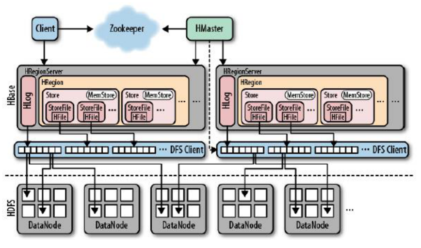

# HBase


# 概念

* 是一个分布式的,面向列的,可扩展的开源数据库,适用于非结构化数据的存储
* 高可靠性:HBase非常稳定
* 高性能:可以存储上亿或十亿级别的数据,可以实现毫秒级别的查询
* 面向列:数据是按照列存储
* 可伸缩:可以很方便的添加或删除一个节点
* NameSpace:可以理解为关系型数据库的数据库
* Table:类似为数据库中的表.必须是在文件路径中合法的名字,会映射在HDFS上的文件
* Row:在表里面,每行代表一个数据对象,每行都是一个行键(Row Key)进行唯一标识.行键可以是任何类型,在库中以字节存储
* RowKey:唯一标识,类似于主键,不可更改,只能删除后重新插入
* Column:列由Column family和Column qualifier组成,访问数据时用冒号(:)分割开
* Column family(CF):类似传统数据库的字段名,又称为列簇.和传统字段不同的是,CF中存储的数据类似于键值对,而其中的键值就是ColumnQualifier(CQ或Key),可以有多个CQ.这就相当于CF下又有字段,而真正的值则是存储于CQ下.一个表中可以有多个CF,也可以只有一个CF,需要根据实际情况而定.例如:userinfo{"username":"ddd","email":"12@ali.com"},password{"pwd":"123456"}.其中userinfo就是一个CF,其中的username是CQ,ddd是值(CellValue).password是另外一个CF
* Column qualifier:列簇中的数据通过列标识来进行映射,可以认为是key,如上个例子中的userinfo中的username,email
* Cell:每一个行键(rowkey),CF和CQ共同组成一个单元,值可以是任意类型,以字节存储
* Timestamp:每个值都会有一个timestamp,作为该值特定版本的标识符

  * 插入数据时若不指定该值,则默认为当前时间戳
  * 查询时若不指定时间戳,默认查询最新版本的值
  * Timestamp由HBase进行单独维护,默认只会维持3个版本的数据
* HBase中的数据类型只有一种:byte[]
* HBase与传统的关系型数据库的区别在于:

  * HBase处理的数据为PB级别,而传统数据库处理的一般是GB,TB数据
  * HBase只处理字节数据,而传统数据库的数据类型很丰富
  * HBase只支持单行ROW的ACID
  * HBase只支持rowkey的索引
  * HBase的吞吐量是百万级别/每秒,传统数据库数千/每秒
* HBase是基于HDFS系统进行数据存储,类似于Hive,但在Hadoop上提供了类似于Bigtable的能力
* 适合于非结构化数据的存储,如图片等,适合用来进行大数据的实时查询
* HBase提供了对数据的随机实时读写访问功能
* HBase内部使用哈希表,并存储索引,可将在HDFS中的数据进行快速查找
* HBase不适用于有join,多级索引,表关系复杂的数据模型
* HBase由Java Api(提供查询),Hmaster,RegionServer和自带的zk组成


> RowKey	|		Timestamp		|			CF1				|				   CF2
>
> ​														 |col1	| 	col2		|			col1   |	 col2 |
>
> ----------------------------------------------------------------------------------------------------------------------------------
>
> rowkey1			timestamp1		value1		value2		value1		value2
>
> ​							timestamp2		value3		value4		value3		value4


# 应用场景

* 半结构化或非结构化数据:对于数据结构字段不够确定或杂乱无章很难按一个概念去进行抽取的数据适合用HBase.比如文章的tag信息,就会不断的增加,删除
* 记录非常稀疏:RDBMS的行的列数是固定的,值为null的列浪费了存储空间.HBase为null的Column不会被存储,这样既节省了空间又提高了读性能
* 多版本数据:Rowkey和Columnkey定位到的Value可以有任意数量的版本值,因此对于需要存储变动历史记录的数据,用HBase就非常方便了.业务上一般只需要最新的值,但有时可能需要查询到历史值
* 超大数据量:当数据量越来越大,RDBMS数据库撑不住了,就出现了读写分离策略,通过一个Master专门负责写操作,多个Slave负责读操作,服务器成本倍增.随着压力增加,Master撑不住了,这时就要分库了,把关联不大的数据分开部署,一些join查询不能用了,需要借助中间层.随着数据量的进一步增加,一个表的记录越来越大,查询就变得很慢,于是又得搞分表,比如按ID取模分成多个表以减少单个表的记录数.采用HBase就简单了,只需要加机器即可,HBase会自动水平切分扩展,跟Hadoop的无缝集成保障了其数据可靠性(HDFS)和海量数据分析的高性能(MapReduce)


# 核心

* HMaster:中央节点
  * 将Region分配给regionserver,监控,协调Regionserver的负载均衡并维护集群状态
  * 维护表和Region的元数据,但是不参与数据的输入/输出过程
  * 多个Hmaster可以共存,但同时只会有一个Master在运行,其他处于待机状态
  * 在HBase启动的时候,会将所有表,Region信息(region开始key和结束key,所在regionserver的地址等)全部加载到HMaster中
* RegionServer:区域服务调度,实际数据处理
  * 维护Master分配给他的Region,处理对这些Region的请求
  * 负责切分正在运行的逐渐变的过大的Region,保证查询效率
  * 每个RegionServer只会处理一个CF的数据,当CF的数据值达到某个阀值时,会划分更多的Region来存储CF数据
  * 维护HLog,执行压缩
  * 运行在DataNode上,数量可以与DataNode数量相同
* Region:是HBase存储的最小单元,是HBase的基本单位
* Store:每个Region中都会包含一个或多个Store,用来接收和访问数据
* MemStore:每个Store中都会存在一个MemStore,是数据在内存中的实体,而且是有序的.当内存中的数据达到一定值之后,会创建一个Storefile,并将内存中的数据转入到Storefile中
* Storefile:由MemStore创建,是数据最终在HBase中的存储的位置.Storefile是HFile的一层封装,HFile是HDFS的基础,此时数据就将存储到HDFS中
* HLog:存在于每个RegionServer中,只有一个,是为了保证内存中的数据不丢失而存在,类似于Mysql的bin.log.数据会先在HLog中写入更新操作的日志,之后才会在MemStore中写入数据
* HBase启动
  * 将自己注册到zk(zookeeper)的backup节点中,因为开始时会有多个HMaster节点,需要进行抢占才能成为活动的HMaster
  * 抢占完成之后会将该节点从backup节点中删除,此时HMaster才会开始初始化一些数据,之后HMaster将等待RegionServer汇报
  * 此时RegionServer在zk中注册,并向HMaster汇报,HMaster就会存储可以使用的RegionServer信息,同时开始分配任务
  * 对所有RegionServer(包括已经失效的)数据进行整理,分配Region和Meta信息,将这些信息交给zk

* RegionServer失效
  * HMaster将失效的RegionServer上的Region分配到其他节点
  * HMaster更新hbase:meta表以保证数据正常访问

* HMaster失效
  * 集群模式下,由zk中处于backup状态的其他HMaster节点推选一个转为Active状态
  * 非集群模式下,HMaster挂了,数据仍旧能正常读写,因为是由RegionServer来完成,但是不能创建删除表,也不能更改表结构




## 读写流程

* 1.写:client先访问zk,得到对应的regionserver地址
* 2.client对regionserver发起写请求,regionserver接受数据写入内存
* 3.当memstore的大小达到一定值后,flush到storefile并存储到hdfs
* 4.读:client先访问zk,得到对应的regionserver地址
* 5.client对regionserver发起请求,regionserver收到请求后,先扫描自己的memstore,没有找到,再扫描blockcache(加速读内容缓存区),每有找到,再从storefile中读,然后将数据返回给client


## compact和split

* HBase写入时,先存储到memstore的内存中,当达到一定的大小时(默认128M)会flush到磁盘保存成HFile,当HFile小文件太多时会执行compact操作进行合并.而HFile的数量越少,检索的时间就越快越短
* 当Region的大小达到某一个阀值时,会执行split操作,将大的region分割成多个小的region,以便更快的执行查询
* compact又分为minor compaction和major compaction
* minorcompaction会选取一些小的,相邻的storefile将他们进行合并成一个更大的storefile.理论上就是hfile
* majorcompactioin将所有的storefile合并,同时还会清理无意义的数据,被删除的数据,TTL过期数据,版本号超过设定版本号的数据
* compact和split操作会消耗大量的性能,所以频繁的操作这2个方法会严重降低程序的性能.compact默认是开启的,默认10G,可以因为业务的需求而关闭,然后自行设计合并操作
* 何时会执行compact操作:当memstore中内容被flush到磁盘时,用户执行shell命令compact,major_compact或调用了相关的API,hbase后台周期性触发检查


# 特性

* 对小文件支持比较好,对大文件的支持无法满足
* 因HBase的设计,会发生比较耗时的compact和split操作,文件存储会比较频繁的触发这些操作
* 不适合复杂的检索功能
* 将大文件直接存储到HDFS,HBase只存储索引信息,可解决第一个问题
* 将HBase的memstore尽量调大,避免文件上传频繁flush,需要根据业务来设定,缓解compact和split带来的问题
* 关闭自动major compact功能,改为手动合并,或写脚本处理
* 将hbase-site.xml中的region的容量设置大一些,建表时预先分区
* HBase本身根据字典排序,用户自行在文件夹文件名上做处理
* 通过rowkey设计使其支持起始文件检索,文件前缀匹配等
* 对象存储本身并不需要复杂的检索操作
* 对配置文件中的相关配置进行特殊处理:
  * hbase.regionserver.handler.count:rpc请求线程数,默认是10
  * hbase.hregion.max.filesize:当region的大小大于设定值后就开始split
  * hbase.hregion.majorcompaction:majorcompaction的执行周期,默认是1天执行一次
  * hbase.hstore.compaction.min:每个store里的storefile总数超过该值,触发合并操作
  * hbase.hstore.compaction.max:一次最多合并多少个storefile
  * hbase.hstore.blockingStoreFile:region中的store里的storefile超过该值时,则block所有的写请求执行compaction
  * hfile.block.cache.size:regionserver的blockcache的内存大小限制
  * hbase.hregion.memstore.flush.size:mmestore超过该值将执行flush,默认128M
  * hbase.hregion.memstore.block.multiplier:若memstore的大小超过flush.size*multiplier,会阻塞该memstore的写操作
* 常用优化:预先分区,rowkey优化,column优化,scheme优化
* 预先分区:HBase在建表的时候默认只会在一个resionserver上建立一个region分区,可以在建表的时候预先创建一些空的region,根据rowkey来设定region的起始值和结束值,有目的的进行数据存储,减少region的split操作.同时可以将频繁访问的数据放在多个region中,将访问比较少的数据放在一个或几个region中,合理分配资源
* rowkey优化:利用hbase默认排序特点,将一起访问的数据放在一起,也就是一个CF中;防止热点问题,避免使用时序或单调的递增递减等.热点就是在集群中,大量的请求访问单个或少量几个数据,大量的访问是的这些服务器超出自身的处理能力,从而导致整个集群的性能下降.尽量减少rowkey字节数,尽量短
* rowkey必须唯一,如果不唯一,会被覆盖
* rowkey必须订场,建议是8byte的倍数
* rowkey是二进制字节流,理论长度不超过64k,越短越好,不超过100字节
* rowkey散列原则:高位字段散列,可以化解写入时的数据倾斜,散列值只要保证在同时刻唯一即可
* column优化:字段尽量短,一张表里的CF尽量不要超过3个
* schema优化:
  * 宽表:列多行少,每行存储的数据多,事务更好,因为hbase只支持行事务,不支持其他类型事务
  * 高表:列少行多,每列存储的数据多,查询来说,高表更好.但是开销更大,因为rowkey更多,region更多
* 写优化策略,同步提交或异步提交;WAL优化,是否必须,持久化等;Scan缓存设置,批量获取;BlockCache配置是否合理,HFile是否过多
* HBase在HDFS中默认有2个目录:default和hbase,其中hbase存放系统表,default存放用户表
  * hbase中的namespace表:存放所有的命名空间信息
  * hbase中的meta表:存放数据库所有的region信息的rowkey范围


# 安装

## 单机版

* 下载解压HBase安装包到/app/hbase中

* 配置Java环境变量

* 进入conf目录,配置hbase-site.xml文件

  ```xml
  <!-- 指定hbase的数据目录,若不设置,默认在/tmp目录下 -->
  <property>
  	<name>hbase.rootdir</name>
  	<value>file:///app/hbase/data</value>
  </property>
  ```

* 启动:bin/start-hbase.sh

* jps查看进程:HMaster,HRegionServer

* 访问ip:16010


## 伪分布式

* 在单机版基础上还需要增加其他[配置](http://abloz.com/hbase/book.html#hbase_default_configurations)

* 集群依赖于Hadoop,所以要先将Hadoop的集群搭建成功

* 复制hadoop的hdfs-site.xml和core-site.xml到hbase的conf文件夹下

* 修改hbase-env.sh

  ```shell
  # jdk路径
  export JAVA_HOME=/app/java/jdk1.8.0
  # 给hbase分配的内存空间
  # export HBASE_MASTER_OPTS="$HBASE_MASTER_OPTS -XX:PermSize=128m ..."
  # export HBASE_REGIONSERVER_OPTS="$HBASE_REGIONSERVER_OPTS..."
  # 是否使用hbase自带的zk,true表示使用
  export HBASE_MANAGES_ZK = true
  ```

* 修改hbase-site.xml,在configuration标签添加如下:

  ```xml
  <!-- 指定hbase的根目录,基于hadoop的ip:端口,加上自定义的目录名,会在hbase启动时自动在hadoop下创建 -->
  <property>
  	<name>hbase.rootdir</name>
  	<value>hdfs://localhost:9000/hbase</value>
  </property>
  <!-- 指定hbase是否以集群的方式运行 -->
  <property>
  	<name>hbase.cluster.distributed</name>
  	<value>true</value>
  </property>
  <!-- 若不使用自带的zk,需配置zk地址:第1个是zk的ip,第2个是zk的端口,多个用逗号隔开 -->
  <property>
  	<name>hbase.zookeeper.quorum</name>
  	<value>localhost</value>
  </property>
  <property>
  	<name>hbase.zookeeper.property.clientPort</name>
  	<value>2181</value>
  </property>
  <!-- 指定zookeeper的存储路径 -->
  <property>
  	<name>hbase.zookeeper.property.dataDir</name>
  	<value>/app/hadoop/hadoop-2.9.1/zookeeper</value>
  </property>
  <!-- memstore的内存刷新大小,默认128M,可以设置成256M,单位为字节 -->
  <property>
  	<name>hbase.hregion.memstore.flush.size</name>
  	<value>268435456</value>
  </property>
  <!-- 最大storefile大小,超过这个大小,hbase将开始合并storefile,而存储这个storefile的region将被切割,默认是10G -->
  <property>
  	<name>hbase.hregion.max.filesize</name>
  	<value>10737418240</value>
  </property>
  <!-- region中所有storefile的major compactions时间间隔,默认1天,0表示禁用这个功能 -->
  <property>
  	<name>hbase.hregion.majorcompaction</name>
  	<value>0</value>
  </property>
  ```

* 启动hbase:进入hbase/bin下,sh start-hbase.sh,会显示启动了zk,master,regionserver

* jps:显示HMaster,HRegionServer,HQuorumPeer

* 进入到hbase的命令行:./hbase shell,进入控制台后,执行status,会显示当前hbase的状态


# Shell操作

* create 'tablename','列名1','列名2','列名...':创建表
* list:查看存在那些表
* desc 'tablename':查看表的描述信息
* alter 'tablename','列名3':添加一个CF
* alter 'tablename',{NAME=>'列名',METHOD=>'delete'}:删除列
* put 'tablename','rowkey','cfname:key','值':添加记录
* get 'tablename','rowkey':查看记录
* count 'tablename':查看表中的记录总数
* delete 'tablename','rowkey','cfname:key':删除记录
* disable 'tablename':屏蔽表
* drop 'tablename':先要屏蔽该表,才能删除该表
* scan 'tablename':查看所有记录
* scan 'tablename',{STARTROW=>'rowkey',LIMIT=>1,VERSIONS=>1};查询指定条数的记录
* scan 'tablename',['cfname:key']:查看某个表某个列中所有数据
* list_namespace:查看所有的命名空间,类似于MySQL中的数据库
* list_namespace_tables 'tablename':查看命名空间中所有的表
* create_namespace 'ns1':创建一个命名空间,行键rowkey是命名空间的名称


# Coprocessor

* HBase的协处理器,为用户提供类库和运行时环境,使代码能够在HBase RegionServer和Master上运行

* 协处理器分为系统协处理器和表协处理器
* 系统协处理器:全局加载到Regionserver托管的所有表和region上,针对整个hbase集群

* 表协处理器:用户可以指定一张表使用协处理器,只针对一张表

* Observer(观察者):类似于传统数据库的触发器
  * RegionObserver:提供客户端的数据操作事件钩子:get,put,delete,scan
  * MasterObserver:提供DDL类型的操作钩子,如创建,删除,修改数据表等
  * WALObserver:提供WAL相关日志操作钩子
  * 应用:安全性,在执行get或put之前,通过preGet或prePut方法检查是否允许该操作
  * 引用完整性约束:HBase不支持关系型数据库中的引用完整性约束概念,即外键,可以使用协处理器增强这种约束
  * 二级索引:可以使用协处理器来维持一个二级索引

* Endpoint(终端):动态的终端有点像存储过程,是动态RPC插件的接口,他实现的代码被安装在服务器,从而能通过hbase rpc唤醒
* 调用接口,他们的实现代码会被目标RegionServer远程执行


# 容灾备份


## CopyTable

* 支持时间区间,row区间,改变表名称,改变列簇名称,指定是否copy已经被删除的数据等功能
* 工具采用scan查询,写入新表时采用put和delete api,全部是基于hbase的client api进行读写
* 具体操作

>
	打开hbase的shell控制台:原表为table1,备份表为table2,备份表的名字可以和原表不一样,但是table2的列簇要和原表一样
	table2创建好之后,在hbase下执行hbase org.apache.hadoop.hbase.mapreduce.CopyTable --new.name=table2 table1
	-- 其实是执行CopyTable这个类,参数则是new.name,table2是目的表,table1是原数据表


## Export/Import

* export可导出数据到目标集群,然后可在目标集群import导入数据,export支持指定开始时间和结束时间,因此可以做增量备份
* export导出工具与copytable一样是依赖hbase的scan读取数据
* 具体操作

>
	Export:tablename是需要备份的表名,紧接的是备份的地址以及备份的文件名,版本号,开始时间,结束时间可选
	-- bin/hbase org.apache.hadoop.hbase.mapreduce.Export tablename hdfs://namenode:9000/bakdir [version] [starttime] [endtime]
	Import:
	-- bin/hbase [-Dhbase.import.version=0.94] org.apache.hadoop.hbase.mapreduce.Import tablename bakdir


## Snapshot

* snapshot即快照功能,通过配置hbase-site.xml开始该功能

>
	<property>
		<name>hbase.snapshot.enabled</name>
		<value>true</value>
	</property>

* 可以快速恢复表至快照指定的状态从而迅速修复数据,但是会丢失快照之后的数据

>
	创建快照:snapshot 'tablename' ,'tablename_bak'
	克隆快照:clone_snapshot  'table_bak' 'newtablename'
	列出快照:list_snapshots
	删除快照:delete_snapshot 'table_bak'
	恢复数据:disable 'tablename';restore_snapshot 'tablename_bak'


## Replication

* 可以通过replication机制实现hbase集群的主从模式,通过配置hbase-site.xml开始该功能

><property>
		<name>hbase.replication</name>
		<value>true</value>
	</property>

* replication是依赖WAL日志进行的同步,所以必须开启WAL

>
	在源集群及目标集群都创建同名表
	指定目标集群zk地址和路径:add_peer '1',"zk01:2181:/hbase_backup";(1:一个id值,在下面的复制上要用)
	标注需要备份的列簇信息及备份的目标库地址
	replication_scope值为上面add_peer指定的值
	disable 'tablename';alter 'tablename',{NAME=>'f1',REPLICATION_SCOPE=>'1'}


# 监控

* Ambari:apache开源软件,创建,管理,监视hadoop的集群,可监控hadoop,hbase,hive,zk等
* Hadoop启动之后默认的监控页面:ip:50070,也可以通过ip:50070/jmx获取json信息
* HBase启动之后默认的监控页面:ip:16010,也可以通过ip:16010/jmx获取json信息


# Phoenix

* 构建在HBase之上的一个sql中间层,可以在hbase上执行sql查询,性能强劲,有较完善的查询支持,支持二级索引,查询效率较高
* put the sql back in nosql,将传统的sql语句运用到nosql中
* 具有完整ACID事务功能的标准sql和jdbc api的强大功能
* 完全可以和其他hadoop产品集成,如spark,hive,pig,flume以及mapreduce
* 通过hbase协处理器,在服务端进行操作,从而最大限度的减少客户端和服务器的数据传输
* 通过定制的过滤器对数据进行处理
* 使用本地的hbase api而不是通过mapreduce框架,这样能最大限度降低启动成本


## 安装

* 下载tar包,解压到响应文件夹
* 将解压后的文件夹中的phoenix-core-xx-hbase-xx.jar拷贝到每个hbase文件夹下的lib中,若是集群,每个hbase目录都要拷贝
* 将phoenix-xx-hbase-xx-server.jar同样拷贝到所有的hbase/lib下
* 重启hbase服务
* 进入phoenix的客户端,启动shell客户端:进入phoenix/bin  ./sqlline.py


# HBase表设计

* mysql中的表设计比较简单,就4个表:用户表,token表,权限bucket表,权限与token多对多中间表
* hbase中的数据分为2个表:目录表和文件表

>
	设计方案一(本程序使用):
	目录表:rowkey是目录路径,列簇sub:CQ为直接下级目录名称,值随意,cf:其他信息,如目录创建人,目录唯一编号(SEQID,有序的数字)
	文件表:rowkey是所属目录中的唯一编号(SEQID)+_+文件的名称,列簇有cf:文件的基本信息,如文件的创建者,文件大小等,c:文件字节码

* 不将所有的数据做一个表的原因:直接用文件的全路径或自增或文件名都会造成严重的热点问题,用seqid能缓解一部分问题,同时还便于查询文件,保证文件的有序性

>
	设计方案二:
	目录表:rowkey同上,列簇sub:其中CQ以d_开头则是下级目录,CQ以f_开头,则是文件,其值为文件表的rowkey,cf列簇同上
	文件表:rowkey为uuid,可彻底解决文件的热点问题,其他同上

* 该方案的目录表中设计的问题是:文件不能进行过滤,因为hbase只能对rowkey进行start和stop过滤,会浪费性能
