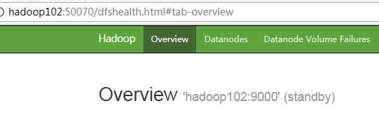
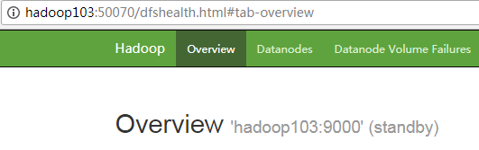
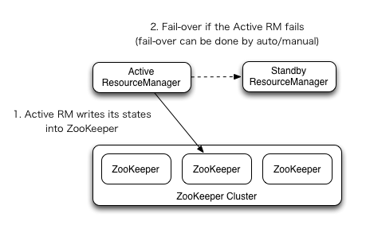
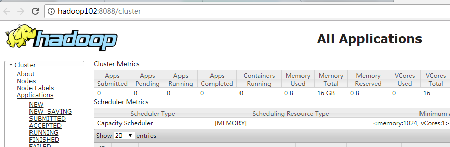
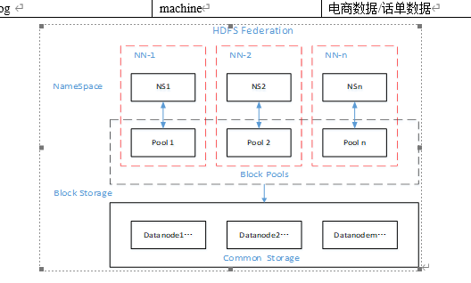

# Hadoop


# 概述

* 主要由HDFS,MR,YARN,COMMON组成,1.0中Yarn的功能由MR实现,2.0中独立出来
* HDFS:Hadoop Distributed File System,高可靠,高吞吐量的分布式文件系统
* MR:MapReduce,分布式离线并行计算框架
* YARN:作业调度与集群资源管理的框架
* COMMON:支持其他模块的工具模块,如RPC,序列化,日志等
* 高可靠性:维护多个工作副本,集群部署,在出现故障时可以对失败的节点重新分布处理
* 高扩展性:在集群间分配任务数据,可方便的扩展数以千计的节点
* 高效性:在MR的思想下,hadoop是并行工作的
* 高容错性:自动保存多份副本数据,并且能够自动将失败的任务重新分配


# 应用场景

* 物流仓储:大数据分析系统助力商家精细化运营,提升销量,节约成本
* 零售:分析用户消费习惯,为用户购买商品提供方便,从而提升商品销量
* 旅游:深度结合大数据能力与旅游行业需求,共建旅游产业智慧管理,智慧服务和智慧营销的未来
* 商品广告推荐:给用户推荐可能喜欢的商品
* 保险:海量数据挖掘以及风险预测,助力保险行业精准营销,提升精细化定价能力
* 金融:多维度体现用户特征,帮助金融机构推荐优质客户,防范欺诈风险
* 房产:大数据全面助力房地产行业,打造精准投策和营销,选出合适的地,建合适的楼,卖合适的人
* 人工智能:大数据+算法


# 生态

* HDFS:解决存储问题
* MapReduce:解决计算问题
* Yarn:解决资源调度问题
* Zookeeper:分布式应用协调服务
* Flume:日志收集
* Hive:基于Hadoop的数仓工具,离线计算,支持SQL除了更新,索引和事务之外几乎所有特性
* HBase:分布式,面向列的开源数据源,近实时数据查询
* Sqoop:数据转换,主要用于HBase/Hive等列数据库和RDMS数据库相互导入导出数据
* Scala:多范式编程语言,面向对象和函数式编程的特性
* Spark:目前企业常用的批处理离线/实时计算引擎
* Flink:目前最火的流处理框架,既支持流处理,也支持批处理
* Elasticsearch:大数据分布式实时弹性搜索引擎
* Pig:Hadoop客户端,使用类似于SQL的面向数据流的语言
* Avro:数据序列化工具,用于支持大量数据的交换的应用


# 核心

* HDFS是一个主从(Master/Slave)结构框架,由一个NameNode和多个DataNode构成


## 存储模型

* 文件线性按字节切割成块(block),具有offset,id
* 文件与文件的block大小可以不一样
* 一个文件除最后一个block,其他block大小一致
* block的大小依据硬件的IO特性调整,如果性能好就可以加大该值
* block中包含真实的文件数据,数据长度,校验和(文件完整性校验),时间戳
* block被分散存放在集群的节点汇总,具有location
* block具有副本(replication),没有主从概念,副本不能出现在同一个节点,是满足可靠性和性能的关键
* 文件上传可以指定block大小和副本数,上传后只能修改副本数
* 一次写入多次读取,不支持修改,因为修改会改变block的大小,进而改变offset,这需要消耗大量的计算机资源
* 支持追加数据,只能在block末尾追加
* hdfs删除时只能删除文件,不能删除block,和修改是同样的原因


## Block的放置策略

* 第一个副本:放置在上传文件的DN上.如果是集群外提交,则随机挑选一台磁盘不太满,cpu不太忙的节点
* 第二个副本:放置在于第一个副本不同的机架节点上
* 第三个副本:与第二个副本相同机架的节点
* 更多副本:随机节点


## Job

* 任务名称
* 任务作业


## JobTracker

* 项目经理,在Hadoop2.0以上的版本中已经去掉了
* JobTracker对应于NameNode
* JobTracker是一个master服务,软件启动之后JobTracker接收Job,负责调度Job的每一个子任务
* Task运行于TaskTracker上,并监控它们,如果发现有失败的task就重新运行它


## TaskTracker

* 开发组长,在Hadoop2.0以上的版本中已经去掉了
* TaskTracker对应于DataNode
* TaskTracker是运行在多个节点上的slaver服务
* TaskTracker主动与JobTracker通信,接收作业,并负责直接执行每一个任务


## Child

* 负责开发的人员


# HDFS


# NameNode(NN)

## 概述

* 文件元数据(metadata)节点
* 存储文件元数据,包括文件名,目录结构,属性,每个文件的block列表和block所在的datanode
* 完全基于内存运行
* 需要持久化方案保证数据可靠性
* 提供副本放置策略

* 元数据持久化
  * 任何对文件系统元数据产生修改的操作,NN都会使用一种称为EditLog的事务日志记录下来
  * 使用FsImage存储内存所有的元数据状态
  * 使用本地磁盘保存EditLog和FsImage
  * EditLog具有完整性,数据丢失少,但恢复速度慢,并有体积膨胀风险
  * FsImage具有恢复速度快,体积与内存数据相当,但不能实时保存,数据丢失多
  * NN使用了FsImage+EdieLog整合的方案:滚动将增量的EditLog更新到FsImage,保证更近实时的FsImage和更小的EditLog体积


## NN故障处理


### 第一种

* 将SNN中数据拷贝到NN存储的目录
  * kill -9 NN进程
  * 删除NN存储的数据
  * 拷贝SNN中数据到原NN存储数据目录
  * 重启NN


### 第二种

* 使用-importCheckpoint选项启动NN守护进程,从而将SNN中数据拷贝到NN目录中

  * 修改hdfs-site.xml,减少checkpoint的时间,指定nn目录

    ```xml
    <property>
    	<!-- 减少SNN检查的时间 -->
    	<name>dfs.namenode.checkpoint.period</name>
    	<value>120</value>
    </property>
    <property>
    	<!-- 指定nn目录 -->
    	<name>dfs.namenode.name.dir</name>
    	<value>/app/hadoop/data/tmp/dfs/name</value>
    </property>
    ```

  * kill -9 NN进程

  * 删除NN存储的数据:rm -rf /app/hadoop/data/tmp/dfs/name/*

  * 若SNN不和NN在一个节点上,需要将SNN存储数据的目录拷贝到NN存储数据的同级目录,并删除in_use.lock文件

  * 导入检查点数据,等待一会再用ctrl+c结束掉

  * 重启NN


## NN多目录配置

* 在hdfs-site.xml中添加如下内容

  ```xml
  <property>
  <name>dfs.namenode.name.dir</name>
  <value>file:///${hadoop.tmp.dir}/dfs/name1,file:///${hadoop.tmp.dir}/dfs/name2</value>
  </property>
  ```

* 停止集群,删除data和logs目录所有数据

* 格式化集群并重启


# 安全模式

* HDFS搭建时会先格式化,此时会产生一个空的FsImage
* 当NN启动时,它从硬盘中读取EditLog和FsImage
* 将所有EditLog中是事务作用在内存中的FsImage中,并将新的FsImage从内存中保存到本地磁盘
* 删除旧的EditLog,因为这个旧的EditLog已经作用在FsImage上了
* NN启动后会进入安全模式状态,该状态下不进行数据块的复制,而是接收DN的心跳和块状态报告
* 每当NN检测确认某个数据块的副本数目达到必须的最小值,则该数据块就会被认为是副本安全的
* 最小副本条件指整个文件系统中99.9%的块满足最小副本级别(dfs.replication=1)
* 在一定百分比(可配置)的数据块被NN检测确认是安全后(再加一个额外的30S等待),NN将退出安全模式状态
* 接下来NN会确定还有哪些数据块的副本没有达到指定数目,并将这些数据库块制到其他DN上
* 相关命令:
  * hdfs dfsadmin -safemode get:查看安全模式状态
  * hdfs dfsadmin -safemode enter:进入安全模式状态
  * hdfs dfsadmin -safemode leave:离开安全模式状态
  * hdfs dfsadmin -safemode wait:等到安全模式状态


# DataNode(DN)

* 数据节点,在本地文件系统存储文件块数据(block),以及提供块数据的校验,读写
* DataNode和NameNode维持心跳,并汇报自己持有的block信息

* 客户端和NameNode交互文件的元数据,和DataNode交互文件爱你block信息


## DN数据完整性

* 当DN读取Block数据时,会计算CheckSum
* 若计算后的CheckSum与Block创建时不一样,说明Block已经损坏
* Client读取其他DN上的Block
* DN在其文件创建后周期验证CheckSum


## DN心跳

* DN进程死亡或网络故障造成DN无法与NN通信,NN不会立即将该节点判定为离线,要经过一段时间,这段时间称为超时时长

* HDFS默认的超时时长为10分钟+30秒

* 若定义超时时间为TimeOut,则超时时长计算公式如下
  $$
  TimeOut=2*dfs.namenode.heartbeat.recheck-interval+10*dfs.heartbeat.interval
  $$

* 默认的dfs.namenode.heartbeat.recheck-interval为5分钟,dfs.heartbeat.interval默认为3秒


## DN多目录

* DN可以配置多个目录,每个目录存储的数据不一样,即数据不是副本

  ```xml
  <property>
  <name>dfs.datanode.data.dir</name>
  <value>file:///${hadoop.tmp.dir}/dfs/data1,file:///${hadoop.tmp.dir}/dfs/data2</value>
  </property>
  ```

* 删除data和logs,重启DN


## DN新增

* 复制已有的DN,修改IP和主机名
* 修改xcall和xsync脚本,增加新节点的同步
* 删除原来DN的HDFS文件系统留下的data和logs目录
* source一下配置文件,之后直接启动DN:hadoop-daemon.sh start datanode
* 也可以重新配置一台机器,但太费事


## DN退役


## DN核心


## DN目录结构

* DN的数据放在由配置文件core-site.xml指定的hadoop.tmp.dir下


# Secondary NameNode(SNN)

* 监控hdfs状态的辅助后台程序,每隔一段时间获得hdfs元数据的快照

* 在非HA模式下,SNN是独立的节点,周期完成对NN的EditLog向FsImage合并,减少EditLog大小
* 根据配置文件设置的时间间隔:fs.checkpoint.period,默认3600S
* 根据配置文件设置edits log大小:fs.checkpoint.size,规定edits文件的最大值默认是64M


# 写流程

* Client和NN连接创建文件元数据,连接后NN判定元数据是否有效
* NN触发副本放置策略,返回一个有序的DN列表
* Client和DN建立Pipeline连接
* Client将块切分成packet(64KB),并使用chunk(512B)+chucksum(4B)填充
* Client将packet放入发送列队dataqueue中,并向第一个DN发送
* 第一个DN接收packet后本地保存并发给第二个DN,第二个DN接收packet后本地保存并发给第三个DN
* 这个过程中,上游节点同时发送下一个packet,HDFS使用这种传输方式,副本数对于Client是透明的
* 当block传输完成,DN各自向NN汇报,同时Client继续传输下一个block
* 所以,Client的传输和block的汇报也是并行的


# 读流程

* 为降低整体带宽消耗和读取延迟,HDFS会进来让读取程序取离它最近的副本
* 如果在读取程序的同一个机架上有一个副本,那么就读取该副本
* 如果一个HDFS集群跨越多个数据中心,那么客户端也将首先读本地数据中心的副本
* 如下载一个文件
  * Client和NN交互文件元数据获取fileBlockLocation
  * NN会按距离策略排序返回
  * Client尝试下载block并校验数据完整性


# 2.X新特性

## 集群间数据拷贝

* distcp实现两个远程主机之间的文件复制,从src拷贝到des

  ```shell
  bin/hadoop distcp hdfs://hadoop001:9000/user/test1.txt hdfs://hadoop002:9000/user/test2.txt 
  ```


## 小文件存档

* 每个文件均按块存储,每个块的元数据存储在NN的内存中,因此HDFS存储小文件会非常低效.因为大量的小文件会耗尽NN中的大部分内存,但是存储小文件所需要的磁盘容量和数据块的大小无关

* 解决小文件存储的办法:HDFS归档文件或HAR文件

  ```shell
  # 归档文件,files.har为自定义归档名称,要带上har,归档src到des
  bin/hadoop archive -archiveName files.har -p /hadoop/test/* /hadoop/archive
  # 查看归档文件
  hadoop fs -lsr /hadoop/archive/files.har
  # 解归档文件
  hadoop -fs -cp har:///hadoop/archive/files.har /hadoop/unarchive
  ```


## 回收站

* 在core-site.xml中添加如下配置

  ```xml
  <!-- 0表示禁用回收站,其他值表示设置文件的存活时间,单位分钟 -->
  <property>
  	<name>fs.trash.interval</name>
  	<value>1</value>
  </property>
  <!-- 检查回收站的时间间隔,如果为0,该值设置和fs.trash.interval值相同 -->
  <property>
  	<name>fs.trash.checkpoint.interval</name>
  	<value>1</value>
  </property>
  <!-- 修改访问回收站的用户名,默认是dr.who -->
  <property>
  	<name>hadoop.http.staticuser.user</name>
  	<value>hadoop</value>
  </property>
  ```

* 查看回收站:/hadoop/hadoop/.Trash

* 通过程序删除的文件不会经过回收站,需要调用moveToTrash()才进入回收站

* 恢复回收站数据

  ```shell
  hadoop fs -mv /hadoop/hadoop/.Trash/Current/file /hadoop/hadoop/test
  ```

* 清空回收站

  ```shell
  hadoop fs -expunge
  ```

  

## 快照管理

* 快照相当于对目录做一个备份,并不会立即复制所有文件,当写入时才会产生新文件
* hdfs dfsadmin -allowSnapshot path:开启指定目录的快照功能
* hdfs dfsadmin -disallowSnapshot path:禁用指定目录的快照功能,默认是禁用
* hdfs dfs -createSnapshot path [name]:对目录创建快照,默认是当前时间为名称
* hdfs dfs -renameSnapshot path oldname newname:重命名快照
* hdfs lsSnapshottableDir:列出当前用户所有可快照目录
* hdfs snapshotDiff path1 path2:比较两个快照目录的不同之处
* hdfs dfs -deleteSnapshot [path] [snapshotName]:删除快照,根据路径或名称


# MapReduce(MR)

是一个分布式运算程序的编程框架,核心功能是将用户编写的业务逻辑代码和自带默认组件整合成一个完整的分布式运算程序,并发运行在一个hadoop集群上


# 优点

* MR易于编程,简单的实现一些接口就可以完成一个分布式程序
* 良好的扩展性,可以通过增加机器来增加程序的计算能力
* 高容错性,即使集群中的一台机器挂掉了,它可以把上面的计算任务转移到另外一个节点上运行
* 适合PB级别以上海量数据的离线处理


# 缺点

* MR不适合做实时计算,流式计算,DAG(有向图)计算
* 实时计算:因为MR是读取磁盘上的文件,做处理比较慢
* 流式计算:流式计算的输入数据是动态的,而MR的输入数据是静态的,这取决于MR的设计特点
* DAG:多个应用程序存在依赖关系,后一个应用程序的输入为前一个的输出.在这种情况下,MR作业的结果会写入到磁盘中,会产生大量的磁盘IO,导致性能很低


# 核心

* 分布式运算程序分为Map和Reduce阶段
* MapTask实例:负责Map阶段的整个数据处理,完全并行运行,互不干涉
* ReduceTask实例:负责Reduce阶段数据处理,并发运行,互不干涉,数据依赖于Map的输出
* MR只能包含一个Map阶段和一个Reduce阶段,如果逻辑很复杂,只能多个MR串行运行
* 将文件中的内容按行读取,之后按照空格进行切分
* 再开辟空间进行分区排序,排序按字典排序,将结果放在一个类似map的集合中
* 排序之后再将相同的项进行合并
* MrAppMaster:负责整个程序的过程调度及状态协调


# 编程规范


## Mapper阶段

1. 用户自定义的Mapper要继承自己的父类
2. Mapper的输入数据是KV对的形式
3. Mapper中的业务逻辑卸载map()方法中
4. Mapper的输出数据是KV对的形式
5. map()方法(MapTask进程)对每一KV对调用一次


## Reducer阶段

1. 用户自定义的Reducer要继承自己的父类
2. Reducer的输入数据类型对应Mapper的输出数据类型,也是KV
3. Reducer的业务逻辑卸载reduce()方法中
4. ReduceTask进程对每一组相同k的KV组调用一次reduce()方法


## Driver阶段

1. 相当于YARN集群的客户端,用于提交整个程序到YARN集群,提交的是封装了MR程序相关运行参数的job对象
2. 获取配置信息,获取job对象实例
3. 指定本程序的jar包所在的本地路径
4. 关联Mapper/Reducer业务类
5. 指定Mapper输出数据的kv类型
6. 指定最终输出的数据的kv类型
7. 指定kv的输入原始文件所在目录
8. 指定job的输出结果多在目录
9. 提交作业


# 序列化

* Hadoop自带的序列化(Writable),不使用Java的序列化(比较重量级)
* 紧凑:高效使用存储空间
* 快速:读写数据的额外开销小
* 可扩展:随着通信协议的升级和升级
* 互操作:支持多语言的交互


## 实现序列化

1. 必须实现Writable接口
2. 反序列化时,需要反射调用空参构造函数,所以必须有空参构造
3. 重写序列化方法
4. 重写反序列化方法
5. 注意反序列化的顺序和序列化的顺序完全一致
6. 要想把结果显示在文件中,需要重写toString(),可用”\t”分开,方便后续用
7. 如果需要将自定义的bean放在key中传输,则还需要实现Comparable接口,因为MapReduce框中的Shuffle过程要求对key必须能排序


# MapTask并行度

* 数据切片:数据切片只是在逻辑上对输入进行分片,并不会在磁盘上将其切分成片进行存储
* 一个job的Map阶段并行度由客户端在提交job时的切片数决定
* 每个Split切片分配一个MapTask并行实例处理
* 默认情况下,切片大小等于Block大小
* 切片时不考虑数据集整体,而是逐个针对每个文件单独切片


# WritableComparable排序

* 排序是MR框架中最重要的操作之一,MapTask和ReduceTask均会对数据(按照key)进行排序
* 排序操作属于Hadoop的默认行为,任何应用程序中的数据均会被排序,不管逻辑上是否需要
* 默认排序是按照字典顺序排序,且实际该排序方式是快速排序
* MapTask(MT)
  * 将处理的结果暂时放到一个缓冲区中
  * 当缓冲区使用率达到一定阈值(80%)后,对缓冲区的数据进行一次快速排序,并将结果写到磁盘上
  * 当数据处理完毕后,MT会对磁盘上所有文件进行一次归并排序:合并文件并排序
* ReduceTask(RT)
  * 从每个MT上远程拷贝相应的数据文件
  * 若文件大小超过一定阈值,则放到磁盘上,否则放到内存中
  * 若磁盘上文件数目达到一定阈值,则进行一次合并以生成一个更大文件
  * 如果内存中文件大小或者数目超过一定阈值,则进行一次合并后将数据写到磁盘上
  * 当所有数据拷贝完毕后,RT统一对内存和磁盘上的所有数据进行一次归并排序
* 排序的分类
  * 部分排序:MR根据输入记录的键对数据集排序,保证输出的每个文件内部有序
  * 全排序:最终输出结果只有一个文件,且文件内部有序
    * 只使用一个分区就会产生全排序,也只输出一个结果
    * 该方法在处理大型文件时效率极低,因为一台机器必须处理所有输出文件,从而完全丧失了MR所提供的并行架构
    * 替代方案:
      * 首先创建一系列排好序的文件
      * 其次,串联这些文件;
      * 最后,生成一个全局排序的文件
      * 主要思路是使用一个分区来描述输出的全局排序
      * 例如:可以为上述文件创建3个分区,在第一分区中,记录的单词首字母a-g,第二分区记录单词首字母h-n, 第三分区记录单词首字母o-z
  * 辅助排序:GroupingComparator分组,在Reducer端对key进行分组,应用于:在接收的key为bean对象时,想让一个或几个字段相同(全部字段比较不相同)的key进入到同一个reduce方法时,可才分组排序
  * 二次排序:在自定义排序过程中,如果compareTo中的判断条件为两个则为二次排序
* 案例:paradise-study-hdfs/com.wy.sort


# Combiner合并

* combiner是MR程序中Mapper和Reducer之外的一种组件

* combiner组件的父类就是Reducer

* combiner和reducer的区别在于运行的位置:

  * Combiner是在每一个maptask所在的节点运行
  * Reducer是接收全局所有Mapper的输出结果

* combiner的意义就是对每一个maptask的输出进行局部汇总,以减小网络传输量

* 自定义Combiner实现步骤:

  * 自定义一个combiner继承Reducer,重写reduce方法

    ```java
    public class  WordcountCombiner extends Reducer<Text, IntWritable, Text,  IntWritable>{
        @Override
        protected void reduce(Text key,  Iterable<IntWritable> values,Context context) throws  IOException, InterruptedException {
            int count = 0;
            for(IntWritable v :values){
                count = v.get();
            }
            context.write(key, new  IntWritable(count));
        }
    }
    ```

  * 在job启动类中设置:job.setCombinerClass(WordcountCombiner.class);

* combiner能够应用的前提是不能影响最终的业务逻辑,而且,combiner的输出kv应该跟reducer的输入kv类型要对应起来


# GroupingComparator分组（辅助排序）

* 对Reduce阶段的数据根据某一个或几个字段进行分组

* 分组排序步骤:

  * 自定义类继承WritableComparator

  * 重写compare()方法

    ```java
    @Override
    public int compare(WritableComparable a, WritableComparable b) {
       // 比较的业务逻辑
       return result;
    }
    ```

* 创建一个构造将比较对象的类传给父类

  ```java
  protected OrderGroupingComparator() {
     super(OrderBean.class, true);
  }
  ```


# YARN


# ResourceManager(rm)

* 资源管理,一个集群只有一个RM是活动状态

* 处理客户端请求
* 监控NodeManager
* 启动和监控ApplicationMaster
* 资源分配与调度


# NodeManager(nm)

* 节点管理,集群中有N个,负责单个节点的资源管理和使用以及task运行状况

* 单个节点上的资源管理和任务管理
* 处理来自ResourceManager和ApplicationMaster的命令
* 定期向RM汇报本节点的资源使用请求和各个Container的运行状态


# ApplicationMaster

* 每个应用/作业对应一个,并分配给内部任务

* 数据切分
* 为应用程序向RM申请资源(Container),并分配给内部任务
* 与NM通信以启动或停止task,task是运行在Container中的
* task任务监控和容错


# Container

* 对任务运行环境的抽象,封装了CPU,内存等多维资源以及环境变量,启动命令等任务信息


# 执行流程

* 用户向YRAN提交作业
* RM为该作业分配第一个Container(AM)
* RM会与对应的NM通信,要求NM在这个Container上启动应用程序的AM
* AM首先向RM注册,然后AM将为各个任务申请资源,并监控运行情况
* AM采用轮询的方式通过RPC协议向RM申请和领取资源
* AM申请到资源后,便和对应的NM通信,要求NM启动任务
* NM启动作业对应的task


# yarn-site.xml

```xml
<!-- 单个任务可申请的最小虚拟CPU个数 -->
<property>
	<name>yarn.scheduler.minimum-allocation-vcores</name>
	<value>1</value>
</property>
<!-- 单个任务可申请的最大虚拟CPU个数,该参数对应yarn.nodemanager.resource.cpu-vcores,建议最大为一个物理CPU的数量 -->
<property>
	<name>yarn.scheduler.maximum-allocation-vcores</name>
	<value>3</value>
</property>
<!-- 该节点上可分配的物理内存总量 -->
<property>
	<name>yarn.nodemanager.resource.memory-mb</name>
	<value>1024</value>
</property>
<!-- 该节点上YARN可使用的虚拟CPU个数,一个物理CPU对应3个虚拟CPU -->
<property>
	<name>yarn.nodemanager.resource.cpu-vcores</name>
	<value>3</value>
</property>
<!-- 单个任务可申请的最多物理内存量 -->
<property>
	<name>yarn.scheduler.maximum-allocation-mb</name>
	<value>43008</value>
</property>
<!-- 是否开启YARN ha -->
<property>
	<name>yarn.resourcemanager.ha.enabled</name>
	<value>true</value>
</property>
<!-- ha状态切换为自动切换 -->
<property>
	<name>yarn.resourcemanager.ha.automatic-failover.embedded</name>
	<value>true</value>
</property>
```


# Shell API

* hadoop fs:查看hadoop的命令,大部分和linux类似,但是都是以hadoop fs开头
* hadoop checknative -a:检查hadoop本地库是否正常,false不正常
* bin/hadoop fs -setrep -R 3 /:设置集群block的备份数,不需要重启
* hadoop fs [] 

  * -ls /file:查看上传的文件是否成功,成功会列出文件地址,否则报错文件不存在
* -lsr /folder:对目录进行递归查看
  * -mkdir /folder:创建目录
  * -moveFromLocal src des:将本地文件上传到hdfs中,同时会删除本地文件
  * -appendToFile src des:将本地文件的内容追加到hdfs中某个文件中,本地文件不变
  * -put/-copyFromLocal src des:将本地文件上传到hdfs中,本地文件不删除.若是/des存在,则删除hadoop fs -rm -r /des,提示deleted des才表示删除成功
  * -get/-copyToLocal src des:将hdfs从的文件拷贝到本地目录,hdfs中的文件不删除
  * -cp/-mv/-tail src des:类似linux的cp/mv/tail,只能在hdfs中拷贝和使用
  * -getmerge folder file:将hdfs中的多个文件合并下载到本地
  * -cat file:查看文件内容
  * -text file:查看文件内容
  * -rm -r /file:删除hadoop集群中的文件或目录
* hadoop jar XXX.jar xx.xx.xxx.TestMain /input /output:运行jar包,需要指定main所在类,/input表示上传文件所在地址,/output表示文件输出地址,且该地址不能是已经存在的
* hadoop distcp hdfs://hadoop001:9000/file1 hdfs://hadoop002:9000/file2:hadoop2.0才有该命令,可以实现直接将hdfs中的file1复制到hdfs的file2中,而且是递归复制


# 伪分布式

1. 环境为linux,centos7.6

2. 下载jdk1.8.0.tar.gz,hadoop2.9.1.tar.gz,在linux根目录新建目录app,app下新建目录java,hadoop

4. 解压jdk和hadoop到各自文件夹中,tar -zxvf jdk1.8.0.tar.gz

5. 解压完成之后配置环境变量,编辑 vi /etc/profile,在文件最底下添加

   ```shell
   JAVA_HOME=/app/java/java1.8
   CLASSPATH=$JAVA_HOME/lib/
   PATH=$PATH:$JAVA_HOME/bin
   export PATH JAVA_HOME CLASSPATH
   export HADOOP_HOME=/app/hadoop/hadoop-2.9.1
   export PATH=$PATH:$JAVA_HOME/bin:$HADOOP_HOME/bin:$HADOOP_HOME/sbin
   ```

6. 添加完之后命令source /etc/profile,输入java -version,出现版本表示安装成功,输入hadoop出现版本信息安装成功

6. 真集群模式下,要想让其他机器能访问hadoop启动后的页面需要先关闭防火墙

   ```shell
   systemctl stop firewalld.service #停止firewall
   systemctl disable firewalld.service #禁止firewall开机启动
   firewall-cmd --state #查看默认防火墙状态（关闭后显示notrunning,开启后显示running）
   vi /etc/selinux/config # 将SELINUX=enforcing改为SELINUX=disabled
   ```

7. 修改自己的ip地址为静态地址,修改主机名

8. 修改/etc/hosts,配置集群其他主机的ip以及主机名,在伪分布式模式下可不配,集群需要配置

9. 修改hadoop配置文件,所需配置文件都在/app/hadoop/hadoop-2.9.1/etc/hadoop文件夹下

10. 修改core-site.xml,在configuration标签中添加:

   ```xml
<!-- 指定namenode地址,name为名称,可自定义,value为当前服务器地址或主机名,9000默认端口-->
<property>
    <name>fs.defaultFS</name>
    <value>hdfs://192.168.1.146:9000/</value>
</property>
<!-- 指定hadoop运行时产生文件的存储目录 -->
<property>
    <name>hadoop.tmp.dir</name>
    <value>/app/hadoop/data</value>
</property>
   ```

11. 修改hdfs-site.xml,该文件是namenode和datanode的存放地址,在configuration标签添加:

    ```xml
    <!-- 指定hdfs的副本数量,即备份 -->
    <property>
    	<name>dfs.replication</name>
    	<value>1</value>
    </property>
    <!-- 指定namenode的存储路径 -->
    <property>
    	<name>dfs.name.dir</name>
    	<value>/app/hadoop/hadoop-2.9.1/namenode</value>
    </property>
    <!-- 指定secondary namenode的地址 -->
    <property>
    	<name>dfs.namenode.secondary.http.address</name>
    	<value>http://192.168.1.146:50090</value>
    </property>
    <!-- 指定datanode的存储路径 -->
    <property>
    	<name>dfs.data.dir</name>
    	<value>/app/hadoop/hadoop-2.9.1/datanode</value>
    </property>
    <!-- 关闭权限 -->
    <property>
    	<name>dfs.permissions</name>
    	<value>false</value>
    </property>
    ```

12. 修改mapred-site.xml.template,将该文件改名为mapred-site.xml(mv mapred-site.xml.template mapred-site.xml),在configuration下添加:

    ```xml
    <!-- 指定mapreduce运行在yarn下 -->
    <property>
    	<name>mapreduce.framework.name</name>
    	<value>yarn</value>
    </property>
    <!-- 历史服务器的地址 -->
    <property>
    	<name>mapreduce.jobhistory.address</name>
    	<value>192.168.1.146:10020</value>
    </property>
    <!-- 历史服务器页面的地址 -->
    <property>
    	<name>mapreduce.jobhistory.webapp.address>
    	<value>192.168.1.146:19888</value>
    </property>
    ```

13. 修改yarn-site.xml,在configuration下添加:

    ```xml
    <!-- 指定yarn的老大(resourceManager)的地址 -->
    <property>
    	<name>yarn.resourcemanager.hostname</name>
        <!-- ip地址或主机名,主机名需要在hosts文件中已经配置过 -->
    	<value>192.168.1.146</value>
    </property>
    <!-- reducer获取数据的方式 -->
    <property>
    	<name>yarn.nodemanager.aux-services</name>
    	<value>mapreduce_shuffle</value>
    </property>
    <!-- 日志聚集功能 -->
    <property>
    	<name>yarn.log-aggregation-enable</name>
    	<value>true</value>
    </property>
    <!-- 日志保留时间,单位秒 -->
    <property>
    	<name>yarn.log-aggregation.retain-seconds</name>
    	<value>604800</value>
    </property>
    ```

14. 修改hadoop-env.sh,yarn-env.sh,mapred-env.sh,修改或添加jdk的路径

    ```shell
    #export JAVA_HOME=${JAVA_HOME}
    export JAVA_HOME=/app/java/jdk1.8
    ```

15. 修改slaves文件,加入自己的ip地址或主机名,若是真正的集群模式,需要写其他节点的ip或主机名,每一台主机都要写相同的内容

16. 免密钥登录,必须配置

    1. 进入到/home文件夹,输入ssh-keygen -t rsa,连着回车确认
    2. 完成后会生成会生成两个文件id_rsa(私钥),id_rsa.pub(公钥)
    3. 将公钥复制到要免登录的机器上scp id_rsa.pub 192.168.1.111:/home
    4. 将公钥复制到密钥列表cat ~/id_rsa.pub >> ./authorized_keys
    5. 若没有authorized_keys文件,则自己新建touch authorized_keys,并改权限为600
    6. 验证是否成功:ssh localhost,首页登录需要密码确认,yes即可

17. 首次启动hadoop

    1. hdfs namenode -format
    2. 若是有错误或启动失败,需要先进入namenode和datanode目录,删除里面的current目录,否则会出现namespaceid不一致的问题.若不成功,可以直接删除data目录和log目录,之后再format

18. 启动/停止:start-dfs.sh/stop-dfs.sh,jps显示DataNode,NameNode,SecondaryNameNode则正常

    1. 若出现有些程序已经启动,则先要kill -9 进程号,结束这些进程
    2. hadoop-daemon.sh start/stop namenode/datanode/secondarynamenode:单独启动某一个模块

19. 启动/停止:start-yarn.sh/stop-yarn.sh,jps显示NodeManager和ResouceManager则正常

    1. 伪分布式模式下,都在一台服务器,需要启动
    2. 真正集群模式,yarn配置在那台机器上,就在那台机器上启动,其他机器启动会报错
    3. yarn-daemon.sh start/stop resourcemanager/nodemanager:单独启动一个模块

20. 访问192.168.1.146:8088,192.168.1.146:50070,192.168.1.146:19888,若能出现网站表示成功

21. 启动历史服务器:sbin/mr-jobhistory-daemon.sh start historyserver

22. 其他命令:

    1. mr-jobhistory-daemon.sh start|stop historyserver:启动/停止历史服务器
    2. yarn-daemon.sh start|stop resourcemanager:启动/停止总资源管理器
    3. yarn-daemon.sh start|stop nodemanager:启动/停止节点管理器
    
23. Web查看Hadoop数据

    1. namenode:50070:查看NN信息
    2. datanode:50075:查看DN信息
    3. SNN:50090:查看SNN信息
    4. yarn-rm:8088:集群信息
    5. yarn-nm:8042:NM信息


# 集群

* 集群与伪分布式的步骤相同,集群中的每台机器都要配置JDK,Hadoop环境

* 关闭所有集群的防火墙,或者根据需求关闭防火墙

* 都要设置静态ip,hostname和/etc/hosts,在所有的配置文件中尽量使用主机名访问

* 伪分布式下slaves文件可以不写,但是集群模式下每台机器的主机名都要写到该文件中,包括本地的也要写入,即集群中每台服务器的slaves都应该是一样的

* 都要配置免密登录

* 需要进行时间同步

  * 安装ntpd服务,该服务需要从网上下载安装包才能安装

  * 开启启动:chkconfig ntpd on

  * 启动定时任务

    ```shell
    crontab -e
    */10 * * * /usr/sbin/ntpdate hadoop001 # hadoop001是作为时间服务器的主机名
    ```

  * 修改时间服务器上的/etc/ntp.conf

    ```shell
    # 授权指定网段上的所有机器可以从本机器上查询和同步时间
    restrict 192.168.1.0 mask 255.255.255.0 nomodify notarp
    # 修改使得禁区在局域网中,不使用其他互联网上的时间,将其注释掉
    #server 0.centos.pool.ntp.org iburst
    #server 1.centos.pool.ntp.org iburst
    #server 2.centos.pool.ntp.org iburst
    #server 3.centos.pool.ntp.org iburst
    ```

  * 让硬件时间和系统时间同步

    ```SHELL
    vi /etc/sysconfig/ntpd
    # 增加如下代码
    SYNC_HWCLOCK=yes
    ```

  * 设置开机启动:chkconfig ntpd on


# 白名单

* 添加白名单,可以控制那些主机能访问NN,那些主机不能访问NN

* 在/app/hadoop/etc/hadoop下新增一个dfs.hosts文件,该文件中添加可以访问集群的主机名

* 在所有节点的hdfs-site.xml中添加如下配置,使白名单生效

  ```xml
  <property>
  	<name>dfs.hosts</name>
  	<value>/app/hadoop/etc/hadoop/dfs.hosts</value>
  </property>
  ```

* 刷新NN和RM

  ```shell
  hdfs dfsadmin -refreshNodes
  yarn rmadmin -refreshNodes
  ```

* ./start-balancer.sh:集群的再平衡,保证DN失效后数据能重新分布


# 黑名单

* 在黑名单上的主机会被强制退出,黑名单和白名单上的主机不能重复

* 在NN的hadoop下创建dfs.hosts.exclude文件,添加要上黑名单的主机名

* 在NN的hdfs-site.xml中增加dfs.hosts.exclude属性

  ```xml
  <property>
  	<name>dfs.hosts.exclude</name>
  	<value>/app/hadoop/etc/hadoop/dfs.hosts.exclude</value>
  </property>
  ```

* 刷新NN和RM

  ```shell
  hdfs dfsadmin -refreshNodes
  yarn rmadmin -refreshNodes
  ```


# 高可用(HA)


* Hadoop的HA严格来说应该分成各个组件的HA机制:HDFS的HA和YARN的HA
* Hadoop2.0之前,在HDFS集群中NameNode存在单点故障
* NameNode主要在以下两个方面影响HDFS集群
  * NameNode机器发生意外,如宕机,集群将无法使用,直到管理员重启
  * NameNode机器需要升级,包括软件,硬件升级,此时集群也将无法使用
* HDFS HA通过配置Active/Standby两个NN来实现集群中对NN的热备和高可用
* 当EditLog发生变化时,直接写入JournalNode,以用来分享给其他的NN


## 故障转移


### 手动

* 使用命令hdfs haadmin -failover手动进行故障转移
* 在该模式下,即使现役NameNode已经失效,系统也不会自动从现役NameNode转移到待机NameNode,下面学习如何配置部署HA自动进行故障转移.自动故障转移为HDFS部署增加了两个新组件：ZooKeeper和ZKFailoverController（ZKFC）进程,如图3-20所示.ZooKeeper是维护少量协调数据,通知客户端这些数据的改变和监视客户端故障的高可用服务


### 自动

* 自动故障转移依赖于ZooKeeper的以下功能
* 故障检测:集群中的每个NameNode在ZooKeeper中维护了一个持久会话,如果机器崩溃,ZooKeeper中的会话将终止,ZooKeeper通知另一个NameNode需要触发故障转移
* 现役NameNode选择:ZooKeeper提供了一个简单的机制用于唯一的选择一个节点为active状态.如果目前现役NameNode崩溃,另一个节点可能从ZooKeeper获得特殊的排外锁以表明它应该成为现役NameNode
* ZKFC是自动故障转移中的另一个新组件,是ZooKeeper的客户端,也监视和管理NameNode的状态.每个运行NameNode的主机也运行了一个ZKFC进程,ZKFC负责:
  * 健康监测:ZKFC使用一个健康检查命令定期地ping与之在相同主机的NameNode,只要该NameNode及时地回复健康状态,ZKFC认为该节点是健康的.如果该节点崩溃,冻结或进入不健康状态,健康监测器标识该节点为非健康的
  * ZooKeeper会话管理:当本地NameNode是健康的,ZKFC保持一个在ZooKeeper中打开的会话.如果本地NameNode处于active状态,ZKFC也保持一个特殊的znode锁,该锁使用了ZooKeeper对短暂节点的支持,如果会话终止,锁节点将自动删除
  * 基于ZooKeeper的选择:如果本地NameNode是健康的,且ZKFC发现没有其它的节点当前持有znode锁,它将为自己获取该锁.如果成功,则它已经赢得了选择,并负责运行故障转移进程以使它的本地NameNode为Active.故障转移进程与前面描述的手动故障转移相似,首先如果必要保护之前的现役NameNode,然后本地NameNode转换为Active状态
* 图解见大数据PPT-01


## HDFS-HA


* 通过双NameNode消除单点故障

* 元数据管理方式需要改变
  * 内存中各自保存一份元数据
  * Edits日志只有Active状态的NameNode节点可以做写操作
  * 两个NameNode都可以读取Edits
  * 共享的Edits放在一个共享存储中管理(qjournal和NFS两个主流实现)
* 需要一个状态管理功能模块
  * 实现了一个zkfailover,常驻在每一个namenode所在的节点
  * 每一个zkfailover负责监控自己所在NameNode节点,利用zk进行状态标识
  * 当需要进行状态切换时,由zkfailover来负责切换,切换时需要防止brain split现象的发生
* 必须保证两个NameNode之间能够ssh无密码登录
* 隔离(Fence),即同一时刻仅仅有一个NameNode对外提供服务


### 环境准备

* 修改IP,主机名及主机名和IP地址的映射
* 关闭防火墙,配置SSH免密登录
* 安装配置Java环境变量等


### 规划集群

| hadoop102   | hadoop103       | hadoop104   |
| ----------- | --------------- | ----------- |
| NameNode    | NameNode        |             |
| JournalNode | JournalNode     | JournalNode |
| DataNode    | DataNode        | DataNode    |
| ZK          | ZK              | ZK          |
|             | ResourceManager |             |
| NodeManager | NodeManager     | NodeManager |


### 配置ZK集群

* 在hadoop102,hadoop103和hadoop104三个节点上部署Zookeeper
* 具体安装配置见Zookeeper文档


### 配置集群

* 在opt目录下创建一个ha文件夹
* 将/opt/app/下的 hadoop-2.7.2拷贝到/opt/ha目录下
* 配置hadoop-env.sh,添加java环境变量,若已存在,可不管
* 配置core-site.xml

```xml
<configuration>
    <!-- 把两个NameNode）的地址组装成一个集群mycluster  -->
    <property>
        <name>fs.defaultFS</name>
        <value>hdfs://mycluster</value>
    </property>
    <!--  指定hadoop运行时产生文件的存储目录  -->
    <property>
        <name>hadoop.tmp.dir</name>
        <value>/opt/ha/hadoop-2.7.2/data/tmp</value>
    </property>
</configuration>
```

* 配置hdfs-site.xml

```xml
<configuration>
    <!--  完全分布式集群名称 -->
    <property>
        <name>dfs.nameservices</name>
        <value>mycluster</value>
    </property>
    <!--  集群中NameNode节点都有哪些  -->
    <property>
        <name>dfs.ha.namenodes.mycluster</name>
        <value>nn1,nn2</value>
    </property>
    <!--  nn1的RPC通信地址 -->
    <property>     
        <name>dfs.namenode.rpc-address.mycluster.nn1</name>
        <value>hadoop102:9000</value>
    </property>
    <!--  nn2的RPC通信地址 -->
    <property>
        <name>dfs.namenode.rpc-address.mycluster.nn2</name>
        <value>hadoop103:9000</value>
    </property>
    <!--  nn1的http通信地址  -->
    <property>
        <name>dfs.namenode.http-address.mycluster.nn1</name>
        <value>hadoop102:50070</value>
    </property>
    <!--  nn2的http通信地址  -->
    <property>
        <name>dfs.namenode.http-address.mycluster.nn2</name>
        <value>hadoop103:50070</value>
    </property>
    <!--  指定NameNode元数据在JournalNode上的存放位置  -->
    <property>
        <name>dfs.namenode.shared.edits.dir</name>
<value>qjournal://hadoop102:8485;hadoop103:8485;hadoop104:8485/mycluster</value>   </property>
    <!--  配置隔离机制,即同一时刻只能有一台服务器对外响应 -->
    <property>
        <name>dfs.ha.fencing.methods</name>
        <value>sshfence</value>
    </property>
    <!--  使用隔离机制时需要ssh无秘钥登录-->
    <property>
        <name>dfs.ha.fencing.ssh.private-key-files</name>
        <value>/home/atguigu/.ssh/id_rsa</value>
    </property>
    <!--  声明journalnode服务器存储目录-->
    <property>
        <name>dfs.journalnode.edits.dir</name>
        <value>/opt/ha/hadoop-2.7.2/data/jn</value>
    </property>
    <!--  关闭权限检查-->
    <property>
        <name>dfs.permissions.enable</name>
        <value>false</value>
    </property>
    <!--  访问代理类：client,mycluster,active配置失败自动切换实现方式-->
    <property>
        <name>dfs.client.failover.proxy.provider.mycluster</name>
<value>org.apache.hadoop.hdfs.server.namenode.ha.ConfiguredFailoverProxyProvider</value>
    </property>
</configuration>
```

* 复制配置好的hadoop环境到其他节点


### 启动集群

* 在各个JournalNode节点上,输入以下命令启动journalnode服务

```shell
 sbin/hadoop-daemon.sh start journalnode
```

* 在[nn1]上,对其进行格式化,并启动

```shell
bin/hdfs namenode -format
sbin/hadoop-daemon.sh start namenode
```

* 在[nn2]上,同步nn1的元数据信息

```shell
bin/hdfs namenode -bootstrapStandby
```

* 启动[nn2]

```shell
sbin/hadoop-daemon.sh start namenode
```

* 查看web页面显示

 

* 在[nn1]上,启动所有datanode

```shell
sbin/hadoop-daemons.sh start datanode
```

* 将[nn1]切换为Active

```shell
bin/hdfs haadmin -transitionToActive nn1
```

* 查看是否Active

```shell
bin/hdfs haadmin -getServiceState nn1
```


### 自动故障转移

* 在hdfs-site.xml中增加如下:

```xml
<property>
    <name>dfs.ha.automatic-failover.enabled</name>
    <value>true</value>
</property>
```

* 在core-site.xml文件中增加如下:

```xml
<property>
    <name>ha.zookeeper.quorum</name>
    <value>hadoop102:2181,hadoop103:2181,hadoop104:2181</value>
</property>
```

* 关闭所有HDFS服务:sbin/stop-dfs.sh
* 启动Zookeeper集群:bin/zkServer.sh start
* 初始化HA在Zookeeper中状态:bin/hdfs zkfc -formatZK
* 启动HDFS服务:sbin/start-dfs.sh
* 在各个NN节点上启动DFSZK Failover Controller,先在哪台机器启动,哪个机器的NN就是Active:sbin/hadoop-daemin.sh start zkfc
* 验证
  * 将Active NameNode进程kill
  * kill -9 namenode的进程id
  * 将Active NameNode机器断开网络
  * service network stop


## YARN-HA配置


* [官方文档](http://hadoop.apache.org/docs/r2.7.2/hadoop-yarn/hadoop-yarn-site/ResourceManagerHA.html)
* YARN-HA工作机制

 

### 环境准备

* 修改IP,修改主机名及主机名和IP地址的映射
* 关闭防火墙,配置SSH免密登录
* 安装JDK,配置环境变量
* 配置Zookeeper集群


### 规划集群


| hadoop102       | hadoop103       | hadoop104   |
| --------------- | --------------- | ----------- |
| NameNode        | NameNode        |             |
| JournalNode     | JournalNode     | JournalNode |
| DataNode        | DataNode        | DataNode    |
| ZK              | ZK              | ZK          |
| ResourceManager | ResourceManager |             |
| NodeManager     | NodeManager     | NodeManager |


### 配置集群

* yarn-site.xml

```xml
<configuration>
    <property>
        <name>yarn.nodemanager.aux-services</name>
        <value>mapreduce_shuffle</value>
    </property>
    <!--启用resourcemanager ha-->
    <property>
        <name>yarn.resourcemanager.ha.enabled</name>
        <value>true</value>
    </property>
    <!--声明两台resourcemanager的地址-->
    <property>
        <name>yarn.resourcemanager.cluster-id</name>
        <value>cluster-yarn1</value>
    </property>
    <property>
        <name>yarn.resourcemanager.ha.rm-ids</name>
        <value>rm1,rm2</value>
    </property>
    <property>
        <name>yarn.resourcemanager.hostname.rm1</name>
        <value>hadoop102</value>
    </property>
    <property>
        <name>yarn.resourcemanager.hostname.rm2</name>
        <value>hadoop103</value>
    </property>
    <!--指定zookeeper集群的地址-->
    <property>
        <name>yarn.resourcemanager.zk-address</name>
        <value>hadoop102:2181,hadoop103:2181,hadoop104:2181</value>
    </property>
    <!--启用自动恢复-->
    <property>
        <name>yarn.resourcemanager.recovery.enabled</name>
        <value>true</value>
    </property>
    <!--指定resourcemanager的状态信息存储在zookeeper集群-->
    <property>
        <name>yarn.resourcemanager.store.class</name>
        <value>org.apache.hadoop.yarn.server.resourcemanager.recovery.ZKRMStateStore</value>
    </property>
</configuration>
```

* 同步更新其他节点的配置信息
* 在各个JournalNode节点上,输入以下命令启动journalnode服务:

```shell
sbin/hadoop-daemon.sh start journalnode
```

* 在[nn1]上,对其进行格式化,并启动:

```shell
bin/hdfs namenode -format
sbin/hadoop-daemon.sh start namenode
```

* 在[nn2]上,同步nn1的元数据信息:

```shell
bin/hdfs namenode -bootstrapStandby
```

* 启动[nn2]:

```shell
sbin/hadoop-daemon.sh start namenode
```

* 启动所有DataNode

```shell
sbin/hadoop-daemons.sh start datanode
```

* 将[nn1]切换为Active

```shell
bin/hdfs haadmin -transitionToActive nn1
```

* 启动YARN,在hadoop102中执行:sbin/start-yarn.sh
* 在hadoop103中执行:sbin/yarn-daemon.sh start resourcemanager
* 查看服务状态:bin/yarn rmadmin -getServiceState rm1




# HDFS Federation

> 联邦机制,主要是负载均衡, 基本上用不到


## NameNode架构局限性

* Namespace(命名空间)的限制:由于NN在内存中存储所有的元数据,因此单个NN所能存储的对象(文件+块)数目受到NN所在JVM的heap size的限制
* 50G的heap能够存储20亿个对象,这20亿个对象支持4000个DN,12PB的存储(假设文件平均大小为40MB).随着数据的飞速增长,存储的需求也随之增长,单个DN从4T增长到36T,集群的尺寸增长到8000个DN.存储的需求从12PB增长到大于100PB
* 隔离问题:由于HDFS仅有一个NN,无法隔离各个程序,因此HDFS上的一个实验程序就很有可能影响整个HDFS上运行的程序
* 性能的瓶颈:由于是单个NN的HDFS架构,因此整个HDFS文件系统的吞吐量受限于单个NN的吞吐量


## HDFS Federation架构设计

| NameNode | NameNode | NameNode          |
| -------- | -------- | ----------------- |
| 元数据   | 元数据   | 元数据            |
| Log      | machine  | 电商数据/话单数据 |



## HDFS Federation应用

* 不同应用可以使用不同NameNode进行数据管理
* 图片业务,爬虫业务,日志审计业务

* Hadoop生态系统中,不同的框架使用不同的NameNode进行管理NameSpace(隔离性)


# Ambari

* Hadoop集群管理软件