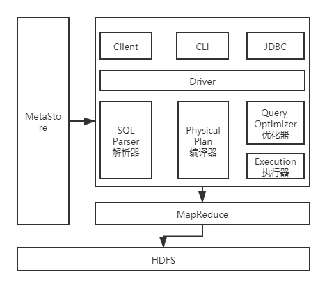
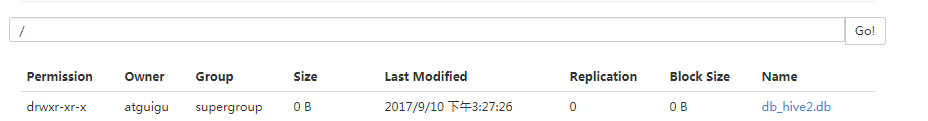
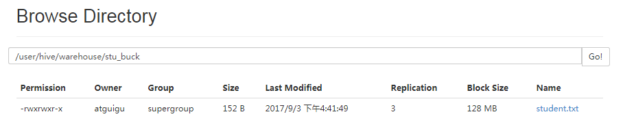
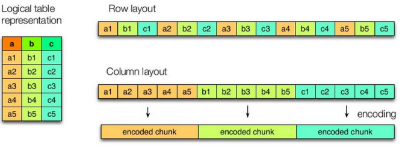
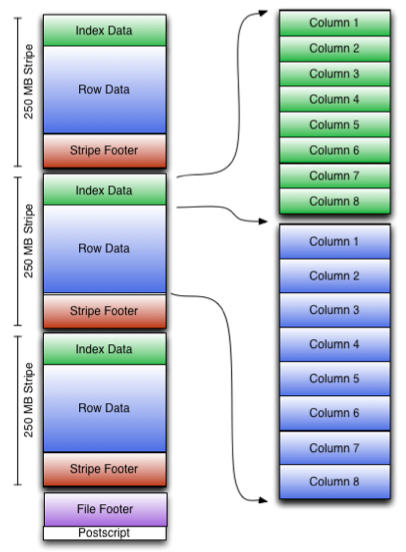
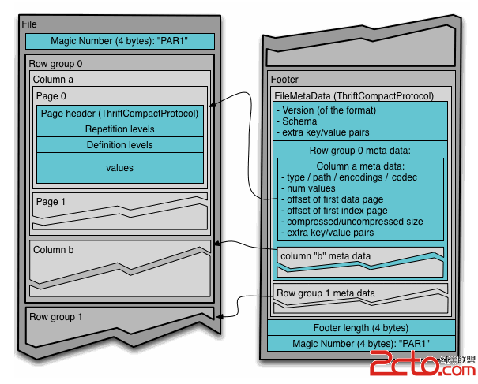
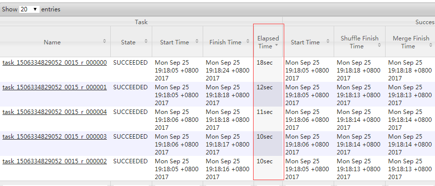
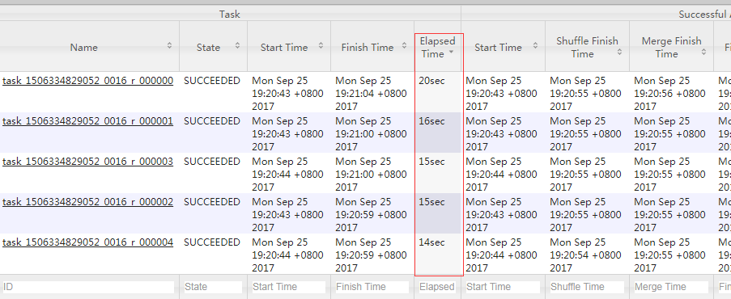

# Hive

看到视频91

# 概述

* 由Facebook开源用于解决海量结构化日志的数据统计
* 基于Hadoop的一个数据仓库,可以将结构化的数据文件映射为一张表,并提供类SQL查询
* 传统的数据库是行结构,而大数据中基本都是列结构,Hive是列结构数据
* 本质上是将HQL转化成MR(MapReduce)程序
* Hive处理的数据存储在HDFS中,底层实现仍然是MR
* 执行程序运行在Yarn上
* 见图解.pptx-01


# 特性

* 操作接口类似SQL语法,简单,容易上手
* 避免了去写MR,减少开发时间
* Hive执行延迟比较高,只能做离线计算
* 对于处理大数据比较有优势,小数据处理没有优势
* 用户可以根据自己的需求自定义函数
* 迭代算法无法表达,数据挖掘不擅长
* 效率比较低,调优比较困难
* Hive的数据底层仍然是存储在HDFS中的
* Hive是读多写少的,不支持数据的改写和添加,所有的数据都是在加载的时候确定
* Hive在加载数据的过程中不会对数据进行任何处理,甚至不会对数据进行扫描,因此也没有对数据中的某些Key建立索引
* Hive要访问数据中满足条件的特定值时,需要暴力扫描整个数据,因此访问延迟较高


# 核心




* Hive通过给用户提供的一系列交互接口,接收到用户的指令(SQL),使用自己的Driver,结合元数据(MetaStore),将这些指令翻译成MR,提交到Hadoop中执行,最后,将执行返回的结果输出到用户交互接口
* 见图解.pptx-02


## Client

* 用户接口,包括CLI(HiveShell),JDBC/ODBC(Java访问Hive),WebUI(浏览器访问)


## Metastore

* 元数据,包括:表名,表所属的数据库(默认是default),表的拥有者,列/分区字段,表类型(是否外部表),表的数据所在目录等
* 默认存储在自带的derby数据库中,推荐使用MySQL存储Metastore


## Hadoop

* 使用HDFS进行存储,使用MapReduce进行计算


## Driver

* 驱动器,包括如下
* SQL Parser:解析器,将SQL字符串转换成抽象语法树AST,这一步一般都用第三方工具库完成,比如antlr;对AST进行语法分析,比如表是否存在,字段是否存在,SQL语义是否有误
* PhysicalPlan:编译器,将AST编译生成逻辑执行计划
* QueryOptimizer:优化器,对逻辑执行计划进行优化
* Execution:执行器,把逻辑执行计划转换成可以运行的物理计划,对于Hive来说,就是MR/Spark


# 安装

* 下载安装包,解压到/app/hive

* 配置Hive环境变量

  ```shell
  export HIVE_HOME =/app/hive
  export PATH=$PATH:$HIVE_HOME/bin
  ```

* 修改hive/conf目录下的hive-env.sh.template为hive-env.sh,配置hadoop环境变量

  ```shell
  HADOOP_HOME=/app/hadoop # 根据自己的来
  ```

* 必须启动hdfs和yarn

  ```shell
  sbin/start-dfs.sh
  sbin/start-yarn.sh
  ```

* 安装一个mysql,略

* 将MySQL目录下的mysq-connector-java.jar复制到/app/hive/lib中

* 配置MySQL以及其他配置,在hive-site.xml中

  ```xml
  <configuration>
      <property>
          <name>java.jdo.option.ConnnectionURL</name>
          <value>jdbc:mysql://localhost:3306/hive?createDatabaseIfNotExists=true</value>
      </property>
      <property>
          <name>java.jdo.option.ConnnectionDriverName</name>
          <value>com.mysql.jdbc.Driver</value>
      </property>
      <property>
          <name>java.jdo.option.ConnnectionUserName</name>
          <value>http://192.168.1.146:50090</value>
      </property>
      <property>
          <name>java.jdo.option.ConnnectionPassword</name>
          <value>123456</value>
      </property>
      <!-- 很多直接利用系统变量的配置需要改掉,在整个配置文件中搜system -->
      <!-- hive运行时文件的存储地址 -->
      <property>
          <name>hive.exec.local.scratchdir</name>
          <value>/app/hive</value>
      </property>
      <property>
          <name>hive.downloaded.resources.dir</name>
          <value>/app/hive/downloads</value>
      </property>
      <property>
          <name>hive.querylog.location</name>
          <value>/app/hive/querylog</value>
      </property>
      <!-- 其他不一一列举 -->
  </configuration>
  ```

* 将Hive的元数据初始化到MySQL中:schematool -dbType mysql -initSchema

* 启动hive:bin/hive

  

# 配置


## 仓库

* Default数据仓库的最原始位置是在hdfs上的:/user/hive/warehouse路径下

* 在仓库目录下,没有对默认的数据库default创建目录.如果某张表属于default数据库,直接在数据仓库目录下创建一个目录

* 修改default数据仓库原始位置,将hive-default.xml.template如下配置信息拷贝到hive-site.xml文件中

  ```xml
  <property>
      <name>hive.metastore.warehouse.dir</name>
      <value>/user/hive/warehouse</value>
  </property>
  ```

* 配置同组用户有执行权限:bin/hdfs dfs -chmod g+w /user/hive/warehouse


## 查询后信息显示

* 在hive-site.xml中添加如下,可以实现显示当前数据库,以及查询表的头信息

```xml
<property>
    <name>hive.cli.print.header</name>
    <value>true</value>
</property>
<property>
    <name>hive.cli.print.current.db</name>
    <value>true</value>
</property>
```

* 重新启动hive


## 运行日志信息

* Hive的log默认存放在/tmp/atguigu/hive.log目录下(当前用户名下)
* 修改hive的log存放日志到/opt/module/hive/logs
  * 修改/opt/module/hive/conf/hive-log4j.properties.template文件名称为hive-log4j.properties
  * 在hive-log4j.properties中修改log地址:hive.log.dir=/opt/module/hive/logs


## 参数配置方式

* 查看当前所有的配置信息:hive>set
* 参数配置有3种方式:配置文件,命令行和参数声明


### 配置文件

* 默认配置文件:hive-default.xml
* 用户自定义配置文件:hive-site.xml
* 用户自定义配置优先级高于默认配置
* Hive也会读入Hadoop的配置,因为Hive是作为Hadoop的客户端启动的
* Hive的配置会覆盖Hadoop的配置
* 配置文件的设定对本机启动的所有Hive进程都有效


### 命令行参数

* 启动Hive时,可以在命令行添加-hiveconf k=v来设定参数

```shell
# 仅对本次hive启动有效
bin/hive -hiveconf mapred.reduce.tasks=10;
# 查看参数设置
hive (default)> set mapred.reduce.tasks;
```


### 参数声明

* 可以在HQL中使用SET关键字设定参数

```shell
# 仅对本次hive启动有效
hive (default)> set mapred.reduce.tasks=100;
# 查看参数设置
hive (default)> get mapred.reduce.tasks;
```


### 优先级

* 上述三种设定方式的优先级依次递增,即配置文件<命令行参数<参数声明

* 某些系统级的参数,例如log4j相关的设定,必须用前两种方式设定,因为那些参数的读取在会话建立以前已经完成了


# Hive Shell

* HiveSQL语法同MySQL相同
* CREATE TABLE tablename(column type) ROW FORMAT DELIMITED FIELDS TERMINATED BY "\t":创建表的时候指定字段之间的分隔符,好用来加载数据
* LOAD DATA LOCAL INPATH path INTO TABLE tablename:从本地文件中加载数据到表,本地文件中的值中间的分隔符需要和建表时一样,其中的列值要和建表中的顺序相同
* bin/hive -e "sql":在LinuxShell中直接执行SQL命令
* bin/hive -f path:执行Shell脚本中的SQL语句
* dfs -ls /:在Hive中查看HDFS
* ! ls /root:在Hive中查看Linux的文件系统
* 查看hive的历史命令:进入当前用户根目录下,cat .hivehistory
* bin/hive:直接进入hive的控制台,使用SQL对数据库进行操作,该模式下无法远程连接数据库
* bin/hiveserver2:后台启动该脚本,可以让其他远程地址连接数据库,默认端口是10000
* bin/beeline:利用hiveserver2启动hive后,运行该脚本可连接数据库,需要输入仓库地址等
  * !connect jdbc:hive2://localhost:10000/mydb2:连接到hive数据


# 数据类型


## 基本类型

| Hive      | Java    | 长度                                             | 例子                                 |
| --------- | ------- | ------------------------------------------------ | ------------------------------------ |
| TINYINT   | byte    | 1byte有符号整数                                  | 20                                   |
| SMALINT   | short   | 2byte有符号整数                                  | 20                                   |
| INT       | int     | 4byte有符号整数                                  | 20                                   |
| BIGINT    | long    | 8byte有符号整数                                  | 20                                   |
| BOOLEAN   | boolean | 布尔类型,true或者false                           | TRUE/FALSE                           |
| FLOAT     | float   | 单精度浮点数                                     | 3.14159                              |
| DOUBLE    | double  | 双精度浮点数                                     | 3.14159                              |
| STRING    | string  | 字符系列.可以指定字符集.可以使用单引号或者双引号 | ‘now is the time’ “for all good men” |
| TIMESTAMP |         | 时间类型                                         |                                      |
| BINARY    |         | 字节数组                                         |                                      |


## 集合类型

| 类型   | 描述                                                         | 示例     |
| ------ | ------------------------------------------------------------ | -------- |
| STRUCT | 和c语言中的struct类似,都可以通过“点”符号访问元素内容.例如,如果某个列的数据类型是STRUCT{first STRING, last STRING},那么第1个元素可以通过字段.first来引用 | struct() |
| MAP    | MAP是一组键值对元组集合,使用数组表示法可以访问数据.例如,如果某个列的数据类型是MAP,其中键值对是’first’->’John’和’last’->’Doe’,可以通过字段名[‘last’]获取最后一个元素 | map()    |
| ARRAY  | 数组是一组具有相同类型和名称的变量的集合,这些变量称为数组的元素,每个数组元素都有一个编号,下标从零开始.例如,数组值为[‘John’,‘Doe’],那么第2个元素可以通过数组名[1]进行引用 | Array()  |

* Hive有三种复杂数据类型ARRAY,MAP和STRUCT,ARRAY和MAP与Java中的Array和Map类似,而STRUCT与C语言中的Struct类似,它封装了一个命名字段集合,复杂数据类型允许任意层次的嵌套


## 实例

* 假设某表有如下一行,我们用JSON格式来表示其数据结构.在Hive下访问的格式为

```json
{
    "name": "songsong",
    //列表Array,
    "friends":  ["bingbing" , "lili"],
    "children": {
        //键值Map,
        "xiao song": 18,
        "xiaoxiao song": 19
    },
    "address": {
        //结构Struct,
        "street": "hui long  guan",
        "city": "beijing"
    }
}  
```

* 基于上述数据结构,我们在Hive里创建对应的表,并导入数据,新建test.txt文件,内容如下

```shell
# 这是2条数据,第一条数据到hui longguan_benjing
# 其中逗号是一个字段,而冒号则是类似kv中的分隔符,不要被空格迷惑
songsong,binbin_lili,xiao  song:18_xiaoxiao song:19,hui longguan_beijing
yangyang,caicai_susu,xiao  yang:18_xiaoxiao yang:19,chao yang_beijing
```

* 注意:MAP,STRUCT和ARRAY里的元素间关系都可以用同一个字符表示,这里用“_”

* Hive上创建测试表test

```mysql
create table test(
    name string,  friends  array<string>,
    children  map<string, int>,
    address  struct<street:string, city:string>)
    row format delimited fields terminated by ',' # 定义每个字段之间的分隔符
    collection items  terminated by '_' # 定义集合,map多条数据间的分隔符
    map keys terminated  by ':' # 定义map的kv之间的分隔符
    lines terminated by  '\n'; # 定义2行数据之间的分隔符
```

* 字段解释:
  * row format delimited fields terminated by ',':列分隔符
  * collection items terminated by '_': MAP,STRUCT,ARRAY的分隔符(数据分割符号)
  * map keys terminated by ':':MAP中的key与value的分隔符
  * lines terminated by '\n':行分隔符
* 导入文本数据到测试表

```shell
hive (default)>load data local inpath ‘/opt/module/datas/test.txt’into table test
```

* 访问三种集合列里的数据,以下分别是ARRAY,MAP,STRUCT的访问方式

```shell
hive (default)>select friends[1],children['xiao song'],address.city from test where name="songsong";
# OK  
# _c0   _c1    city  
# lili  18     beijing  
# Time taken: 0.076  seconds, Fetched: 1 row(s)
```


## 类型转化

* Hive的原子数据类型是可以进行隐式转换的,类似于Java的类型转换
* 隐式转换只能从小的转成大的,但是大的不能自动转成小的
* 隐式类型转换规则如下
  * 任何整数类型都可以隐式地转换为一个范围更广的类型,如TINYINT可以转换成INT
  * 所有整数类型,FLOAT和STRING类型都可以隐式地转换成DOUBLE
  * TINYINT,SMALLINT,INT都可以转换为FLOAT
  * BOOLEAN类型不可以转换为任何其它的类型
* 可以使用CAST操作显示进行数据类型转换
  * CAST('1' AS INT)将把字符串'1' 转换成整数1
  * 如果强制类型转换失败,如执行CAST('X' AS INT),表达式返回空值NULL


# DDL数据定义


## 事务

* 在0.13.0之后的版本中支持事务
* 所有事务自动提交
* 只支持orc格式
* 使用bucket表
* 需要进行配置
  * hive.support.concurrency = true;
  * hive.enforce.bucketing = true;
  * hive.exec.dynamic.partition.mode = nonstrict;
  * SET hive.txn.manager = org.apache.hadoop.hive.ql.lockmgr.DbTxnManager;
  * SET hive.compactor.initiator.on = true;
  * SET hive.compactor.worker.threads = 1;
* 使用事务操作

```mysql
CREATE TABLE tx(id int,name string,age int) CLUSTERED BY (id) INTO 3 BUCKETS ROW FORMAT DELIMITED FIELDS TERMINATED BY ',' stored as orc TBLPROPERTIES ('transactional'='true');
```


## 视图

* 支持视图,语法同通用SQL


## 创建数据库

* 创建一个数据库,数据库在HDFS上的默认存储路径是/user/hive/warehouse/*.db

  ```shell
  hive (default)> create database db_hive;
  ```

* 避免要创建的数据库已经存在错误,增加if not exists判断

  ```mysql
  hive (default)>create database db_hive;
  # FAILED: Execution Error, return code 1 from  org.apache.hadoop.hive.ql.exec.DDLTask.Database db_hive already exists
  hive (default)> create database if not exists  db_hive;
  ```

* 创建一个数据库,指定数据库在HDFS上存放的位置

  ```shell
  hive (default)> create database db_hive2 location '/db_hive2.db';
  ```



* 创建数据库时,若指定数据库路径为/,则在Web页面将不显示该数据库,类似Default数据库,只有当该数据库中有表时,此数据库才会显示


## 查询数据库


### 显示数据库

* 显示数据库

```mysql
hive> show databases;
```

* 过滤显示查询的数据库

```mysql
hive> show databases like 'db_hive*';
```


### 查看详情

* 显示数据库信息

```mysql
hive> desc database db_hive;
# OK
# db_hive hdfs://hadoop102:9000/user/hive/warehouse/db_hive.db atguiguUSER
```

* 显示数据库详细信息,extended

```mysql
hive> desc database extended db_hive;
# OK
# db_hive hdfs://hadoop102:9000/user/hive/warehouse/db_hive.db atguiguUSER 
```

* 切换当前数据库

```mysql
hive (default)> use db_hive;
```


## 修改数据库


* 使用ALTER DATABASE为某个数据库的DBPROPERTIES设置键值对属性值,来描述这个数据库的属性信息.数据库的其他元数据信息都是不可更改的,包括数据库名和数据库所在的目录位置

```mysql
hive(default)>alter database db_hive set dbproperties('createtime'='20170830');
# 在hive中查看修改结果
hive> desc database extended db_hive;
# db_name comment location    owner_name   owner_type   parameters
# db_hive     hdfs://hadoop102:8020/user/hive/warehouse/db_hive.db  atguigu USER  {createtime=20170830}
```


## 删除数据库

* 删除空数据库:hive>drop database db_hive2;
* 如果删除的数据库不存在,最好采用 if exists判断数据库是否存在

```mysql
hive> drop database db_hive;
FAILED: SemanticException [Error 10072]: Database does not exist: db_hive
hive> drop database if exists db_hive2;
```

* 如果数据库不为空,可以采用cascade命令,强制删除

```mysql
hive> drop database db_hive;
FAILED: Execution Error, return code 1 from org.apache.hadoop.hive.ql.exec.DDLTask. InvalidOperationException(message:Database db_hive is not empty. One or more tables exist.)
hive> drop database db_hive cascade;
```


## 创建表

* 建表语法

```mysql
CREATE [EXTERNAL] TABLE [IF NOT EXISTS] table_name
[(col_name data_type [COMMENT col_comment], ...)] 
[COMMENT table_comment]
[PARTITIONED BY (col_name data_type [COMMENT col_comment], ...)] 
[CLUSTERED BY (col_name, col_name, ...) 
[SORTED BY (col_name [ASC|DESC], ...)] INTO num_buckets BUCKETS] 
[ROW FORMAT row_format] 
[STORED AS file_format]
[LOCATION hdfs_path]
```

* 字段解释说明
* CREATE TABLE:创建一个指定名字的表.如果相同名字的表已经存在,则抛出异常
* EXTERNAL:让用户创建一个外部表,在建表的同时指定一个指向实际数据的路径(LOCATION)
  * Hive创建内部表时,会将数据移动到数据仓库指向的路径
  * 若创建外部表,仅记录数据所在的路径,不对数据的位置做任何改变
  * 在删除表的时候,内部表的元数据和数据会被一起删除,而外部表只删除元数据,不删除数据
* COMMENT:为表和列添加注释
* PARTITIONED BY:创建分区表
* CLUSTERED BY:创建分桶表
* SORTED BY:不常用
* ROW FORMAT DELIMITED [FIELDS TERMINATED BY char] [COLLECTION ITEMS TERMINATED BY char] [MAP KEYS TERMINATED BY char] [LINES TERMINATED BY char]  | SERDE serde_name [WITH SERDEPROPERTIES (property_name=property_value, property_name=property_value, ...)]:用户在建表的时候可以自定义SerDe或者使用自带的SerDe.如果没有指定ROW FORMAT 或者ROW FORMAT DELIMITED,将会使用自带的SerDe.在建表的时候,用户还需要为表指定列,用户在指定表的列的同时也会指定自定义的SerDe,Hive通过SerDe确定表的具体的列的数据
  * SerDe是Serialize/Deserilize的简称,目的是用于序列化和反序列化
* STORED AS:指定存储文件类型,常用的存储文件类型:SEQUENCEFILE(二进制序列文件),TEXTFILE(文本),RCFILE(列式存储格式文件).如果文件数据是纯文本,可以使用STORED AS TEXTFILE.如果数据需要压缩,使用 STORED AS SEQUENCEFILE
* LOCATION:指定表在HDFS上的存储位置
* LIKE:允许用户复制现有的表结构,但是不复制数据


## 管理表

* 默认创建的表都是所谓的管理表,有时也被称为内部表.因为这种表,Hive会（或多或少地）控制着数据的生命周期.Hive默认情况下会将这些表的数据存储在由配置项hive.metastore.warehouse.dir(例如,/user/hive/warehouse)所定义的目录的子目录下.  当我们删除一个管理表时,Hive也会删除这个表中数据.管理表不适合和其他工具共享数据

* 案例实操

  * 普通创建表

  ```mysql
  create table if not exists student2(  id int, name string  )  row format delimited fields terminated by '\t'  stored as textfile  location '/user/hive/warehouse/student2';
  ```

  * 根据查询结果创建表,查询的结果会添加到新创建的表中

  ```mysql
   create table if not  exists student3 as select id, name from student; 
  ```

  * 根据已经存在的表结构创建表

  ```mysql
  create  table if not exists student4 like student; 
  ```

  * 查询表的类型

  ```mysql
  hive (default)> desc formatted student2;
  # Table Type:       MANAGED_TABLE 
  ```


## 外部表

* 因为表是外部表,所以Hive并非认为其完全拥有这份数据.删除该表并不会删除掉这份数据,不过描述表的元数据信息会被删除掉

* 管理表和外部表的使用场景:每天将收集到的网站日志定期流入HDFS文本文件.在外部表（原始日志表）的基础上做大量的统计分析,用到的中间表、结果表使用内部表存储,数据通过SELECT+INSERT进入内部表

* 案例实操

  * 分别创建部门和员工外部表,并向表中导入数据,原始数据如下

  ```
  # depart.txt
  10	ACCOUNTING	1700
  20	RESEARCH	1800
  30	SALES	1900
  40	OPERATIONS	1700
  # emp.txt
  7369	SMITH	CLERK	7902	1980-12-17	800.00		20
  7499	ALLEN	SALESMAN	7698	1981-2-20	1600.00	300.00	30
  7521	WARD	SALESMAN	7698	1981-2-22	1250.00	500.00	30
  7566	JONES	MANAGER	7839	1981-4-2	2975.00		20
  7654	MARTIN	SALESMAN	7698	1981-9-28	1250.00	1400.00	30
  7698	BLAKE	MANAGER	7839	1981-5-1	2850.00		30
  7782	CLARK	MANAGER	7839	1981-6-9	2450.00		10
  7788	SCOTT	ANALYST	7566	1987-4-19	3000.00		20
  7839	KING	PRESIDENT		1981-11-17	5000.00		10
  7844	TURNER	SALESMAN	7698	1981-9-8	1500.00	0.00	30
  7876	ADAMS	CLERK	7788	1987-5-23	1100.00		20
  7900	JAMES	CLERK	7698	1981-12-3	950.00		30
  7902	FORD	ANALYST	7566	1981-12-3	3000.00		20
  7934	MILLER	CLERK	7782	1982-1-23	1300.00		10
  ```

  * 建表语句

  ```mysql
  # 创建部门表
  create  external table if not exists default.dept(deptno int,dname string, loc int) row format delimited fields terminated by '\t';
  # 创建员工表
  create external table if not exists default.emp(empno int,ename string,job  string,mgr int,hiredate string,sal double,comm double,deptno int)  row  format delimited fields terminated by '\t'; 
  ```

  * 查看创建的表:hive (default)> show tables;
  * 向外部表中导入数据

  ```mysql
  hive (default)> load data local inpath '/opt/module/datas/dept.txt' into table default.dept;
  hive (default)> load data local inpath '/opt/module/datas/emp.txt' into table default.emp
  ```

  * 查看表格式化数据:hive (default)> desc formatted dept;


## 内,外部表互转

* desc formatted student2:查询表的类型,重点查看table_type是否为external
* alter table student2 set tblproperties('EXTERNAL'='TRUE'):修改内部表student2为外部表
* alter table student2 set tblproperties('EXTERNAL'='FALSE'):修改外部表student2为内部表
* ('EXTERNAL'='TRUE')和('EXTERNAL'='FALSE')为固定写法,区分大小写,引号也不要变


## 分区表


> 分区表实际上就是对应一个HDFS文件系统上的独立的文件夹,该文件夹下是该分区所有的数据文件.Hive中的分区就是分目录,把一个大的数据集根据业务需要分割成小的数据集.在查询时通过WHERE子句中的表达式选择查询所需要的指定的分区,这样的查询效率会提高很多


### 基本操作

* 引入分区表,需要根据日期对日志进行管理

```shell
/user/hive/warehouse/log_partition/20170702/20170702.log
/user/hive/warehouse/log_partition/20170703/20170703.log
/user/hive/warehouse/log_partition/20170704/20170704.log
```

* 创建分区表语法
  * partitioned by:需要声明一个或多个特殊的字段来区别分区表,几个字段就是几级分区
  * 所有的分区表都是一个目录,有一个相同的上级目录
  * SQL的WHERE后可以接分区字段,如下表中的month

```mysql
hive> create table dept_partition(deptno int,dname string,loc string)  partitioned by(month string) row format delimited fields terminated by '\t';
```

* 加载数据到分区表中:需要指定分区字段的值

```mysql
hive (default)> load data local inpath '/opt/module/datas/dept.txt' into table default.dept_partition partition(month='201709');
hive (default)> load data local inpath '/opt/module/datas/dept.txt' into table default.dept_partition partition(month='201708');
hive (default)> load data local inpath '/opt/module/datas/dept.txt' into table default.dept_partition partition(month='201707’);
```

* 查询分区表中数据

```mysql
# 单分区查询
hive (default)> select * from dept_partition where month='201709';
# 多分区联合查询
hive (default)> select * from dept_partition where month='201709'
union select * from dept_partition where month='201708'
union select * from dept_partition where month='201707';
# _u3.deptno   _u3.dname    _u3.loc _u3.month
# 10   ACCOUNTING   NEW YORK    201707
# 10   ACCOUNTING   NEW YORK    201708
# 10   ACCOUNTING   NEW YORK    201709
# 20   RESEARCH    DALLAS 201707
# 20   RESEARCH    DALLAS 201708
# 20   RESEARCH    DALLAS 201709
# 30   SALES  CHICAGO 201707
# 30   SALES  CHICAGO 201708
# 30   SALES  CHICAGO 201709
# 40   OPERATIONS   BOSTON 201707
# 40   OPERATIONS   BOSTON 201708
# 40   OPERATIONS   BOSTON 201709
```

* 增加分区

```mysql
# 创建单个分区
hive (default)> alter table dept_partition add partition(month='201706') ;
# 同时创建多个分区
hive (default)> alter table dept_partition add partition(month='201705') partition(month='201704');
```

* 删除分区

```mysql
# 删除单个分区
hive (default)> alter table dept_partition drop partition (month='201704');
# 同时删除多个分区
hive (default)> alter table dept_partition drop partition (month='201705'), partition (month='201706');
```

* 查看分区表有多少分区:hive> show partitions dept_partition;
* 查看分区表结构:hive> desc formatted dept_partition;

 

### 二级分区

* 创建二级分区表

```mysql
hive>create table dept_partition2(deptno int,dname string,loc string) partitioned by(month string,day string) row format delimited fields terminated by '\t';  
```

* 加载数据到二级分区表中:需要同时指定所有分区字段的值

```mysql
hive>load data local inpath '/opt/module/datas/dept.txt' into table default.dept_partition2 partition(month='201709',day='13');
```

* 查询分区数据

```mysql
hive> select * from dept_partition2 where month='201709' and day='13';
```

* 把数据直接上传到分区目录上,让分区表和数据产生关联的三种方式

  * 方式一:上传数据后修复

  ```mysql
  # 上传数据
  hive>dfs -mkdir -p /user/hive/warehouse/dept_partition2/month=201709/day=12;
  hive>dfs -put /app/hive/datas/dept.txt /user/hive/warehouse/dept_partition2/month=201709/day=12;
  # 查询数据(查询不到刚上传的数据)
  hive>select * from dept_partition2 where month='201709' and day='12';
  # 执行修复命令
  hive>msck repair table dept_partition2;
  # 再次查询数据
  hive>select * from dept_partition2 where month='201709' and day='12';
  ```
  
* 方式二:上传数据后添加分区
  
```mysql
  # 上传数据
  hive>dfs -mkdir -p
   /user/hive/warehouse/dept_partition2/month=201709/day=11;
  hive>dfs -put /opt/module/datas/dept.txt /user/hive/warehouse/dept_partition2/month=201709/day=11;
  # 执行添加分区
  hive>alter table dept_partition2 add partition(month='201709',day='11');
  # 查询数据
  hive>select * from dept_partition2 where month='201709' and day='11';
```

  * 方式三:创建文件夹后load数据到分区

  ```mysql
# 创建目录
  hive>dfs -mkdir -p
   /user/hive/warehouse/dept_partition2/month=201709/day=10;
  # 上传数据
  hive>load data local inpath '/opt/module/datas/dept.txt' into table dept_partition2 partition(month='201709',day='10');
  # 查询数据
  hive>select * from dept_partition2 where month='201709' and day='10';
  ```


## 修改表


### 重命名表

* ALTER TABLE table_name RENAME TO new_table_name


### 增加/修改/替换列信息

* 更新列:ALTER TABLE table_name CHANGE [COLUMN] col_old_name col_new_name column_type [COMMENT col_comment] [FIRST|AFTER column_name]
* 增加和替换列:ALTER TABLE table_name ADD|REPLACE COLUMNS (col_name data_type [COMMENT col_comment], ...) 
* ADD表示新增字段,字段位置在所有列后面(partition列前),REPLACE则是表示替换表中所有字段

```mysql
# 查询表结构
hive> desc dept_partition;
# 添加列
hive (default)> alter table dept_partition add columns(deptdesc string);
# 查询表结构
hive> desc dept_partition;
# 更新列
hive (default)> alter table dept_partition change column deptdesc desc int;
# 查询表结构
hive> desc dept_partition;
# 替换列
hive (default)> alter table dept_partition replace columns(deptno string, dname string,loc string);
# 查询表结构
hive> desc dept_partition;
```


## 删除表

* hive (default)> drop table dept_partition;


# DML数据操作


## 数据导入

### Load

* 向表中装载数据

* hive> load data [local] inpath '/opt/module/datas/student.txt' overwrite | into table student [partition (partcol1=val1,…)];
  * load data:表示加载数据
  * local:表示从本地加载数据到hive表;否则从HDFS加载数据到hive表
  * inpath:表示加载数据的路径
  * overwrite:表示覆盖表中已有数据,否则表示追加
  * into table:表示加载到哪张表
  * student:表示具体的表
  * partition:表示上传到指定分区
* 案例

```mysql
# 1.创建一张表
hive (default)> create table student(id string, name string) row format delimited fields terminated by '\t';
# 2.加载本地文件到hive
hive (default)> load data local inpath '/opt/module/datas/student.txt' into table default.student;
# 3.加载HDFS文件到hive中
# 上传文件到HDFS
hive (default)> dfs -put /opt/module/datas/student.txt /user/atguigu/hive;
# 加载HDFS上数据
hive (default)> load data inpath '/user/atguigu/hive/student.txt' into table default.student;
# 4.加载数据覆盖表中已有的数据
# 上传文件到HDFS
hive (default)> dfs -put /opt/module/datas/student.txt /user/atguigu/hive;
# 加载数据覆盖表中已有的数据
hive (default)> load data inpath '/user/atguigu/hive/student.txt' overwrite into table default.student;
```


### Insert

* 查询语句向表中插入数据
* 创建一张分区表

```mysql
hive (default)> create table student(id int, name string) partitioned by (month string) row format delimited fields terminated by '\t';
```

* 基本数据插入

```mysql
hive (default)> insert into table student partition(month='201709') values(1,'wangwu');
```

* 基本模式插入:单张表结果插入

```mysql
hive (default)> insert overwrite table student partition(month='201708')
select id, name from student where month='201709';
```

* 多插入模式:多张表结果插入

```mysql
hive (default)> from student
insert overwrite table student partition(month='201707')
select id, name where month='201709'
insert overwrite table student partition(month='201706')
select id, name where month='201709';
```


### As Select

* 查询语句中创建表并加载数据,见创建表
* 根据查询结果创建表,查询的结果会添加到新创建的表中


### Location

* 创建表时通过Location指定加载数据路径
* 创建表,并指定在hdfs上的位置

```mysql
hive (default)> create table if not exists student5(id int, name string)
row format delimited fields terminated by '\t'
location '/user/hive/warehouse/student5';
```

* 上传数据到hdfs上

```mysql
hive(default)>dfs -put /app/hive/datas/student.txt user/hive/warehouse/student5
```

* 查询数据:hive (default)> select * from student5


### Import

* 先用export导出后,再将数据导入

```mysql
hive (default)> import table student2 partition(month='201709') from
 '/user/hive/warehouse/export/student';
```


## 数据导出

### Insert

* 将查询的结果导出到本地
* 将查询的结果格式化导出到本地
* 将查询的结果导出到HDFS上,没有local

```mysql
hive(default)>insert overwrite local directory '/app/hive/datas/export/student' select * from student;
hive(default)>insert overwrite local directory '/app/hive/datas/export/student1'
ROW FORMAT DELIMITED FIELDS TERMINATED BY '\t' select * from student;
hive(default)>insert overwrite directory '/user/atguigu/student2'
ROW FORMAT DELIMITED FIELDS TERMINATED BY '\t' select * from student;
```


### Hadoop命令导出

```mysql
hive (default)> dfs -get /user/hive/warehouse/student/month=201709/000000_0
/app/hive/datas/export/student3.txt;
```


### HiveShell命令导出

```shell
# hive -f/-e 执行语句或者脚本 > file
bin/hive -e 'select * from default.student;' >/app/hive/datas/export/student4.txt;
```


### Export导出到HDFS

```mysql
hive(default)>export table default.student to '/user/hive/warehouse/export/student'
```


### Sqoop导出


## Truncate

* 清除表中数据,Truncate只能删除管理表,不能删除外部表中数据
* hive (default)> truncate table student;


# 查询

* 官方[文档](https://cwiki.apache.org/confluence/display/Hive/LanguageManual+Select)

```mysql
[WITH CommonTableExpression (,CommonTableExpression)*](Note: Only available   starting  with Hive 0.13.0)
SELECT [ALL | DISTINCT] select_expr, select_expr,  ...
FROM table_reference
[WHERE where_condition]
[GROUP BY col_list]
[ORDER BY col_list]
[CLUSTER BY col_list|[DISTRIBUTE BY col_list][SORT BY col_list]][LIMIT number]
```

​      

## 基本查询


* 所有基本的语法和通用SQL语法相同,分页,排序和MySQL相同
* 函数count,sum,avg,max,min,group by,having和通用SQL语法相同
* 比较运算符,like,in等和通用SQL语法相同
* SQL语言大小写不敏感
* SQL可以写在一行或者多行
* 关键字不能被缩写也不能分行
* 各子句一般要分行写
* 使用缩进提高语句的可读性
* JOIN等同于INNER JOIN,RIGHT JOIN,LEFT JOIN和通用SQL语法相同,不支持OR
* 多表连接时每一个连接就会启动一个MR,有多少个启动多少个
* Hive的多表连接是按照从左到右的顺序执行的


## Sort By

* Sort By:每个Reducer内部进行排序,对全局结果集来说不是排序

```mysql
# 设置reduce个数
hive (default)> set mapreduce.job.reduces=3;
# 查看设置reduce个数
hive (default)> set mapreduce.job.reduces;
# 根据部门编号降序查看员工信息
hive (default)> select * from emp sort by empno desc;
# 将查询结果导入到文件中（按照部门编号降序排序）
hive (default)> insert overwrite local directory '/opt/module/datas/sortby-result' select * from emp sort by deptno desc;
```

​    

## Distribute By

* 分区排序:类似MR中partition,进行分区,结合sort by使用
* Hive要求DISTRIBUTE BY语句要写在SORT BY语句之前
* 对于distribute by进行测试,一定要分配多reduce进行处理,否则无法看到distribute by的效果

```mysql
hive (default)> set mapreduce.job.reduces=3;
hive (default)> insert overwrite local directory '/opt/module/datas/distribute-result' select * from emp distribute by deptno sort by empno desc;
```


## Cluster By

* 当distribute by和sorts by字段相同时,可以使用cluster by方式
* cluster by除了具有distribute by的功能外还兼具sort by的功能.但是排序只能是升序排序,不能指定排序规则为ASC或者DESC

```mysql
# 以下两种写法等价
# 按照部门编号分区,不一定就是固定死的数值,可以是20号和30号部门分到一个分区里面去
hive (default)> select * from emp cluster by deptno;
hive (default)> select * from emp distribute by deptno sort by deptno;
```


## 分桶表数据存储

* 分区针对的是数据的存储路径;分桶针对的是数据文件
* 分区提供一个隔离数据和优化查询的便利方式.不过,并非所有的数据集都可形成合理的分区,特别是之前所提到过的要确定合适的划分大小这个疑虑
* 分桶是将数据集分解成更容易管理的若干部分的另一个技术
* 先创建分桶表,直接导入数据文件添加数据,数据准备:student.txt
  * CLUSTERED BY column INTO num BUCKETS:根据表中的某个字段分桶,分到num个桶里

```mysql
# 创建分桶表
create table stu_buck(id int, name string) clustered by(id) into 4 buckets  row format delimited fields terminated by '\t';
# 查看表结构
hive> desc formatted stu_buck;
# Num Buckets:      4
# 导入数据到分桶表中
hive>load data local inpath '/opt/module/datas/student.txt' into table stu_buck;
```

* 查看创建的分桶表中是否分成4个桶,发现并没有分成4个桶



* 创建分桶表时,数据通过子查询的方式导入数据

```mysql
# 先建一个普通的stu表
create table stu(id int,name string) row format delimited fields terminated by '\t';
# 向普通的stu表中导入数据
load  data local inpath '/opt/module/datas/student.txt' into table stu;
# 清空stu_buck表中数据
truncate  table stu_buck;
# 导入数据到分桶表,通过子查询的方式
insert  into table stu_buck  select  id, name from stu;
# 发现还是只有一个分桶
```

* 发现仍然未分桶,是需要设置其他属性

```mysql
hive(default)> set hive.enforce.bucketing=true;
hive(default)> set mapreduce.job.reduces=-1;
hive(default)> insert into table stu_buck  select  id, name from stu;
```


* 查询分桶的数据

```mysql
hive(default)>select * from stu_buck;
# OK  stu_buck.id   stu_buck.name
1004  ss4
1008  ss8
1012  ss12
1016  ss16
1001  ss1
1005  ss5
1009  ss9
1013  ss13
1002  ss2
1006  ss6
1010  ss10
1014  ss14
1003  ss3
1007  ss7
1011  ss11
1015  ss15
```


## 分桶抽样查询

* 对于非常大的数据集,有时用户需要使用的是一个具有代表性的查询结果而不是全部结果.Hive可以通过对表进行抽样来满足这个需求
* 查询表stu_buck中的数据

```mysql
hive>select * from stu_buck tablesample(bucket 1 out of 4 on id);
```

* tablesample是抽样语句,语法:TABLESAMPLE(BUCKET x OUT OF y) 
  * y必须是table总bucket数的倍数或者因子
  * hive根据y的大小,决定抽样的比例
  * 例如,table总共分了4份,当y=2时,抽取(4/2=)2个bucket的数据
  * x表示从哪个bucket开始抽取,如果需要取多个分区,以后的分区号为当前分区号加上y
  * 例如,table总bucket数为4,tablesample(bucket 1 out of 2),表示总共抽取(4/2)2个bucket的数据,抽取第1(x)个和第3(x+y)个bucket的数据
  * x的值必须小于等于y的值,否则抛异常:FAILED: SemanticException [Error 10061]: Numerator should not be bigger than denominator in sample clause for table stu_buck


## NVL

* NVL(str1,str2):str1不为NULL,返回str1;为NULL则返回str2.若str1,str2都为NULL,返回NULL


## CASE WHEN

* 同通用SQL语法


## 行转列

* CONCAT(string A/col, string B/col…):返回输入字符串连接后的结果,支持任意个输入字符串

* CONCAT_WS(separator, str1, str2,...):它是一个特殊形式的CONCAT()
  * 第一个参数是后面所有参数间的分隔符,会将被加到后面所有参数的之间
  * 如果分隔符是NULL,返回值也将为NULL
  * 这个函数会跳过分隔符参数后的任何NULL和空字符串

* COLLECT_SET(col):只接受基本数据类型,作用是将某字段的值进行去重汇总,产生array类型字段
  * 该函数可以配合CONCAT_WS使用,它的结果可以作为CONCAT_WS的第二个参数

```mysql
# 表结构
# name	constellation	blood_type
# 孙悟空	白羊座	   			A
# 大海	 射手座			A
# 宋宋	 白羊座			B
# 猪八戒	白羊座				A
# 凤姐	 射手座			 A
select t1.base,concat_ws('|', collect_set(t1.name)) name from 
(select name,concat(constellation, ",", blood_type) basefrom person_info) t1
group by t1.base;
# 结果
# 射手座,A            大海|凤姐
# 白羊座,A            孙悟空|猪八戒
# 白羊座,B            宋宋
```


## 列转行

* EXPLODE(col):将hive一列中复杂的array或者map结构拆分成多行

* LATERAL VIEW udtf(expression) tableAlias AS columnAlias:用于和split,explode等UDTF一起使用,它能够将一列数据拆成多行数据,在此基础上可以对拆分后的数据进行聚合

```mysql
# 表结构
# movie        			category
# 《疑犯追踪》    	   悬疑,动作,科幻,剧情
# 《Lie to me》  	  	 悬疑,警匪,动作,心理,剧情
# 《战狼2》      		战争,动作,灾难
select movie,category_name from movie_info lateral view explode(category) table_tmp as category_name;
# 结果
# movie		category_name
# 《疑犯追踪》   悬疑
# 《疑犯追踪》   动作
# 《疑犯追踪》   科幻
# 《疑犯追踪》   剧情
# 《Lie to me》  悬疑
# 《Lie to me》  警匪
# 《Lie to me》  动作
# 《Lie to me》  心理
# 《Lie to me》  剧情
# 《战狼2》     战争
# 《战狼2》     动作
# 《战狼2》     灾难
```

   

## 窗口函数

* OVER():指定分析函数工作的数据窗口大小,这个数据窗口大小可能会随着行的变化而变化
* CURRENT ROW:当前行
* n PRECEDING:往前n行数据
* n FOLLOWING:往后n行数据
* UNBOUNDED:起点,UNBOUNDED PRECEDING 表示从前面的起点, UNBOUNDED FOLLOWING表示到后面的终点
* LAG(col,n):往前第n行数据
* LEAD(col,n):往后第n行数据
* NTILE(n):把有序分区中的行分发到指定数据的组中,各个组有编号,编号从1开始,对于每一行,NTILE返回此行所属的组的编号.注意:n必须为int类型

```mysql
# 表结构
# name,orderdate,cost
# jack,2017-01-01,10
# tony,2017-01-02,15
# jack,2017-02-03,23
# tony,2017-01-04,29
# jack,2017-01-05,46
# jack,2017-04-06,42
# tony,2017-01-07,50
# jack,2017-01-08,55
# mart,2017-04-08,62
# mart,2017-04-09,68
# neil,2017-05-10,12
# mart,2017-04-11,75
# neil,2017-06-12,80
# mart,2017-04-13,94
# 1.查询在2017年4月份购买过的顾客及总人数
select name,count(*) over() from business where substring(orderdate,1,7) = '2017-04' group by name;
# 2.查询顾客的购买明细及月购买总额
select name,orderdate,cost,sum(cost) over(partition  by month(orderdate)) from   business;
# 3.上述的场景,要将cost按照日期进行累加
select name,orderdate,cost,sum(cost) over() as sample1,--所有行相加
sum(cost) over(partition by name) as sample2,--按name分组,组内数据相加   sum(cost) over(partition by name order by orderdate) as sample3,--按name分组,组内数据累加   
sum(cost) over(partition by name order by orderdate  rows between UNBOUNDED PRECEDING and current row ) as sample4,--和sample3一样,由起点到当前行的聚合
sum(cost) over(partition by name order by orderdate  rows between 1 PRECEDING and current row) as sample5, --当前行和前面一行做聚合
sum(cost) over(partition by name order by orderdate  rows between 1 PRECEDING AND 1 FOLLOWING ) as sample6,--当前行和前边一行及后面一行   
sum(cost) over(partition by name order by orderdate  rows between current row and UNBOUNDED FOLLOWING ) as sample7 --当前行及后面所有行
from business;  
# 4.查询顾客上次的购买时间
select name,orderdate,cost,lag(orderdate,1,'1900-01-01') over(partition by  name order by orderdate ) as time1, lag(orderdate,2) over (partition by name  order by orderdate) as time2 from business; 
# 5.查询前20%时间的订单信息
select * from (select name,orderdate,cost, ntile(5) over(order by orderdate) sorted from business) t where sorted = 1;  
```

  

## Rank

* RANK():排序相同时会重复,总数不会变
* DENSE_RANK():排序相同时会重复,总数会减少
* ROW_NUMBER():会根据顺序计算

```mysql
# name    subject  score 
# 孙悟空  语文     87
# 孙悟空  数学     95
# 孙悟空  英语     68
# 大海    语文     94
# 大海    数学     56
# 大海    英语     84
# 宋宋    语文     64
# 宋宋    数学     86
# 宋宋    英语     84
# 婷婷    语文     65
# 婷婷    数学     85
# 婷婷    英语     78
# 计算每门学科成绩排名
select name,subject,score,rank() over(partition by subject order by score  desc) rp,dense_rank() over(partition by subject order by  score desc) drp,  row_number() over(partition by subject order by  score desc) rmp from score;
# 结果
# name subject score rp drp rmp 
# 孙悟空 数学  95     1    1    1  
# 宋宋  数学  86     2    2    2  
# 婷婷  数学  85     3    3    3  
# 大海  数学  56     4    4    4  
# 宋宋  英语  84     1    1    1  
# 大海  英语  84     1    1    2  
# 婷婷  英语  78     3    2    3  
# 孙悟空 英语  68     4    3    4  
# 大海  语文  94     1    1    1  
# 孙悟空 语文  87     2    2    2  
# 婷婷  语文  65     3    3    3  
# 宋宋  语文  64     4    4    4  
```


# 函数

## 内置函数

* show functions:查看系统自带的函数
* desc function upper:显示自带的函数的用法
* desc function extended upper:详细显示自带的函数的用法


## 自定义函数

* [官方文档](https://cwiki.apache.org/confluence/display/Hive/HivePlugins)
* UDF:user-defined function,用户自定义函数,一进一出
* UDAF:User-Defined Aggregation Function:聚集函数,多进一出,类似于:count/max/min
* UDTF:User-Defined Table-Generating Functions:一进多出,如lateral view explore()
* 利用Java开发UDF,步骤如下:
  * 继承org.apache.hadoop.hive.ql.UDF或者继承org.apache.hadoop.hive.ql.udf.generic.GenericUDF,建议继承GenericUDF
  * 需要自己重写evaluate方法,evaluate方法支持重载
  * 在hive命令行添加打包好的jar到hive环境中:add jar udf_jar_path
  * 创建function:create [temporary] function [dbname.]function_name AS class_name;
  * 删除函数:Drop [temporary] function [if exists] [dbname.]function_name;
* UDF必须要有返回类型,可以返回null,但是返回类型不能为void


# 压缩

> 需要使用到Hadoop的压缩功能,若需要使用Snappy则需要自行编译


## Map压缩

> 开启map输出阶段压缩可以减少job中map和Reduce task间数据传输量

```mysql
# 1.开启hive中间传输数据压缩功能
hive (default)>set hive.exec.compress.intermediate=true;
# 2.开启mapreduce中map输出压缩功能
hive (default)>set mapreduce.map.output.compress=true;
# 3.设置mapreduce中map输出数据的压缩方式,可根据需求自定修改
hive (default)>set mapreduce.map.output.compress.codec=
 org.apache.hadoop.io.compress.SnappyCodec;
# 4.执行查询语句
hive (default)> select count(ename) name from emp;
```


## Reduce压缩

> 当Hive将输出写入到表中时,输出内容同样可以进行压缩.属性hive.exec.compress.output控制着这个功能.用户可能需要保持默认设置文件中的默认值false,这样默认的输出就是非压缩的纯文本文件了.用户可以通过在查询语句或执行脚本中设置这个值为true,来开启输出结果压缩功能


```mysql
# 1.开启hive最终输出数据压缩功能
hive (default)>set hive.exec.compress.output=true;
# 2.开启mapreduce最终输出数据压缩
hive (default)>set mapreduce.output.fileoutputformat.compress=true;
# 3.设置mapreduce最终数据输出压缩方式
hive (default)> set mapreduce.output.fileoutputformat.compress.codec =
 org.apache.hadoop.io.compress.SnappyCodec;
# 4.设置mapreduce最终数据输出压缩为块压缩
hive (default)> set mapreduce.output.fileoutputformat.compress.type=BLOCK;
# 5.测试一下输出结果是否是压缩文件
hive (default)> insert overwrite local directory
 '/opt/module/datas/distribute-result' select * from emp distribute by deptno sort by empno desc;
```


## 文件存储格式

* Hive支持的存储数的格式主要有:TEXTFILE,SEQUENCEFILE,ORC,PARQUET

* 存储文件的压缩比:ORC > Parquet > textFile
* 存储文件的查询速度:查询速度相近


### 列存储和行存储



* 行存储的特点:查询满足条件的一整行数据的时候,列存储则需要去每个聚集的字段找到对应的每个列的值,行存储只需要找到其中一个值,其余的值都在相邻地方,所以此时行存储查询的速度更快
* 列存储的特点:因为每个字段的数据聚集存储,在查询只需要少数几个字段的时候,能大大减少读取的数据量;每个字段的数据类型一定是相同的,列式存储可以针对性的设计更好的设计压缩算法
* TEXTFILE和SEQUENCEFILE的存储格式都是基于行存储的
* ORC和PARQUET是基于列式存储的


### TextFile格式

> 默认格式,数据不做压缩,磁盘开销大,数据解析开销大.可结合Gzip,Bzip2使用,但使用Gzip这种方式,hive不会对数据进行切分,从而无法对数据进行并行操作


### Orc格式

* Orc(Optimized Row Columnar)是Hive0.11版里引入的新的存储格式
* 每个Orc文件由1个或多个stripe组成,每个stripe250MB大小,这个Stripe实际相当于RowGroup概念,不过大小由4MB->250MB,这样应该能提升顺序读的吞吐率
* 每个Stripe里有三部分组成,分别是Index Data,Row Data,Stripe Footer



* Index Data:一个轻量级的index,默认是每隔1W行做一个索引.这里做的索引应该只是记录某行的各字段在Row Data中的offset
* Row Data:存的是具体的数据,先取部分行,然后对这些行按列进行存储.对每个列进行了编码,分成多个Stream来存储
* Stripe Footer:存的是各个Stream的类型,长度等信息
* 每个文件有一个File Footer,存储的是每个Stripe的行数,每个Column的数据类型信息等
* 每个文件的尾部是一个PostScript,存储了整个文件的压缩类型以及FileFooter的长度信息等
* 在读取文件时,会seek到文件尾部读PostScript,从里面解析到File Footer长度,再读FileFooter,从里面解析到各个Stripe信息,再读各个Stripe,即从后往前读


### Parquet格式

* Parquet是面向分析型业务的列式存储格式
* Parquet文件是以二进制方式存储的,所以是不可以直接读取的,文件中包括该文件的数据和元数据,因此Parquet格式文件是自解析的
* 在存储Parquet数据的时候会按照Block大小设置行组的大小,由于一般情况下每一个Mapper任务处理数据的最小单位是一个Block,这样可以把每一个行组由一个Mapper任务处理,增大任务执行并行度



* 一个Parquet文件中可以存储多个行组,文件的首位都是该文件的Magic Code,用于校验它是否是一个Parquet文件
* Footer length记录了文件元数据的大小,通过该值和文件长度可以计算出元数据的偏移量,文件的元数据中包括每一个行组的元数据信息和该文件存储数据的Schema信息
* 除了文件中每一个行组的元数据,每一页的开始都会存储该页的元数据
* 在Parquet中,有三种类型的页:数据页,字典页和索引页
  * 数据页用于存储当前行组中该列的值
  * 字典页存储该列值的编码字典,每一个列块中最多包含一个字典页
  * 索引页用来存储当前行组下该列的索引,目前Parquet中还不支持索引页


## 存储和压缩结合

* 修改Hadoop集群具有Snappy压缩方式
* 查看hadoop checknative命令使用

```shell
hadoop checknative [-a|-h] check native hadoop and compression libraries availability
```

* 查看hadoop支持的压缩方式:hadoop checknative
* 将编译好的支持Snappy压缩的hadoop-2.7.2.tar.gz上传解压到指定目录中
* 进入到/app/hadoop-2.7.2/lib/native路径可以看到支持Snappy压缩的动态链接库
* 复制/app/hadoop-2.7.2/lib/native里面的所有内容到开发集群的相同目录下
* 再次查看hadoop支持的压缩类型:hadoop checknative
* 重新启动hadoop集群和hive


## 测试存储和压缩

[官网](https://cwiki.apache.org/confluence/display/Hive/LanguageManual+ORC)

| Key                      | Default    | Notes                                                        |
| ------------------------ | ---------- | ------------------------------------------------------------ |
| orc.compress             | ZLIB       | high level compression (one of NONE, ZLIB,  SNAPPY)          |
| orc.compress.size        | 262,144    | number of bytes in each compression chunk                    |
| orc.stripe.size          | 67,108,864 | number of bytes in each stripe                               |
| orc.row.index.stride     | 10,000     | number of rows between index entries (must be  >= 1000)      |
| orc.create.index         | true       | whether to create row indexes                                |
| orc.bloom.filter.columns | ""         | comma separated list of column names for which  bloom filter should be created |
| orc.bloom.filter.fpp     | 0.05       | false positive probability for bloom filter  (must >0.0 and <1.0) |

* 创建一个非压缩的的ORC存储方式

```mysql
# 建表语句
create table log_orc_none(track_time  string,url  string,session_id  string,  referer string,ip string,end_user_id  string,city_id  string) row format delimited fields terminated by '\t' stored as orc tblproperties ("orc.compress"="NONE");
# 插入数据
hive(default)> insert into table log_orc_none select * from log_text;
# 查看插入后数据
hive(default)> dfs -du -h /user/hive/warehouse/log_orc_none/ ;
```

* 创建一个SNAPPY压缩的ORC存储方式

```mysql
# 建表语句
create table log_orc_snappy(  track_time string,  url string,  session_id string,  referer string,  ip string,  end_user_id string,  city_id string  )  row format delimited fields terminated by '\t'  stored as orc tblproperties  ("orc.compress"="SNAPPY");
# 插入数据
hive  (default)> insert into table log_orc_snappy select * from log_text ;
# 查看插入后数据
hive  (default)> dfs -du -h /user/hive/warehouse/log_orc_snappy/ ;
# 3.8 M  /user/hive/warehouse/log_orc_snappy/000000_0
```

* 默认创建的ORC存储方式,导入数据后大小为:2.8 M,/user/hive/warehouse/log_orc/000000_0,比Snappy压缩的还小.原因是orc存储文件默认采用ZLIB压缩.比snappy压缩的小
* 存储方式和压缩总结:在实际的项目开发当中,hive表的数据存储格式一般选择:orc或parquet.压缩方式一般选择snappy,lzo.


# 优化


## Fetch抓取

* Fetch抓取是指Hive中对某些情况的查询可以不必使用MapReduce计算.例如:SELECT * FROM employees;在这种情况下,Hive可以简单地读取employee对应的存储目录下的文件,然后输出查询结果到控制台
* 在hive-default.xml.template文件中hive.fetch.task.conversion默认是more,老版本hive默认是minimal,该属性修改为more以后,在全局查找,字段查找,limit查找等都不走mapreduce

```xml
<property>
    <name>hive.fetch.task.conversion</name>
    <value>more</value>
</property>
```


## 本地模式

* 大多数的HadoopJob是需要Hadoop提供的完整的可扩展性来处理大数据集的.不过,有时Hive的输入数据量是非常小的.在这种情况下,为查询触发执行任务消耗的时间可能会比实际job的执行时间要多的多.对于大多数这种情况,Hive可以通过本地模式在单台机器上处理所有的任务.对于小数据集,执行时间可以明显被缩短
* 设置hive.exec.mode.local.auto的值为true,来让Hive在适当的时候自动启动这个优化
* set  hive.exec.mode.local.auto=true:开启本地mr
* set  hive.exec.mode.local.auto.inputbytes.max=50000000:设置local mr的最大输入数据量,当输入数据量小于这个值时采用local mr的方式,默认为134217728,即128M
* set  hive.exec.mode.local.auto.input.files.max=10:设置local mr的最大输入文件个数,当输入文件个数小于这个值时采用local mr的方式,默认为4


## 表优化


### 小表,大表Join

* 将key相对分散,并且数据量小的表放在join的左边
* 新版hive对小表JOIN大表和大表JOIN小表进行了优化,小表放在左边和右边已经没有明显区别


### 大表Join大表

#### 空KEY过滤

* 有时join超时是因为某些key对应的数据太多,而相同key对应的数据都会发送到相同的reducer上,从而导致内存不够.此时我们应该仔细分析这些异常的key,很多情况下,这些key对应的数据是异常数据,我们需要在SQL语句中进行过滤.例如key对应的字段为空,操作如下:
* 配置历史服务器:mapred-site.xml

```xml
<property>
    <name>mapreduce.jobhistory.address</name>
    <value>hadoop102:10020</value>
</property>
<property>
    <name>mapreduce.jobhistory.webapp.address</name>
    <value>hadoop102:19888</value>
</property>
```

* 启动历史服务器:sbin/mr-jobhistory-daemon.sh start historyserver
* 查看jobhistory:http://hadoop102:19888/jobhistory
* 创建原始数据表、空id表、合并后数据表

```mysql
// 创建原始表
create table ori(id bigint,time bigint,uid string,keyword string,url_rank int, click_num int,click_url string) row format delimited fields terminated by  '\t';
// 创建空id表
create table nullidtable(id bigint, time bigint, uid string, keyword string,  url_rank int, click_num int, click_url string) row format delimited fields  terminated by '\t';
// 创建join后表的语句
create  table jointable(id bigint, time bigint, uid string, keyword string, url_rank  int, click_num int, click_url string) row format delimited fields terminated  by '\t';
```

* 分别加载原始数据和空id数据到对应表中

```mysql
hive(default)>load data local inpath '/opt/module/datas/ori' into table ori;
hive(default)>load data local inpath '/opt/module/datas/nullid' into table nullidtable;
```

* 测试不过滤空id

```mysql
hive(default)>insert overwrite table jointable 
select n.* from nullidtable n left join ori o on n.id = o.id;
```

* 测试过滤空id

```mysql
hive (default)> insert overwrite table jointable 
select n.* from (select * from nullidtable where id is not null ) n left join ori o on n.id = o.id;
```


#### 空key转换

* 有时虽然某个key为空对应的数据很多,但是相应的数据不是异常数据,必须要包含在join的结果中,此时我们可以表a中key为空的字段赋一个随机的值,使得数据随机均匀地分不到不同的reducer上

* 不随机分布空null值:

  * 设置5个reduce个数:set mapreduce.job.reduces = 5;
  * JOIN两张表

  ```mysql
  insert overwrite table jointable
  select n.* from nullidtable n left join ori b on n.id = b.id;
  ```
  * 从结果中可以看出,出现了数据倾斜,某些reducer的资源消耗远大于其他reducer

  

图6-13 空key转换

* 随机分布空null值

  * 设置5个reduce个数:set mapreduce.job.reduces = 5;
  * JOIN两张表

  ```mysql
  insert overwrite table jointable
  select n.* from nullidtable n full join ori o on 
  case when n.id is null then concat('hive', rand()) else n.id end = o.id;
  ```

  * 从结果可以看出来,消除了数据倾斜,负载均衡reducer的资源消耗

  


### MapJoin

* 若不指定或者不符合MapJoin条件,Hive会将Join转换成CommonJoin,即在Reduce阶段完成join,容易发生数据倾斜.可以用MapJoin把小表全部加载到内存在map端进行join,避免reducer处理
* 开启MapJoin参数设置
  * 设置自动选择Mapjoin:set hive.auto.convert.join = true; 默认为true
  * 大表小表阈值设置(默认25M以下为小表):set hive.mapjoin.smalltable.filesize=25000000;
* MapJoin工作机制:见图解.pptx-03
* 开启Mapjoin功能:set hive.auto.convert.join = true; 默认为true
* 执行小表JOIN大表语句

```mysql
insert overwrite table jointable select b.id,b.keyword,b.url_rank,b.time,b.uid, b.click_num,b.click_url from smalltable s join bigtable b on s.id = b.id; 
```

* 执行大表JOIN小表语句

```mysql
insert overwrite table jointable select b.id,b.keyword,b.url_rank,b.time,b.uid, b.click_num,b.click_url from bigtable b join smalltable s on s.id = b.id;  
```


### Group By

* 默认情况下,Map阶段同一Key数据分发给一个reduce,当一个key数据过大时就倾斜了
* 并不是所有的聚合操作都需要在Reduce端完成,很多聚合操作都可以先在Map端进行部分聚合,最后在Reduce端得出最终结果
* 开启Map端聚合参数设置
  * 是否在Map端进行聚合,默认为True:hive.map.aggr = true
  * 在Map端进行聚合操作的条目数目:hive.groupby.mapaggr.checkinterval = 100000
  * 有数据倾斜的时候进行负载均衡,默认false:hive.groupby.skewindata = true
* 当选项设定为true,生成的查询计划会有两个MR
  * 第一个MR中,Map的结果会随机分布到Reduce中,每个Reduce做部分聚合,并输出结果,这样处理的结果是相同的GroupByKey有可能被分发到不同的Reduce中,从而达到负载均衡的目的
  * 第二个MR再根据预处理的数据结果按照Group By Key分布到Reduce中,这个过程可以保证相同的Group By Key被分布到同一个Reduce中,最后完成最终的聚合操作.


### Count(Distinct)

* 数据量小的时候无所谓,数据量大的情况下,由于COUNT DISTINCT操作需要用一个Reduce Task来完成,这一个Reduce需要处理的数据量太大,就会导致整个Job很难完成,一般COUNT DISTINCT使用先GROUP BY再COUNT的方式替换


### 笛卡尔积

尽量避免笛卡尔积,Hive只能使用1个reducer来完成笛卡尔积


### 行列过滤

* 列处理:在SELECT中,只拿需要的列,如果有,尽量使用分区过滤,少用SELECT *
* 行处理:在分区剪裁中,当使用外关联时,如果将副表的过滤条件写在Where后面,那么就会先全表关联,之后再过滤


### 动态分区调整

* 关系型数据库中,对分区表Insert数据时候,数据库自动会根据分区字段的值,将数据插入到相应的分区中,Hive中也提供了类似的机制,即动态分区(Dynamic Partition),只不过,使用Hive的动态分区,需要进行相应的配置
* 开启动态分区参数设置
* hive.exec.dynamic.partition=true:开启动态分区功能,默认true,开启
* hive.exec.dynamic.partition.mode=nonstrict:设置为非严格模式
  * 动态分区的模式,默认strict,表示必须指定至少一个分区为静态分区
  * nonstrict模式表示允许所有的分区字段都可以使用动态分区
* hive.exec.max.dynamic.partitions=1000:在所有执行MR的节点上,总共可创建的动态分区数
* hive.exec.max.dynamic.partitions.pernode=100:单个执行MR的节点上,最大可创建动态分区数
  * 该参数需要根据实际的数据来设定
  * 比如:源数据中包含了一年的数据,即day字段有365个值,那么该参数就需要设置成大于365,如果使用默认值100,则会报错
* hive.exec.max.created.files=100000:整个MR Job中,最大可以创建多少个HDFS文件
* hive.error.on.empty.partition=false:当有空分区生成时,是否抛出异常.一般不需要设置
* 需求:将ori中的数据按照时间(如:20111230000008),插入到目标表ori_partitioned_target的相应分区中
* 创建分区表

```mysql
create table ori_partitioned(id bigint,time bigint,uid string,keyword string,url_rank  int,click_num int,click_url string) partitioned by (p_time bigint) row format delimited fields terminated by '\t';  
```

* 加载数据到分区表中

```mysql
hive>load data local inpath '/home/atguigu/ds1' into table ori_partitioned  partition(p_time='20111230000010');
hive (default)> load data local inpath '/home/atguigu/ds2' into table ori_partitioned partition(p_time='20111230000011') ;  
```

* 创建目标分区表

```mysql
create  table ori_partitioned_target(id bigint, time bigint, uid string,   keyword string, url_rank int, click_num int,  click_url string) PARTITIONED BY (p_time STRING) row format delimited fields  terminated by '\t';  
```

* 设置动态分区

```mysql
set  hive.exec.dynamic.partition = true;
set  hive.exec.dynamic.partition.mode = nonstrict;
set  hive.exec.max.dynamic.partitions = 1000;
set  hive.exec.max.dynamic.partitions.pernode = 100;
set  hive.exec.max.created.files = 100000;
set  hive.error.on.empty.partition = false;
hive  (default)> insert overwrite table ori_partitioned_target partition  (p_time)   select  id, time, uid, keyword, url_rank, click_num, click_url, p_time from  ori_partitioned;
```

* 查看目标分区表的分区情况

```mysql
hive (default)> show partitions ori_partitioned_target;
```


### 分桶

见前面笔记


### 分区

见前面笔记


## 数据倾斜


### 合理设置Map数

* 通常情况下,作业会通过input的目录产生一个或者多个map任务
  * 主要的决定因素有:input的文件总个数,input的文件大小,集群设置的文件块大小
* 是不是map数越多越好
  * 不是.如果一个任务有很多小文件(远远小于块大小128m),则每个小文件也会被当做一个块,用一个map任务来完成,而一个map任务启动和初始化的时间远远大于逻辑处理的时间,就会造成很大的资源浪费.而且,同时可执行的map数是受限的
* 是不是保证每个map处理接近128m的文件块,就高枕无忧了
  * 不一定.比如有一个127m的文件,正常会用一个map去完成,但这个文件只有一个或者两个小字段,却有几千万的记录,如果map处理的逻辑比较复杂,用一个map任务去做,肯定也比较耗时
* 针对上面的问题2和3,我们需要采取两种方式来解决:即减少map数和增加map数


### 小文件合并

* 在map执行前合并小文件,减少map数:CombineHiveInputFormat具有对小文件进行合并的功能.HiveInputFormat没有对小文件合并功能
* set hive.input.format= org.apache.hadoop.hive.ql.io.CombineHiveInputFormat


### 复杂文件增加Map数

* 当input的文件都很大,任务逻辑复杂,map执行非常慢的时候,可以考虑增加Map数,来使得每个map处理的数据量减少,从而提高任务的执行效率
* 增加map的方法为:根据computeSliteSize(Math.max(minSize,Math.min(maxSize,blocksize)))=blocksize=128M公式,调整maxSize最大值,让maxSize最大值低于blocksize就可以增加map的个数
* set mapreduce.input.fileinputformat.split.maxsize=100:设置最大切片值为100个字节


### 合理设置Reduce数

* 调整reduce个数方法一
  * hive.exec.reducers.bytes.per.reducer=256000000:每个Reduce处理的数据量默认是256MB
  * hive.exec.reducers.max=1009:每个任务最大的reduce数,默认为1009
  * N=min(参数2,总输入数据量/参数1):计算reducer数的公式
* 调整reduce个数方法二
  * 在hadoop的mapred-default.xml文件中修改,设置每个job的Reduce个数
  * set mapreduce.job.reduces = 15;
* reduce个数并不是越多越好
  * 过多的启动和初始化reduce也会消耗时间和资源
  * 有多少个reduce,就会有多少个输出文件,如果生成了很多个小文件,那么如果这些小文件作为下一个任务的输入,则也会出现小文件过多的问题
* 在设置reduce个数的时候也需要考虑这两个原则:处理大数据量利用合适的reduce数;使单个reduce任务处理数据量大小要合适;


## 并行执行

* Hive会将一个查询转化成一个或者多个阶段,这样的阶段可以是MapReduce阶段,抽样阶段,合并阶段,limit阶段,或者Hive执行过程中可能需要的其他阶段
* 默认情况下,Hive一次只会执行一个阶段.不过,某个特定的job可能包含众多的阶段,而这些阶段可能并非完全互相依赖的,即有些阶段是可以并行执行的,这样可能使得整个job的执行时间缩短.不过,如果有更多的阶段可以并行执行,那么job可能就越快完成
* 通过设置参数hive.exec.parallel值为true,就可以开启并发执行.不过,在共享集群中,需要注意下,如果job中并行阶段增多,那么集群利用率就会增加
* set hive.exec.parallel=true:打开任务并行执行
* set hive.exec.parallel.thread.number=16:同一个sql允许最大并行度,默认为8
* 在系统资源比较空闲的时候才有优势,否则,没资源,并行也起不来.


## 严格模式

* Hive提供了一个严格模式,可以防止用户执行那些可能意想不到的不好的影响的查询
* hive.mapred.mode=strict:设置为严格模式,默认是非严格模式nonstrict
* 开启严格模式可以禁止3种类型的查询
  * 对于分区表,除非where语句中含有分区字段过滤条件来限制范围,否则不允许执行
  * 对于使用了order by语句的查询,要求必须使用limit语句
  * 限制笛卡尔积的查询


## JVM重用

* JVM重用是Hadoop调优参数的内容,其对Hive的性能具有非常大的影响,特别是对于很难避免小文件的场景或task特别多的场景,这类场景大多数执行时间都很短
* Hadoop的默认配置通常是使用派生JVM来执行MR任务.这时JVM的启动过程可能会造成相当大的开销,尤其是执行的job包含有成百上千task任务的情况.JVM重用可以使得JVM实例在同一个job中重新使用N次.N的值可以在Hadoop的mapred-site.xml文件中对mapreduce.job.jvm.numtasks进行配置,通常在10-20之间,具体多少需要根据具体业务场景指定
* 这个功能的缺点是,开启JVM重用将一直占用使用到的task插槽,以便进行重用,直到任务完成后才能释放.如果某个“不平衡的”job中有某几个reduce task执行的时间要比其他Reduce task消耗的时间多的多的话,那么保留的插槽就会一直空闲着却无法被其他的job使用,直到所有的task都结束了才会释放.


## 推测执行

* 在分布式集群环境下,因为程序Bug,负载不均衡或者资源分布不均等原因,会造成同一个作业的多个任务之间运行速度不一致,有些任务的运行速度可能明显慢于其他任务,如一个作业的某个任务进度只有50%,而其他所有任务已经运行完毕,这些任务会拖慢作业的整体执行进度
* 为了避免这种情况发生,Hadoop采用了推测执行(Speculative Execution)机制,它根据一定的法则推测出“拖后腿”的任务,并为这样的任务启动一个备份任务,让该任务与原始任务同时处理同一份数据,并最终选用最先成功运行完成任务的计算结果作为最终结果
* 设置开启推测执行参数:Hadoop的mapred-site.xml文件中进行配置

```xml
<property>
    <name>mapreduce.map.speculative</name>
    <value>true</value>
</property>
<property>
    <name>mapreduce.reduce.speculative</name>
    <value>true</value>
</property>
```

* hive本身也提供了配置项来控制reduce-side的推测执行

```xml
<property>
    <name>hive.mapred.reduce.tasks.speculative.execution</name>
    <value>true</value>
</property>  
```

* 关于调优这些推测执行变量,还很难给一个具体的建议.如果用户对于运行时的偏差非常敏感的话,那么可以将这些功能关闭掉.如果用户因为输入数据量很大而需要执行长时间的Map或者Reduce task的话,那么启动推测执行造成的浪费是非常巨大大.


## 压缩

* 详见压缩


## 执行计划

* 语法:EXPLAIN [EXTENDED | DEPENDENCY | AUTHORIZATION] query
* 和MySQL的explain有相同功能,优化SQL语句


# 常见错误

* hive默认的输入格式处理是CombineHiveInputFormat,会对小文件进行合并,可以采用HiveInputFormat就会根据分区数输出相应的文件

```mysql
hive(default)>set hive.input.format;
# hive.input.format=org.apache.hadoop.hive.ql.io.CombineHiveInputFormat
hive>set hive.input.format=org.apache.hadoop.hive.ql.io.HiveInputFormat;
```

* 不能执行mapreduce程序:可能是hadoop的yarn没开启

* 启动mysql服务时,报MySQL server PID file could not be found! 异常

  * 在/var/lock/subsys/mysql路径下创建hadoop102.pid,并在文件中添加内容:4396

* 异常:service mysql status MySQL is not running, but lock file (/var/lock/subsys/mysql[失败])

  * 在/var/lib/mysql目录下创建: -rw-rw----. 1 mysql mysql    5 12月 22 16:41 hadoop102.pid 文件,并修改权限为777

* JVM堆内存溢出

  * 在yarn-site.xml中加入如下代码

  ```xml
  <property>
    <name>yarn.scheduler.maximum-allocation-mb</name>
    <value>2048</value>
  </property>
  <property>
    <name>yarn.scheduler.minimum-allocation-mb</name>
    <value>2048</value>
  </property>
  <property>
    <name>yarn.nodemanager.vmem-pmem-ratio</name>
    <value>2.1</value>
  </property>
  <property>
    <name>mapred.child.java.opts</name>
    <value>-Xmx1024m</value>
  </property>
  ```


# 实战之谷粒影音


## 需求描述


* 统计视频观看数Top10
* 统计视频类别热度Top10
* 统计视频观看数Top20所属类别
* 统计视频观看数Top50所关联视频的所属类别Rank
* 统计每个类别中的视频热度Top10
* 统计每个类别中视频流量Top10
* 统计上传视频最多的用户Top10以及他们上传的视频
* 统计每个类别视频观看数Top10


## 数据结构


### 视频表

| 字段        | 备注       | 详细描述               |
| ----------- | ---------- | ---------------------- |
| video id    | 视频唯一id | 11位字符串             |
| uploader    | 视频上传者 | 上传视频的用户名String |
| age         | 视频年龄   | 视频在平台上的整数天   |
| category    | 视频类别   | 上传视频指定的视频分类 |
| length      | 视频长度   | 整形数字标识的视频长度 |
| views       | 观看次数   | 视频被浏览的次数       |
| rate        | 视频评分   | 满分5分                |
| ratings     | 流量       | 视频的流量,整型数字    |
| conments    | 评论数     | 一个视频的整数评论数   |
| related ids | 相关视频id | 相关视频的id,最多20个  |


### 用户表

| 字段     | 备注         | 字段类型 |
| -------- | ------------ | -------- |
| uploader | 上传者用户名 | string   |
| videos   | 上传视频数   | int      |
| friends  | 朋友数量     | int      |


## ETL原始数据

* 通过观察原始数据形式,可以发现,视频可以有多个所属分类,每个所属分类用&符号分割,且分割的两边有空格字符,同时相关视频也是可以有多个元素,多个相关视频又用“\t”进行分割
* 为了分析数据时方便对存在多个子元素的数据进行操作,首先进行数据重组清洗操作.即:将所有的类别用“&”分割,同时去掉两边空格,多个相关视频id也使用“&”进行分割
* 代码见paradise-study-hive/src/main/com/wy/video

* 执行ETL

```shell
$ bin/yarn jar /app/hive/softwares/jars/gulivideo-0.0.1-SNAPSHOT.jar com.atguigu.etl.ETLVideosRunner   /gulivideo/video/2008/0222  /gulivideo/output/video/2008/0222  
```


## 准备工作


### 创建表

```mysql
# 创建表gulivideo_ori,gulivideo_user_ori,gulivideo_orc,gulivideo_user_orc
# gulivideo_ori:
create table gulivideo_ori(videoId string,uploader string,age int,category array<string>,length int,views int,rate float,ratings int,comments int,    relatedId array<string>)  row format delimited fields  terminated by "\t"  collection items terminated by "&" stored as  textfile;  
# gulivideo_user_ori:
create table gulivideo_user_ori(uploader string,videos int,friends int)  row format delimited fields terminated by "\t" stored as textfile;
# 然后把原始数据插入到orc表中
# gulivideo_orc
create table gulivideo_orc(videoId string,uploader string,age int,category array<string>,length int,views int,rate float,ratings int,comments int,    relatedId array<string>)  clustered by  (uploader) into 8 buckets row format  delimited fields terminated by "\t" collection  items terminated by "&"   stored as  orc;  
# gulivideo_user_orc:
create table gulivideo_user_orc(uploader string,videos int,friends int)  row format  delimited   fields  terminated by "\t"   stored as  orc; 
```


### 导入ETL后的数据

```mysql
gulivideo_ori:
load data inpath "/gulivideo/output/video/2008/0222" into table gulivideo_ori;
gulivideo_user_ori:
load data inpath "/gulivideo/user/2008/0903" into table gulivideo_user_ori;
```


### 向ORC表插入数据

```mysql
# gulivideo_orc:
insert into table gulivideo_orc select * from gulivideo_ori;  
# gulivideo_user_orc:
insert into table gulivideo_user_orc select * from gulivideo_user_ori;  
```


## 业务分析


* 统计视频观看数Top10
  * 使用order by按照views字段做一个全局排序即可,同时我们设置只显示前10条

```mysql
select videoId,uploader,age,category,length,views,rate,ratings,comments from     gulivideo_orc order by views desc limit 10; 
```


* 统计视频类别热度Top10
  * 即统计每个类别有多少个视频,显示出包含视频最多的前10个类别
  * 我们需要按照类别group by聚合,然后count组内的videoId个数即可
  * 因为当前表结构为:一个视频对应一个或多个类别.所以如果要group by类别,需要先将类别进行列转行(展开),然后再进行count即可
  * 最后按照热度排序,显示前10条

```mysql
select category_name as category,count(t1.videoId) as hot from (select videoId, category_name from gulivideo_orc lateral view explode(category) t_catetory as category_name) t1 group by t1.category_name order by hot desc limit 10;  
```


* 统计视频观看数最高的20个视频的所属类别以及类别包含Top20视频的个数
  * 先找到观看数最高的20个视频所属条目的所有信息,降序排列
  * 把这20条信息中的category分裂出来(列转行)
  * 最后查询视频分类名称和该分类下有多少个Top20的视频

```mysql
select category_name as category,count(t2.videoId) as hot_with_views from (   select videoId,category_name from (select * from gulivideo_orc order by views desc limit 20) t1 lateral view  explode(category) t_catetory as category_name) t2 group by category_name order by hot_with_views desc; 
```


* 观看数Top50所关联视频的所属类别Rank
  * 查询出观看数最多的前50个视频的所有信息(当然包含了每个视频对应的关联视频),记为临时表t1

  ```mysql
  select * from gulivideo_orc order by views desc limit 50;
  ```
  * 将找到的50条视频信息的相关视频relatedId列转行,记为临时表t2

  ```mysql
  select explode(relatedId) as videoId   from     t1;
  ```

  * 将相关视频的id和gulivideo_orc表进行inner join操作

  ```mysql
  (select distinct(t2.videoId),t3.category from t2 inner join gulivideo_orc t3 on t2.videoId=t3.videoId) t4 lateral view explode(category) t_catetory as category_name;
  ```

  * 按照视频类别进行分组,统计每组视频个数,然后排行

  ```mysql
  select category_name as category,count(t5.videoId) as hot   from (select       videoId,category_name from (select distinct(t2.videoId),t3.category from (select explode(relatedId) as videoId from (select * from gulivideo_orc order by views desc limit 50) t1) t2 inner join gulivideo_orc t3 on t2.videoId =  t3.videoId) t4 lateral view explode(category) t_catetory as category_name) t5 group by category_name order by hot desc; 
  ```


* 统计每个类别中的视频热度Top10,以Music为例
  * 要想统计Music类别中的视频热度Top10,需要先找到Music类别,那么就需要将category展开,所以可以创建一张表用于存放categoryId展开的数据
  * 向category展开的表中插入数据
  * 统计对应类别（Music）中的视频热度

  ```mysql
  # 创建表类别表:
  create table gulivideo_category(videoId string,uploader string,age int,     categoryId string,length int,views int,rate float,ratings int,comments int,relatedId array<string>)  row format  delimited   fields  terminated by "\t"   collection  items terminated by "&"   stored as  orc;  
  # 向类别表中插入数据:
  insert into table gulivideo_category select videoId,uploader,age,categoryId, length,views,rate,ratings,comments,relatedId from gulivideo_orc lateral view  explode(category) catetory as categoryId;  
  # 统计Music类别的Top10（也可以统计其他）
  select videoId,views from gulivideo_category  where categoryId = "Music"   order by views desc limit 10;
  ```


* 统计每个类别中视频流量Top10,以Music为例
  * 创建视频类别展开表(categoryId列转行后的表)
  * 按照ratings排序即可

  ```mysql
  select videoId,views,ratings from gulivideo_category where categoryId="Music"   order by ratings desc limit 10;
  ```

 

* 统计上传视频最多的用户Top10以及他们上传的观看次数在前20的视频

  * 先找到上传视频最多的10个用户的用户信息
  * 通过uploader字段与gulivideo_orc表进行join,得到的信息按照views观看次数进行排序即可

  ```mysql
  select t2.videoId,t2.views,t2.ratings,t1.videos,t1.friends from (select * from gulivideo_user_orc order by videos desc limit 10) t1 join gulivideo_orc t2 on t1.uploader=t2.uploader order by views desc limit 20;
  ```


* 统计每个类别视频观看数Top10

  * 先得到categoryId展开的表数据
  * 子查询按照categoryId进行分区,然后分区内排序,并生成递增数字,该递增数字这一列起名为rank列
  * 通过子查询产生的临时表,查询rank值小于等于10的数据行即可

  ```mysql
  select t1.* from (select videoId,categoryId,views,row_number() over(partition by  categoryId order by views desc) rank from gulivideo_category) t1 where rank <= 10;
  ```
