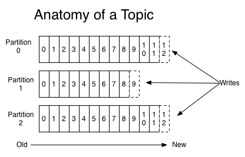
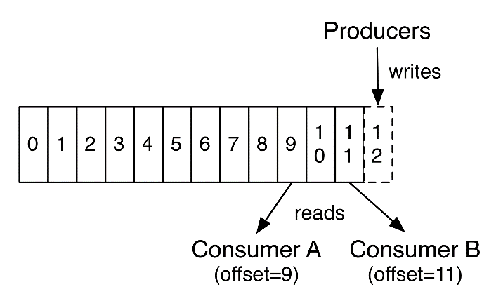
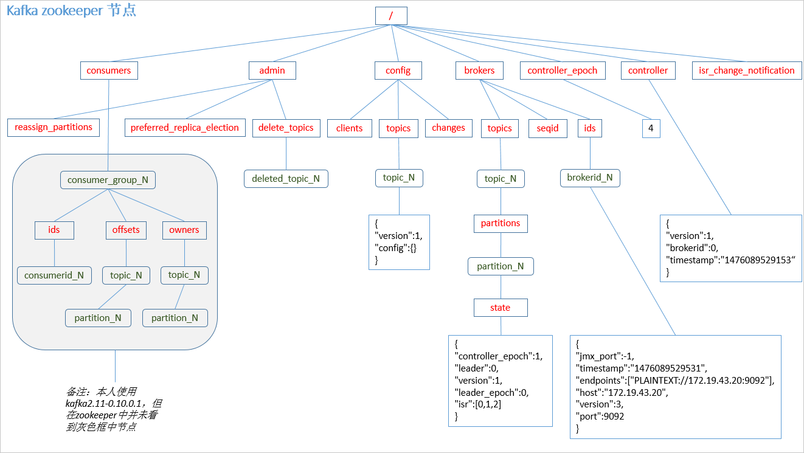
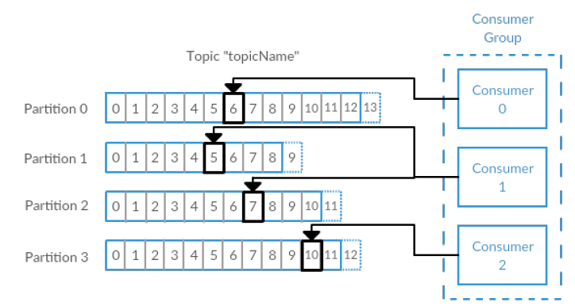

# Kafka


# 一 概述


## 1.1 什么是Kafka

* 在流式计算中,Kafka一般用来缓存数据,Storm通过消费Kafka的数据进行计算
* Kafka是一个开源消息系统,由Scala写成
* 该项目的目标是为处理实时数据提供一个统一、高通量、低等待的平台
* Kafka是一个分布式消息队列
* Kafka对消息保存时根据Topic进行归类,发送消息者称为Producer,消息接受者称为Consumer,此外kafka集群有多个kafka实例组成,每个实例(server)称为broker
* 无论是kafka集群,还是consumer都依赖于zookeeper集群保存一些meta信息,来保证系统可用性


## 1.2 消息队列

* 点对点模式(一对一,消费者主动拉取数据,消息收到后消息清除)
  * 点对点模型通常是一个基于拉取或者轮询的消息传送模型,这种模型从队列中请求信息,而不是将消息推送到客户端.这个模型的特点是发送到队列的消息被一个且只有一个接收者接收处理,即使有多个消息监听者也是如此
* 发布/订阅模式(一对多,数据生产后,推送给所有订阅者)
  * 发布订阅模型则是一个基于推送的消息传送模型.发布订阅模型可以有多种不同的订阅者,临时订阅者只在主动监听主题时才接收消息,而持久订阅者则监听主题的所有消息,即使当前订阅者不可用,处于离线状态
* 图解:见PPT-1


## 1.3 消息队列作用

* 解耦:允许你独立的扩展或修改两边的处理过程,只要确保它们遵守同样的接口约束
* 冗余:消息队列把数据进行持久化直到它们已经被完全处理,通过这一方式规避了数据丢失风险.许多消息队列所采用的"插入-获取-删除"范式中,在把一个消息从队列中删除之前,需要你的处理系统明确的指出该消息已经被处理完毕,从而确保你的数据被安全的保存直到你使用完毕
* 扩展性:因为消息队列解耦了你的处理过程,所以增大消息入队和处理的频率是很容易的,只要另外增加处理过程即可
* 灵活性和峰值处理能力:在访问量剧增的情况下,应用仍然需要继续发挥作用,但是这样的突发流量并不常见.如果为以能处理这类峰值访问为标准来投入资源随时待命无疑是巨大的浪费.使用消息队列能够使关键组件顶住突发的访问压力,而不会因为突发的超负荷的请求而完全崩溃
* 可恢复性:系统的一部分组件失效时,不会影响到整个系统.消息队列降低了进程间的耦合度,所以即使一个处理消息的进程挂掉,加入队列中的消息仍然可以在系统恢复后被处理
* 顺序保证:在大多使用场景下,数据处理的顺序都很重要.大部分消息队列本来就是排序的,并且能保证数据会按照特定的顺序来处理.(Kafka保证一个Partition内的消息的有序性)
* 缓冲:有助于控制和优化数据流经过系统的速度,解决生产消息和消费消息的处理速度不一致的情况
* 异步通信:很多时候,用户不想也不需要立即处理消息.消息队列提供了异步处理机制,允许用户把一个消息放入队列,但并不立即处理它.想向队列中放入多少消息就放多少,然后在需要的时候再去处理它们

 

## 1.4 Kafka架构

图解见PPT-2

* Producer:消息生产者,就是向kafka broker发消息的客户端
* Consumer:消息消费者,向kafka broker取消息的客户端
* Topic:可以理解为一个队列
* Consumer Group (CG):这是kafka用来实现一个topic消息的广播(发给所有的consumer)和单播(发给任意一个consumer)的手段.一个topic可以有多个CG.topic的消息会复制(不是真的复制,是概念上的)到所有的CG,但每个partion只会把消息发给该CG中的一个consumer.如果需要实现广播,只要每个consumer有一个独立的CG就可以了.要实现单播只要所有的consumer在同一个CG.用CG还可以将consumer进行自由的分组而不需要多次发送消息到不同的topic
* Broker:一台kafka服务器就是一个broker.一个集群由多个broker组成.一个broker可以容纳多个topic
* Partition:为了实现扩展性,一个非常大的topic可以分布到多个broker(即服务器)上,一个topic可以分为多个partition,每个partition是一个有序的队列.partition中的每条消息都会被分配一个有序的id(offset).kafka只保证按一个partition中的顺序将消息发给consumer,不保证一个topic的整体(多个partition间)的顺序
* Offset:kafka的存储文件都是按照offset.kafka来命名,用offset做名字的好处是方便查找.例如你想找位于2049的位置,只要找到2048.kafka的文件即可.当然the first offset就是00000000000.kafka


# 二 集群部署


## 2.1 环境准备

准备3台服务器,主机名分别为:hadoop102,hadoop103,hadoop104,每台服务器上都配置zk和kafka


## 2.2 集群部署

* 解压安装包到指定目录,并改名

  ```shell
  tar -zxvf kafka_2.11-0.11.0.0.tgz -C /opt/module/
  mv kafka_2.11-0.11.0.0/ kafka
  ```

* 在/opt/module/kafka目录下创建logs文件夹

* 修改配置文件,config/server.properties

  ```properties
  # broker的全局唯一编号,不能重复
  broker.id=0
  # 是否可以删除topic,默认不能删
  delete.topic.enable=true
  # 处理网络请求的线程数量
  num.network.threads=3
  # 用来处理磁盘IO的线程数量
  num.io.threads=8
  # 发送套接字的缓冲区大小
  socket.send.buffer.bytes=102400
  # 接收套接字的缓冲区大小
  socket.receive.buffer.bytes=102400
  # 请求套接字的缓冲区大小
  socket.request.max.bytes=104857600
  # kafka运行日志存放的路径    
  log.dirs=/opt/module/kafka/logs
  # topic在当前broker上的分区个数
  num.partitions=1
  # 用来恢复和清理data下数据的线程数量
  num.recovery.threads.per.data.dir=1
  # segment文件保留的最长时间,超时将被删除
  log.retention.hours=168
  # 配置连接Zookeeper集群地址
  zookeeper.connect=hadoop102:2181,hadoop103:2181,hadoop104:2181
  ```

* 配置环境变量,之后重启

  ```shell
  vi /etc/profile
  export KAFKA_HOME=/opt/module/kafka
  export PATH=$PATH:$KAFKA_HOME/bin
  source /etc/profile
  ```

* 分发安装包:xsync kafka/,完成之后配置其他的2台服务器的环境变量

* 分别在hadoop103和hadoop104上修改配置文件server.properties中的broker.id=1、broker.id=2

* broker.id不得重复

* 启动集群

  * 依次在hadoop102、hadoop103、hadoop104节点上启动kafka
  * bin/kafka-server-start.sh config/server.properties &

* 关闭集群:bin/kafka-server-stop.sh stop


## 2.3 命令行操作

* 查看当前服务器中的所有topic

  ```shell
  bin/kafka-topics.sh --zookeeper hadoop102:2181 --list
  ```

* 创建topic

  ```shell
  bin/kafka-topics.sh --zookeeper hadoop102:2181 
  --create --replication-factor 3 --partitions 1 --topic first
  ```

  * --topic:定义topic名
  * --replication-factor:定义副本数
  * --partitions:定义分区数

* 删除topic,需要server.properties中设置delete.topic.enable=true,否则只是标记删除或者直接重启

  ```shell
  bin/kafka-topics.sh --zookeeper hadoop102:2181 
  --delete --topic first
  ```

* 发送消息

  ```shell
  bin/kafka-console-producer.sh --broker-list hadoop102:9092 --topic first
  ```

* 消费消息

  ```shell
  # 会把first主题中以往所有的数据都读取出来.根据业务场景选择是否增加该配置
  bin/kafka-console-consumer.sh --zookeeper hadoop102:2181 --from-beginning --topic first --from-beginning
  ```

* 查看某个Topic的详情

  ```shell
  bin/kafka-topics.sh --zookeeper hadoop102:2181 --describe --topic first
  ```


# 三 核心流程


## 3.1 生产过程


### 3.1.1 写入方式

producer采用推(push)模式将消息发布到broker,每条消息都被追加(append)到分区(patition)中,属于顺序写磁盘(顺序写磁盘效率比随机写内存要高,保障kafka吞吐率)


### 3.1.2 分区(Partition)

消息发送时都被发送到一个topic,其本质就是一个目录,而topic是由一些Partition Logs(分区日志)组成,每个Partition中的消息都是有序的,生产的消息被不断追加到Partition log上,其中的每一个消息都被赋予了一个唯一的offset值





* 分区的原因

  * 方便在集群中扩展,每个Partition可以通过调整以适应它所在的机器,而一个topic又可以有多个Partition组成,因此整个集群就可以适应任意大小的数据了
  * 可以提高并发,因为可以以Partition为单位读写了

* 分区的原则
  * 指定了patition,则直接使用
  * 未指定patition但指定key,通过对key的value进行hash出一个patition
  * patition和key都未指定,使用轮询选出一个patition

  ```java
  // DefaultPartitioner类
  public int partition(String topic, Object key, byte[] keyBytes, Object value, byte[] valueBytes, Cluster cluster) {
      List<PartitionInfo> partitions = cluster.partitionsForTopic(topic);
      int numPartitions = partitions.size();
      if (keyBytes == null) {
          int nextValue = nextValue(topic);
          List<PartitionInfo> availablePartitions = cluster.availablePartitionsForTopic(topic);
          if (availablePartitions.size() > 0) {
              int part = Utils.toPositive(nextValue) % availablePartitions.size();
              return availablePartitions.get(part).partition();
          } else {
              // 无可用分区,给一个不可用分区
              return Utils.toPositive(nextValue) % numPartitions;
          }
      } else {
          // hash the keyBytes to choose a partition
          return Utils.toPositive(Utils.murmur2(keyBytes)) % numPartitions;    
      }
  }
  ```

  

### 3.1.3 副本(Replication)

同一个partition可能会有多个replication(对应 server.properties 配置中的 default.replication.factor=N).没有replication的情况下,一旦broker 宕机,其上所有 patition 的数据都不可被消费,同时producer也不能再将数据存于其上的patition.引入replication之后,同一个partition可能会有多个replication,而这时需要在这些replication之间选出一个leader,producer和consumer只与这个leader交互,其它replication作为follower从leader 中复制数据


### 3.1.4 写入流程

producer写入消息流程如下:图解见PPT-3

* producer先从zookeeper的 "/brokers/.../state"节点找到该partition的leader
* producer将消息发送给该leader
* leader将消息写入本地log
* followers从leader pull消息,写入本地log后向leader发送ACK
* leader收到所有ISR中的replication的ACK后,增加HW(high watermark,最后commit 的offset)并向producer发送ACK


## 3.2 Broker保存消息


### 3.2.1 存储方式

物理上把topic分成一个或多个patition(对应server.properties中的num.partitions=3配置),每个patition物理上对应一个目录(该目录存储该patition的所有消息和索引文件)


### 3.2.2 存储策略

无论消息是否被消费,kafka都会保留所有消息.有两种策略可以删除旧数据:

* 基于时间:log.retention.hours=168
* 基于大小:log.retention.bytes=1073741824
* 需要注意的是,因为Kafka读取特定消息的时间复杂度为O(1),即与文件大小无关,所以这里删除过期文件与提高 Kafka 性能无关


### 3.2.3 Zookeeper存储结构



注意:producer不在zk中注册,消费者在zk中注册


## 3.3 Kafka消费过程分析

kafka提供了两套consumer API:高级Consumer API和低级Consumer API


### 3.3.1 高级API

* 优点
  * 高级API 写起来简单,不需要自行去管理offset,系统通过zookeeper自行管理
  * 不需要管理分区,副本等情况,系统自动管理
  * 消费者断线会自动根据上一次记录在zookeeper中的offset去接着获取数据,默认设置1分钟更新一下zookeeper中存的offset
  * 可以使用group来区分对同一个topic的不同程序访问分离开来,不同的group记录不同的offset,这样不同程序读取同一个topic才不会因为offset互相影响
* 缺点
  * 不能自行控制offset(对于某些特殊需求来说)
  * 不能细化控制如分区、副本、zk等


### 3.3.2 低级API

* 优点
  * 能够让开发者自己控制offset,想从哪里读取就从哪里读取
  * 自行控制连接分区,对分区自定义进行负载均衡
  * 对zookeeper的依赖性降低(如:offset不一定非要靠zk存储,自行存储offset即可,比如存在文件或者内存中)
* 缺点
  * 太过复杂,需要自行控制offset,连接哪个分区,找到分区leader 等


### 3.3.3 消费者组



* 消费者是以consumer group消费者组的方式工作,由一个或者多个消费者组成一个组,共同消费一个topic.每个分区在同一时间只能由group中的一个消费者读取,但是多个group可以同时消费这个partition.在图中,有一个由三个消费者组成的group,有一个消费者读取主题中的两个分区,另外两个分别读取一个分区.某个消费者读取某个分区,也可以叫做某个消费者是某个分区的拥有者
* 在这种情况下,消费者可以通过水平扩展的方式同时读取大量的消息.另外,如果一个消费者失败了,那么其他的group成员会自动负载均衡读取之前失败的消费者读取的分区


### 3.3.4 消费方式

* consumer采用pull(拉)模式从broker中读取数据
* push(推)模式很难适应消费速率不同的消费者,因为消息发送速率是由broker决定的.它的目标是尽可能以最快速度传递消息,但是这样很容易造成consumer来不及处理消息,典型的表现就是拒绝服务以及网络拥塞.而pull模式则可以根据consumer的消费能力以适当的速率消费消息
* 对于Kafka而言,pull模式更合适,它可简化broker的设计,consumer可自主控制消费消息的速率,同时consumer可以自己控制消费方式——即可批量消费也可逐条消费,同时还能选择不同的提交方式从而实现不同的传输语义
* pull模式不足之处是,如果kafka没有数据,消费者可能会陷入循环中,一直等待数据到达.为了避免这种情况,我们在我们的拉请求中有参数,允许消费者请求在等待数据到达的“长轮询”中进行阻塞(并且可选地等待到给定的字节数,以确保大的传输大小)


### 3.3.5 消费者组案例

需求:测试同一个消费者组中的消费者,同一时刻只能有一个消费者消费

* 在hadoop102、hadoop103上修改/opt/module/kafka/config/consumer.properties配置文件中的group.id属性为任意组名

  ```shell
  vi consumer.properties
  group.id=atguigu
  ```

* 在hadoop102、hadoop103上分别启动消费者

  ```shell
  bin/kafka-console-consumer.sh --zookeeper hadoop102:2181 --topic first --consumer.config config/consumer.properties
  ```

* 在hadoop104上启动生产者

  ```shell
  bin/kafka-console-producer.sh --broker-list hadoop104:9092 --topic first
  ```

* 查看hadoop102和hadoop103的接收者,同一时刻只有一个消费者接收到消息


# 四 [Kafka ](http://www.cnblogs.com/huxi2b/p/7072447.html)API


## 4.1 环境准备

* 启动zk和kafka集群,在kafka集群中打开一个消费者

  ```shell
  bin/kafka-console-consumer.sh --zookeeper hadoop102:2181 --topic first
  ```

* 导入pom依赖

  ```xml
  <dependencies>
      <dependency>
          <groupId>org.apache.kafka</groupId>
          <artifactId>kafka-clients</artifactId>
          <version>0.11.0.0</version>
      </dependency>
      <dependency>
          <groupId>org.apache.kafka</groupId>
          <artifactId>kafka_2.12</artifactId>
          <version>0.11.0.0</version>
      </dependency>
  </dependencies>
  ```

  


## 4.2 生产者


### 4.2.2 普通生产者

```java
package com.atguigu.kafka;
import java.util.Properties;
import org.apache.kafka.clients.producer.KafkaProducer;
import org.apache.kafka.clients.producer.Producer;
import org.apache.kafka.clients.producer.ProducerRecord;

public class NewProducer {
    public static void main(String[] args) {
        Properties props = new Properties();
        // Kafka服务端的主机名和端口号
        props.put("bootstrap.servers", "hadoop103:9092");
        // 等待所有副本节点的应答
        props.put("acks", "all");
        // 消息发送最大尝试次数
        props.put("retries", 0);
        // 一批消息处理大小
        props.put("batch.size", 16384);
        // 请求延时
        props.put("linger.ms", 1);
        // 发送缓存区内存大小
        props.put("buffer.memory", 33554432);
        // key序列化
        props.put("key.serializer", "org.apache.kafka.common.serialization.StringSerializer");
        // value序列化
        props.put("value.serializer", "org.apache.kafka.common.serialization.StringSerializer");
        Producer<String, String> producer = new KafkaProducer<>(props);
        for (int i = 0; i < 50; i++) {
            producer.send(new ProducerRecord<String, String>("first", Integer.toString(i), "hello world-" + i));
        }
        producer.close();
    }
}
```


### 4.2.3 带回调函数

```java
package com.atguigu.kafka;
import java.util.Properties;
import org.apache.kafka.clients.producer.Callback;
import org.apache.kafka.clients.producer.KafkaProducer;
import org.apache.kafka.clients.producer.ProducerRecord;
import org.apache.kafka.clients.producer.RecordMetadata;

public class CallBackProducer {
    public static void main(String[] args) {
        Properties props = new Properties();
        // Kafka服务端的主机名和端口号  
        props.put("bootstrap.servers", "hadoop103:9092");
        // 等待所有副本节点的应答
        props.put("acks", "all");
        // 消息发送最大尝试次数
        props.put("retries", 0);
        // 一批消息处理大小
        props.put("batch.size", 16384);
        // 增加服务端请求延时
        props.put("linger.ms", 1);
        // 发送缓存区内存大小
        props.put("buffer.memory", 33554432);
        // key序列化
        props.put("key.serializer", "org.apache.kafka.common.serialization.StringSerializer");
        // value序列化
        props.put("value.serializer", "org.apache.kafka.common.serialization.StringSerializer");
        KafkaProducer<String, String> kafkaProducer = new KafkaProducer<>(props);
        for (int i = 0; i < 50; i++) {
            kafkaProducer.send(new ProducerRecord<String, String>("first", "hello" + i), new Callback() {
                @Override
                public void onCompletion(RecordMetadata metadata, Exception exception) {
                    if (metadata != null) {
                        System.err.println(metadata.partition() + "---" + metadata.offset());
                    }
                }
            });  
        }
        kafkaProducer.close();
    }
}
```


### 4.2.4 自定义分区

* 将所有数据存储到topic的第0号分区上

```java
package com.atguigu.kafka;
import java.util.Map;
import org.apache.kafka.clients.producer.Partitioner;
import org.apache.kafka.common.Cluster;
public class CustomPartitioner implements Partitioner {
    @Override
    public void configure(Map<String, ?> configs) {

    }
    @Override
    public int partition(String topic, Object key, byte[] keyBytes, Object value, byte[] valueBytes, Cluster cluster) {
        // 控制分区
        return 0;
    }

    @Override
    public void close() {
    }
}
```


* 在代码中调用

```java
package com.atguigu.kafka;
import java.util.Properties;
import org.apache.kafka.clients.producer.KafkaProducer;
import org.apache.kafka.clients.producer.Producer;
import org.apache.kafka.clients.producer.ProducerRecord;

public class PartitionerProducer {
    public static void main(String[] args) {
        Properties props = new Properties();
        // Kafka服务端的主机名和端口号
        props.put("bootstrap.servers", "hadoop103:9092");
        // 等待所有副本节点的应答
        props.put("acks", "all");
        // 消息发送最大尝试次数
        props.put("retries", 0);
        // 一批消息处理大小
        props.put("batch.size", 16384);
        // 增加服务端请求延时
        props.put("linger.ms", 1);
        // 发送缓存区内存大小
        props.put("buffer.memory", 33554432);
        // key序列化
        props.put("key.serializer", "org.apache.kafka.common.serialization.StringSerializer");
        // value序列化
        props.put("value.serializer", "org.apache.kafka.common.serialization.StringSerializer");
        // 自定义分区
        props.put("partitioner.class", "com.atguigu.kafka.CustomPartitioner");
        Producer<String, String> producer = new KafkaProducer<>(props);
        producer.send(new ProducerRecord<String, String>("first", "1", "atguigu"));
        producer.close();
    }
}
```


* 测试:在hadoop102上利用tail监控/opt/module/kafka/logs/目录下first主题3个分区的log日志动态变化情况,发现数据都存储到指定的分区了


## 4.3 消费者


### 4.3.1 高级API


* 自动维护消费情况

```java
package com.atguigu.kafka.consume;
import java.util.Arrays;
import java.util.Properties;
import org.apache.kafka.clients.consumer.ConsumerRecord;
import org.apache.kafka.clients.consumer.ConsumerRecords;
import org.apache.kafka.clients.consumer.KafkaConsumer;

public class CustomNewConsumer {
    public static void main(String[] args) {
        Properties props = new Properties();
        // 定义kakfa 服务的地址,不需要将所有broker指定上 
        props.put("bootstrap.servers", "hadoop102:9092");
        // 制定consumer group 
        props.put("group.id", "test");
        // 是否自动确认offset 
        props.put("enable.auto.commit", "true");
        // 自动确认offset的时间间隔 
        props.put("auto.commit.interval.ms", "1000");
        // key的序列化类
        props.put("key.deserializer", "org.apache.kafka.common.serialization.StringDeserializer");
        // value的序列化类 
        props.put("value.deserializer", "org.apache.kafka.common.serialization.StringDeserializer");
        // 定义consumer 
        KafkaConsumer<String, String> consumer = new KafkaConsumer<>(props);
        // 消费者订阅的topic, 可同时订阅多个 
        consumer.subscribe(Arrays.asList("first", "second","third"));
        while (true) {
            // 读取数据,读取超时时间为100ms 
            ConsumerRecords<String, String> records = consumer.poll(100);
            for (ConsumerRecord<String, String> record : records)
                System.out.printf("offset = %d, key = %s, value = %s%n", record.offset(), record.key(), record.value());
        }
    }
}
```


### 4.3.2 低级API

实现使用低级API读取指定topic,指定partition,指定offset的数据

* 消费者使用低级API 的主要步骤

| 步骤 | 主要工作                               |
| ---- | -------------------------------------- |
| 1    | 根据指定的分区从主题元数据中找到主副本 |
| 2    | 获取分区最新的消费进度                 |
| 3    | 从主副本拉取分区的消息                 |
| 4    | 识别主副本的变化,重试                  |

* 方法描述

| findLeader()    | 客户端向种子节点发送主题元数据,将副本集加入备用节点 |
| --------------- | --------------------------------------------------- |
| getLastOffset() | 消费者客户端发送偏移量请求,获取分区最近的偏移量     |
| run()           | 消费者低级AP I拉取消息的主要方法                    |
| findNewLeader() | 当分区的主副本节点发生故障,客户将要找出新的主副本   |

* 代码

```java
package com.atguigu;
import java.nio.ByteBuffer;
import java.util.ArrayList;
import java.util.Collections;
import java.util.HashMap;
import java.util.List;
import java.util.Map;
import kafka.api.FetchRequest;
import kafka.api.FetchRequestBuilder;
import kafka.api.PartitionOffsetRequestInfo;
import kafka.cluster.BrokerEndPoint;
import kafka.common.ErrorMapping;
import kafka.common.TopicAndPartition;
import kafka.javaapi.FetchResponse;
import kafka.javaapi.OffsetResponse;
import kafka.javaapi.PartitionMetadata;
import kafka.javaapi.TopicMetadata;
import kafka.javaapi.TopicMetadataRequest;
import kafka.javaapi.consumer.SimpleConsumer;
import kafka.message.MessageAndOffset;

public class SimpleExample {
    private List<String> m_replicaBrokers = new ArrayList<>();
    public SimpleExample() {
        m_replicaBrokers = new ArrayList<>();
    }

    public static void main(String args[]) {
        SimpleExample example = new SimpleExample();
        // 最大读取消息数量
        long maxReads = Long.parseLong("3");
        // 要订阅的topic
        String topic = "test1";
        // 要查找的分区
        int partition = Integer.parseInt("0");
        // broker节点的ip
        List<String> seeds = new ArrayList<>();
        seeds.add("192.168.9.102");
        seeds.add("192.168.9.103");
        seeds.add("192.168.9.104");
        // 端口
        int port = Integer.parseInt("9092");
        try {
            example.run(maxReads, topic, partition, seeds, port);
        } catch (Exception e) {
            System.out.println("Oops:" + e);
            e.printStackTrace();
        }
    }

    public void run(long a_maxReads, String a_topic, int a_partition, List<String> a_seedBrokers, int a_port) throws Exception {
        // 获取指定Topic partition的元数据
        PartitionMetadata metadata = findLeader(a_seedBrokers, a_port, a_topic, a_partition);
        if (metadata == null) {
            System.out.println("Can't find metadata for Topic and Partition. Exiting");
            return;
        }
        if (metadata.leader() == null) {
            System.out.println("Can't find Leader for Topic and Partition. Exiting");
            return;
        }
        String leadBroker = metadata.leader().host();
        String clientName = "Client_" + a_topic + "_" + a_partition;
        SimpleConsumer consumer = new SimpleConsumer(leadBroker, a_port, 100000, 64 * 1024, clientName);
        long readOffset = getLastOffset(consumer, a_topic, a_partition, kafka.api.OffsetRequest.EarliestTime(), clientName);
        int numErrors = 0;
        while (a_maxReads > 0) {
            if (consumer == null) {
                consumer = new SimpleConsumer(leadBroker, a_port, 100000, 64 * 1024, clientName);
            }
            FetchRequest req = new FetchRequestBuilder().clientId(clientName).addFetch(a_topic, a_partition, readOffset, 100000).build();
            FetchResponse fetchResponse = consumer.fetch(req);
            if (fetchResponse.hasError()) {
                numErrors++;
                // Something went wrong!
                short code = fetchResponse.errorCode(a_topic, a_partition);
                System.out.println("Error fetching data from the Broker:" + leadBroker + " Reason: " + code);
                if (numErrors > 5)
                    break;
                if (code == ErrorMapping.OffsetOutOfRangeCode()) {
                    // We asked for an invalid offset. For simple case ask for
                    // the last element to reset
                    readOffset = getLastOffset(consumer, a_topic, a_partition, kafka.api.OffsetRequest.LatestTime(), clientName);
                    continue;
                }
                consumer.close();
                consumer = null;
                leadBroker = findNewLeader(leadBroker, a_topic, a_partition, a_port);
                continue;
            }
            numErrors = 0;
            long numRead = 0;
            for (MessageAndOffset messageAndOffset : fetchResponse.messageSet(a_topic, a_partition)) {
                long currentOffset = messageAndOffset.offset();
                if (currentOffset < readOffset) {
                    System.out.println("Found an old offset: " + currentOffset + " Expecting: " + readOffset);
                    continue;
                }
                readOffset = messageAndOffset.nextOffset();
                ByteBuffer payload = messageAndOffset.message().payload();
                byte[] bytes = new byte[payload.limit()];
                payload.get(bytes);
                System.out.println(String.valueOf(messageAndOffset.offset()) + ": " + new String(bytes, "UTF-8"));
                numRead++;
                a_maxReads--;
            }
            if (numRead == 0) {
                try {
                    Thread.sleep(1000);
                } catch (InterruptedException ie) {
                }
            }
        }
        if (consumer != null)
            consumer.close();
    }

    public static long getLastOffset(SimpleConsumer consumer, String topic, int partition, long whichTime, String clientName) {
        TopicAndPartition topicAndPartition = new TopicAndPartition(topic, partition);
        Map<TopicAndPartition, PartitionOffsetRequestInfo> requestInfo = new HashMap<TopicAndPartition, PartitionOffsetRequestInfo>();
        requestInfo.put(topicAndPartition, new PartitionOffsetRequestInfo(whichTime, 1));
        kafka.javaapi.OffsetRequest request = new kafka.javaapi.OffsetRequest(requestInfo, kafka.api.OffsetRequest.CurrentVersion(), clientName);
        OffsetResponse response = consumer.getOffsetsBefore(request);
        if (response.hasError()) {
            System.out.println("Error fetching data Offset Data the Broker. Reason: " + response.errorCode(topic, partition));
            return 0;
        }
        long[] offsets = response.offsets(topic, partition);
        return offsets[0];
    }

    private String findNewLeader(String a_oldLeader, String a_topic, int a_partition, int a_port) throws Exception {
        for (int i = 0; i < 3; i++) {
            boolean goToSleep = false;
            PartitionMetadata metadata = findLeader(m_replicaBrokers, a_port, a_topic, a_partition);
            if (metadata == null) {
                goToSleep = true;
            } else if (metadata.leader() == null) {
                goToSleep = true;
            } else if (a_oldLeader.equalsIgnoreCase(metadata.leader().host()) && i == 0) {
                // first time through if the leader hasn't changed give
                // ZooKeeper a second to recover
                // second time, assume the broker did recover before failover,
                // or it was a non-Broker issue
                //
                goToSleep = true;
            } else {
                return metadata.leader().host();
            }
            if (goToSleep) {
                Thread.sleep(1000);
            }
        }
        System.out.println("Unable to find new leader after Broker failure. Exiting");
        throw new Exception("Unable to find new leader after Broker failure. Exiting");
    }

    private PartitionMetadata findLeader(List<String> a_seedBrokers, int a_port, String a_topic, int a_partition) {
        PartitionMetadata returnMetaData = null;
        loop:
        for (String seed : a_seedBrokers) {
            SimpleConsumer consumer = null;
            try {
                consumer = new SimpleConsumer(seed, a_port, 100000, 64 * 1024, "leaderLookup");
                List<String> topics = Collections.singletonList(a_topic);
                TopicMetadataRequest req = new TopicMetadataRequest(topics);
                kafka.javaapi.TopicMetadataResponse resp = consumer.send(req);
                List<TopicMetadata> metaData = resp.topicsMetadata();
                for (TopicMetadata item : metaData) {
                    for (PartitionMetadata part : item.partitionsMetadata()) {
                        if (part.partitionId() == a_partition) {
                            returnMetaData = part;
                            break loop;
                        }
                    }
                }
            } catch (Exception e) {
                System.out.println("Error communicating with Broker [" + seed + "] to find Leader for [" + a_topic + ", " + a_partition + "] Reason: " + e);
            } finally {
                if (consumer != null)
                    consumer.close();
            }
        }
        if (returnMetaData != null) {
            m_replicaBrokers.clear();
            for (BrokerEndPoint replica : returnMetaData.replicas()) {
                m_replicaBrokers.add(replica.host());
            }
        }
        return returnMetaData;
    }
}
```


# 五 [producer拦截器](http://www.cnblogs.com/huxi2b/p/7072447.html)


## 5.1 原理

* Producer拦截器(interceptor)是在Kafka 0.10版本被引入的,主要用于实现clients端的定制化控制逻辑
* 对于producer而言,interceptor使得用户在消息发送前以及producer回调逻辑前有机会对消息做一些定制化需求,比如修改消息等.同时,producer允许用户指定多个interceptor按序作用于同一条消息从而形成一个拦截链(interceptor chain).Intercetpor的实现接口是org.apache.kafka.clients.producer.ProducerInterceptor,其定义的方法包括:
  * configure(configs):获取配置信息和初始化数据时调用
  * onSend(ProducerRecord):该方法封装进KafkaProducer.send方法中,即它运行在用户主线程中.Producer确保在消息被序列化以及计算分区前调用该方法.用户可以在该方法中对消息做任何操作,但最好保证不要修改消息所属的topic和分区,否则会影响目标分区的计算
  * onAcknowledgement(RecordMetadata, Exception):该方法会在消息被应答或消息发送失败时调用,并且通常都是在producer回调逻辑触发之前.onAcknowledgement运行在producer的IO线程中,因此不要在该方法中放入很重的逻辑,否则会拖慢producer的消息发送效率
  * close:关闭interceptor,主要用于执行一些资源清理工作
* interceptor可能被运行在多个线程中,因此在具体实现时用户需要自行确保线程安全
* 倘若指定了多个interceptor,则producer将按照指定顺序调用它们,并仅仅是捕获每个interceptor可能抛出的异常记录到错误日志中而非在向上传递,在使用过程中要特别留意


## 5.2 案例


需求:实现一个简单的双interceptor组成的拦截链.第一个interceptor会在消息发送前将时间戳信息加到消息value的最前部;第二个interceptor会在消息发送后更新成功发送消息数或失败发送消息数

图解见PPT-5


* 增加时间戳拦截器

```java
package com.atguigu.kafka.interceptor;
import java.util.Map;
import org.apache.kafka.clients.producer.ProducerInterceptor;
import org.apache.kafka.clients.producer.ProducerRecord;
import org.apache.kafka.clients.producer.RecordMetadata;
public class TimeInterceptor implements ProducerInterceptor<String, String> {
    @Override
    public void configure(Map<String, ?> configs) {
    }

    @Override
    public ProducerRecord<String, String> onSend(ProducerRecord<String, String> record) {
        // 创建一个新的record,把时间戳写入消息体的最前部
        return new ProducerRecord(record.topic(), record.partition(), record.timestamp(), record.key(),System.currentTimeMillis() + "," + record.value().toString());
    }

    @Override
    public void onAcknowledgement(RecordMetadata metadata, Exception exception) {
    }

    @Override
    public void close() {
    }
}
```


* 统计发送消息成功和发送失败消息数,并在producer关闭时打印这两个计数器

```java
package com.atguigu.kafka.interceptor;
import java.util.Map;
import org.apache.kafka.clients.producer.ProducerInterceptor;
import org.apache.kafka.clients.producer.ProducerRecord;
import org.apache.kafka.clients.producer.RecordMetadata;

public class CounterInterceptor implements ProducerInterceptor<String, String>{
    private int errorCounter = 0;
    private int successCounter = 0;

    @Override
    public void configure(Map<String, ?> configs) {

    }

    @Override
    public ProducerRecord<String, String> onSend(ProducerRecord<String, String> record) {
        return record;
    }

    @override
    public void onAcknowledgement(RecordMetadata metadata, Exception exception) {
        // 统计成功和失败的次数
        if (exception == null) {
            successCounter++;
        } else {
            errorCounter++;
        }
    }

    @Override
    public void close() {
        // 保存结果
        System.out.println("Successful sent: " + successCounter);
        System.out.println("Failed sent: " + errorCounter);
    }
}
```


* producer主程序

```java
package com.atguigu.kafka.interceptor;
import java.util.ArrayList;
import java.util.List;
import java.util.Properties;
import org.apache.kafka.clients.producer.KafkaProducer;
import org.apache.kafka.clients.producer.Producer;
import org.apache.kafka.clients.producer.ProducerConfig;
import org.apache.kafka.clients.producer.ProducerRecord;

public class InterceptorProducer {
    public static void main(String[] args) throws Exception {
        // 1 设置配置信息
        Properties props = new Properties();
        props.put("bootstrap.servers", "hadoop102:9092");
        props.put("acks", "all");
        props.put("retries", 0);
        props.put("batch.size", 16384);
        props.put("linger.ms", 1);
        props.put("buffer.memory", 33554432);
        props.put("key.serializer", "org.apache.kafka.common.serialization.StringSerializer");
        props.put("value.serializer", "org.apache.kafka.common.serialization.StringSerializer");
        // 2 构建拦截链
        List<String> interceptors = new ArrayList<>();
       interceptors.add("com.atguigu.kafka.interceptor.TimeInterceptor");   interceptors.add("com.atguigu.kafka.interceptor.CounterInterceptor");
        props.put(ProducerConfig.INTERCEPTOR_CLASSES_CONFIG, interceptors);
        String topic = "first";
        Producer<String, String> producer = new KafkaProducer<>(props);
        // 3 发送消息
        for (int i = 0; i < 10; i++) {
            ProducerRecord<String, String> record = new ProducerRecord<>(topic, "message" + i);
            producer.send(record);
        }
        // 4 一定要关闭producer,这样才会调用interceptor的close方法
        producer.close();
    }
}
```


* 测试,)在kafka上启动消费者,然后运行客户端java程序

```shell
bin/kafka-console-consumer.sh --zookeeper hadoop102:2181 --from-beginning --topic first
```


# 六 Kafka Streams


## 6.1 概述

* 用于在Kafka上构建高可分布式,拓展性,容错的应用程序
* 功能强大,高扩展性,弹性,容错
* 轻量级,无需专门的集群,一个库,而不是框架
* 完全集成,100%的Kafka 0.10.0版本兼容,易于集成到现有的应用程序
* 实时性,毫秒级延迟,并非微批处理,窗口允许乱序数据,允许迟到数据


## 6.2 作用

* 当前已经有非常多的流式处理系统,例如Spark Streaming和Storm
* Storm发展多年,应用广泛,提供记录级别的处理能力,当前也支持SQL on Stream
* Spark Streaming基于Spark,可以非常方便与图计算,SQL处理等集成,功能强大
* 目前主流的Hadoop发行版,都集成了Storm和Spark,使得部署更容易
* 既然Spark与Storm拥用如此多的优势,那为何还需要Kafka Stream呢,主要有如下原因

* Spark和Storm都是流式处理框架,要求开发者按照特定的方式去开发逻辑部分,供框架调用.开发者很难了解框架的具体运行方式,从而使得调试成本高,并且使用受限.
* 而Kafka Stream提供的是一个基于Kafka的流式处理类库,直接提供具体的类给开发者调用,整个应用的运行方式主要由开发者控制,方便使用和调试
* Cloudera与Hortonworks方便了Storm和Spark的部署,但这些框架的部署仍相对复杂.而Kafka Stream作为类库,可以很方便的嵌入程序中,它对应用的打包和部署基本没有要求
* 大部分流式处理系统基本都支持Kafka作为数据源,而且系统中都已部署了Kafka,此时使用Kafka Stream的成本非常低
* 使用Storm或Spark Streaming时,需要为框架本身的进程预留资源,如Storm的supervisor和Spark on YARN的NodeManager.即使对于应用而言,框架本身也会占用部分资源,如Spark Streaming需要为shuffle和storage预留内存.但是Kafka作为类库不占用系统资源
* 由于Kafka本身提供数据持久化,因此Kafka Stream提供滚动部署和滚动升级以及重新计算的能力
* 由于Kafka Consumer Rebalance机制,Kafka Stream可以在线动态调整并行度


## 6.3 数据清洗

* 需求:实时处理单词带有”>>>”前缀的内容.例如输入”atguigu>>>ximenqing”,最终处理成“ximenqing”
* 需求分析:图解见PPT-6
* 创建主类

```java
package com.atguigu.kafka.stream;
import java.util.Properties;
import org.apache.kafka.streams.KafkaStreams;
import org.apache.kafka.streams.StreamsConfig;
import org.apache.kafka.streams.processor.Processor;
import org.apache.kafka.streams.processor.ProcessorSupplier;
import org.apache.kafka.streams.processor.TopologyBuilder;

public class Application {
    public static void main(String[] args) {
        // 定义输入的topic
        String from = "first";
        // 定义输出的topic
        String to = "second";
        // 设置参数
        Properties settings = new Properties();
        settings.put(StreamsConfig.APPLICATION_ID_CONFIG, "logFilter");
        settings.put(StreamsConfig.BOOTSTRAP_SERVERS_CONFIG, "hadoop102:9092");
        StreamsConfig config = new StreamsConfig(settings);
        // 构建拓扑
        TopologyBuilder builder = new TopologyBuilder();
        builder.addSource("SOURCE", from)
            .addProcessor("PROCESS", new ProcessorSupplier<byte[], byte[]>() {
                @Override
                public Processor<byte[], byte[]> get() {
                    // 具体分析处理
                    return new LogProcessor();
                }
            }, "SOURCE")
            .addSink("SINK", to, "PROCESS");
        // 创建kafka stream
        KafkaStreams streams = new KafkaStreams(builder, config);
        streams.start();
    }
}
```

* 具体业务处理

```java
package com.atguigu.kafka.stream;
import org.apache.kafka.streams.processor.Processor;
import org.apache.kafka.streams.processor.ProcessorContext;
public class LogProcessor implements Processor<byte[], byte[]> {
    private ProcessorContext context;
    @Override
    public void init(ProcessorContext context) {
        this.context = context;
    }

    @Override
    public void process(byte[] key, byte[] value) {
        String input = new String(value);
        // 如果包含“>>>”则只保留该标记后面的内容
        if (input.contains(">>>")) {
            input = input.split(">>>")[1].trim();
            // 输出到下一个topic
            context.forward("logProcessor".getBytes(), input.getBytes());
        }else{
            context.forward("logProcessor".getBytes(), input.getBytes());
        }
    }
    @Override

    public void punctuate(long timestamp) {
    }

    @Override
    public void close() {
    }
}
```

* 运行程序
* 在hadoop104上启动生产者

```SHELL
bin/kafka-console-producer.sh --broker-list hadoop102:9092 --topic first
>hello>>>world
>h>>>atguigu
>hahaha
```

* 在hadoop103上启动消费者

```shell
bin/kafka-console-consumer.sh --zookeeper hadoop102:2181 --from-beginning --topic second
```


# 七 扩展


## 7.1 Kafka与Flume


* flume:
  * 适合多个生产者
  * 适合下游数据消费者不多的情况
  * 适合数据安全性要求不高的操作
  * 适合与Hadoop生态圈对接的操作
* kafka:
  * 适合数据下游消费众多的情况
  * 适合数据安全性要求较高的操作,支持replication
* 常用的一种模型是:线上数据-->flume-->kafka-->flume(根据情景增删该流程)-->HDFS


## 7.2 Flume与kafka集成

* 配置flume(flume-kafka.conf)

```shell
# define
a1.sources = r1
a1.sinks = k1
a1.channels = c1
# source
a1.sources.r1.type = exec
a1.sources.r1.command = tail -F -c +0 /opt/module/datas/flume.log
a1.sources.r1.shell = /bin/bash -c
# sink
a1.sinks.k1.type = org.apache.flume.sink.kafka.KafkaSink
a1.sinks.k1.kafka.bootstrap.servers = hadoop102:9092,hadoop103:9092,hadoop104:9092
a1.sinks.k1.kafka.topic = first
a1.sinks.k1.kafka.flumeBatchSize = 20
a1.sinks.k1.kafka.producer.acks = 1
a1.sinks.k1.kafka.producer.linger.ms = 1
# channel
a1.channels.c1.type = memory
a1.channels.c1.capacity = 1000
a1.channels.c1.transactionCapacity = 100
# bind
a1.sources.r1.channels = c1
a1.sinks.k1.channel = c1
```

* 启动kafkaIDEA消费者
* 进入flume根目录下,启动flume

```shell
bin/flume-ng agent -c conf/ -n a1 -f jobs/flume-kafka.conf
```

* 向 /opt/module/datas/flume.log里追加数据,查看kafka消费者消费情况

```shell
echo hello > /opt/module/datas/flume.log
```


## 7.3 Kafka配置


### 7.3.1 Broker

| **属性**                                | **默认值**         | **描述**                                                     |
| --------------------------------------- | ------------------ | ------------------------------------------------------------ |
| broker.id                               |                    | 必填参数,broker的唯一标识                                    |
| log.dirs                                | /tmp/kafka-logs    | Kafka数据存放的目录.可以指定多个目录,中间用逗号分隔,当新partition被创建的时会被存放到当前存放partition最少的目录. |
| port                                    | 9092               | BrokerServer接受客户端连接的端口号                           |
| zookeeper.connect                       | null               | Zookeeper的连接串,格式为:hostname1:port1,hostname2:port2,hostname3:port3.可以填一个或多个,为了提高可靠性,建议都填上.注意,此配置允许我们指定一个zookeeper路径来存放此kafka集群的所有数据,为了与其他应用集群区分开,建议在此配置中指定本集群存放目录,格式为:hostname1:port1,hostname2:port2,hostname3:port3/chroot/path  .需要注意的是,消费者的参数要和此参数一致. |
| message.max.bytes                       | 1000000            | 服务器可以接收到的最大的消息大小.注意此参数要和consumer的maximum.message.size大小一致,否则会因为生产者生产的消息太大导致消费者无法消费. |
| num.io.threads                          | 8                  | 服务器用来执行读写请求的IO线程数,此参数的数量至少要等于服务器上磁盘的数量. |
| queued.max.requests                     | 500                | I/O线程可以处理请求的队列大小,若实际请求数超过此大小,网络线程将停止接收新的请求. |
| socket.send.buffer.bytes                | 100 * 1024         | The SO_SNDBUFF buffer the server prefers for socket  connections. |
| socket.receive.buffer.bytes             | 100 * 1024         | The SO_RCVBUFF buffer the server prefers for socket  connections. |
| socket.request.max.bytes                | 100 * 1024 * 1024  | 服务器允许请求的最大值, 用来防止内存溢出,其值应该小于 Java heap size. |
| num.partitions                          | 1                  | 默认partition数量,如果topic在创建时没有指定partition数量,默认使用此值,建议改为5 |
| log.segment.bytes                       | 1024 * 1024 * 1024 | Segment文件的大小,超过此值将会自动新建一个segment,此值可以被topic级别的参数覆盖. |
| log.roll.{ms,hours}                     | 24 * 7 hours       | 新建segment文件的时间,此值可以被topic级别的参数覆盖.         |
| log.retention.{ms,minutes,hours}        | 7 days             | Kafka segment log的保存周期,保存周期超过此时间日志就会被删除.此参数可以被topic级别参数覆盖.数据量大时,建议减小此值. |
| log.retention.bytes                     | -1                 | 每个partition的最大容量,若数据量超过此值,partition数据将会被删除.注意这个参数控制的是每个partition而不是topic.此参数可以被log级别参数覆盖. |
| log.retention.check.interval.ms         | 5 minutes          | 删除策略的检查周期                                           |
| auto.create.topics.enable               | true               | 自动创建topic参数,建议此值设置为false,严格控制topic管理,防止生产者错写topic. |
| default.replication.factor              | 1                  | 默认副本数量,建议改为2.                                      |
| replica.lag.time.max.ms                 | 10000              | 在此窗口时间内没有收到follower的fetch请求,leader会将其从ISR(in-sync replicas)中移除. |
| replica.lag.max.messages                | 4000               | 如果replica节点落后leader节点此值大小的消息数量,leader节点就会将其从ISR中移除. |
| replica.socket.timeout.ms               | 30 * 1000          | replica向leader发送请求的超时时间.                           |
| replica.socket.receive.buffer.bytes     | 64 * 1024          | The socket receive buffer for network requests to the leader  for replicating data. |
| replica.fetch.max.bytes                 | 1024 * 1024        | The number of byes of messages to attempt to fetch for each  partition in the fetch requests the replicas send to the leader. |
| replica.fetch.wait.max.ms               | 500                | The maximum amount of time to wait time for data to arrive  on the leader in the fetch requests sent by the replicas to the leader. |
| num.replica.fetchers                    | 1                  | Number of threads used to replicate messages from leaders.  Increasing this value can increase the degree of I/O parallelism in the follower  broker. |
| fetch.purgatory.purge.interval.requests | 1000               | The purge interval (in number of requests) of the fetch  request purgatory. |
| zookeeper.session.timeout.ms            | 6000               | ZooKeeper session 超时时间.如果在此时间内server没有向zookeeper发送心跳,zookeeper就会认为此节点已挂掉. 此值太低导致节点容易被标记死亡;若太高,.会导致太迟发现节点死亡. |
| zookeeper.connection.timeout.ms         | 6000               | 客户端连接zookeeper的超时时间.                               |
| zookeeper.sync.time.ms                  | 2000               | H ZK follower落后 ZK  leader的时间.                          |
| controlled.shutdown.enable              | true               | 允许broker  shutdown.如果启用,broker在关闭自己之前会把它上面的所有leaders转移到其它brokers上,建议启用,增加集群稳定性. |
| auto.leader.rebalance.enable            | true               | If this is enabled the controller will automatically try to  balance leadership for partitions among the brokers by periodically returning  leadership to the “preferred” replica for each partition if it is available. |
| leader.imbalance.per.broker.percentage  | 10                 | The percentage of leader imbalance allowed per broker. The  controller will rebalance leadership if this ratio goes above the configured  value per broker. |
| leader.imbalance.check.interval.seconds | 300                | The frequency with which to check for leader imbalance.      |
| offset.metadata.max.bytes               | 4096               | The maximum amount of metadata to allow clients to save  with their offsets. |
| connections.max.idle.ms                 | 600000             | Idle connections timeout: the server socket processor  threads close the connections that idle more than this. |
| num.recovery.threads.per.data.dir       | 1                  | The number of threads per data directory to be used for log  recovery at startup and flushing at shutdown. |
| unclean.leader.election.enable          | true               | Indicates whether to enable replicas not in the ISR set to  be elected as leader as a last resort, even though doing so may result in  data loss. |
| delete.topic.enable                     | false              | 启用deletetopic参数,建议设置为true.                          |
| offsets.topic.num.partitions            | 50                 | The number of partitions for the offset commit topic. Since  changing this after deployment is currently unsupported, we recommend using a  higher setting for production (e.g., 100-200). |
| offsets.topic.retention.minutes         | 1440               | Offsets that are older than this age will be marked for  deletion. The actual purge will occur when the log cleaner compacts the  offsets topic. |
| offsets.retention.check.interval.ms     | 600000             | The frequency at which the offset manager checks for stale  offsets. |
| offsets.topic.replication.factor        | 3                  | The replication factor for the offset commit topic. A  higher setting (e.g., three or four) is recommended in order to ensure higher  availability. If the offsets topic is created when fewer brokers than the  replication factor then the offsets topic will be created with fewer  replicas. |
| offsets.topic.segment.bytes             | 104857600          | Segment size for the offsets topic. Since it uses a  compacted topic, this should be kept relatively low in order to facilitate  faster log compaction and loads. |
| offsets.load.buffer.size                | 5242880            | An offset load occurs when a broker becomes the offset  manager for a set of consumer groups (i.e., when it becomes a leader for an  offsets topic partition). This setting corresponds to the batch size (in  bytes) to use when reading from the offsets segments when loading offsets  into the offset manager’s cache. |
| offsets.commit.required.acks            | -1                 | The number of acknowledgements that are required before the  offset commit can be accepted. This is similar to the producer’s  acknowledgement setting. In general, the default should not be overridden. |
| offsets.commit.timeout.ms               | 5000               | The offset commit will be delayed until this timeout or the  required number of replicas have received the offset commit. This is similar  to the producer request timeout. |


### 7.3.2 Producer

| **属性**                           | **默认值**                        | **描述**                                                     |
| ---------------------------------- | --------------------------------- | ------------------------------------------------------------ |
| metadata.broker.list               |                                   | 启动时producer查询brokers的列表,可以是集群中所有brokers的一个子集.注意,这个参数只是用来获取topic的元信息用,producer会从元信息中挑选合适的broker并与之建立socket连接.格式是:host1:port1,host2:port2. |
| request.required.acks              | 0                                 | 参见3.2节介绍                                                |
| request.timeout.ms                 | 10000                             | Broker等待ack的超时时间,若等待时间超过此值,会返回客户端错误信息. |
| producer.type                      | sync                              | 同步异步模式.async表示异步,sync表示同步.如果设置成异步模式,可以允许生产者以batch的形式push数据,这样会极大的提高broker性能,推荐设置为异步. |
| serializer.class                   | kafka.serializer.DefaultEncoder   | 序列号类,.默认序列化成 byte[] .                              |
| key.serializer.class               |                                   | Key的序列化类,默认同上.                                      |
| partitioner.class                  | kafka.producer.DefaultPartitioner | Partition类,默认对key进行hash.                               |
| compression.codec                  | none                              | 指定producer消息的压缩格式,可选参数为: “none”, “gzip” and “snappy”.关于压缩参见4.1节 |
| compressed.topics                  | null                              | 启用压缩的topic名称.若上面参数选择了一个压缩格式,那么压缩仅对本参数指定的topic有效,若本参数为空,则对所有topic有效. |
| message.send.max.retries           | 3                                 | Producer发送失败时重试次数.若网络出现问题,可能会导致不断重试. |
| retry.backoff.ms                   | 100                               | Before each retry, the producer refreshes the metadata of  relevant topics to see if a new leader has been elected. Since leader  election takes a bit of time, this property specifies the amount of time that  the producer waits before refreshing the metadata. |
| topic.metadata.refresh.interval.ms | 600 * 1000                        | The producer generally refreshes the topic metadata from  brokers when there is a failure (partition missing, leader not available…).  It will also poll regularly (default: every 10min so 600000ms). If you set this  to a negative value, metadata will only get refreshed on failure. If you set  this to zero, the metadata will get refreshed after each message sent (not  recommended). Important note: the refresh happen only AFTER the message is  sent, so if the producer never sends a message the metadata is never  refreshed |
| queue.buffering.max.ms             | 5000                              | 启用异步模式时,producer缓存消息的时间.比如我们设置成1000时,它会缓存1秒的数据再一次发送出去,这样可以极大的增加broker吞吐量,但也会造成时效性的降低. |
| queue.buffering.max.messages       | 10000                             | 采用异步模式时producer  buffer 队列里最大缓存的消息数量,如果超过这个数值,producer就会阻塞或者丢掉消息. |
| queue.enqueue.timeout.ms           | -1                                | 当达到上面参数值时producer阻塞等待的时间.如果值设置为0,buffer队列满时producer不会阻塞,消息直接被丢掉.若值设置为-1,producer会被阻塞,不会丢消息. |
| batch.num.messages                 | 200                               | 采用异步模式时,一个batch缓存的消息数量.达到这个数量值时producer才会发送消息. |
| send.buffer.bytes                  | 100 * 1024                        | Socket write buffer size                                     |
| client.id                          | “”                                | The client id is a user-specified string sent in each  request to help trace calls. It should logically identify the application  making the request. |


### 7.3.3 Consumer

| **属性**                        | **默认值**  | **描述**                                                     |
| ------------------------------- | ----------- | ------------------------------------------------------------ |
| group.id                        |             | Consumer的组ID,相同goup.id的consumer属于同一个组.            |
| zookeeper.connect               |             | Consumer的zookeeper连接串,要和broker的配置一致.              |
| consumer.id                     | null        | 如果不设置会自动生成.                                        |
| socket.timeout.ms               | 30 * 1000   | 网络请求的socket超时时间.实际超时时间由max.fetch.wait + socket.timeout.ms 确定. |
| socket.receive.buffer.bytes     | 64 * 1024   | The socket receive buffer for network requests.              |
| fetch.message.max.bytes         | 1024 * 1024 | 查询topic-partition时允许的最大消息大小.consumer会为每个partition缓存此大小的消息到内存,因此,这个参数可以控制consumer的内存使用量.这个值应该至少比server允许的最大消息大小大,以免producer发送的消息大于consumer允许的消息. |
| num.consumer.fetchers           | 1           | The number fetcher threads used to fetch data.               |
| auto.commit.enable              | true        | 如果此值设置为true,consumer会周期性的把当前消费的offset值保存到zookeeper.当consumer失败重启之后将会使用此值作为新开始消费的值. |
| auto.commit.interval.ms         | 60 * 1000   | Consumer提交offset值到zookeeper的周期.                       |
| queued.max.message.chunks       | 2           | 用来被consumer消费的message chunks 数量, 每个chunk可以缓存fetch.message.max.bytes大小的数据量. |
| auto.commit.interval.ms         | 60 * 1000   | Consumer提交offset值到zookeeper的周期.                       |
| queued.max.message.chunks       | 2           | 用来被consumer消费的message chunks 数量, 每个chunk可以缓存fetch.message.max.bytes大小的数据量. |
| fetch.min.bytes                 | 1           | The minimum amount of data the server should return for a  fetch request. If insufficient data is available the request will wait for  that much data to accumulate before answering the request. |
| fetch.wait.max.ms               | 100         | The maximum amount of time the server will block before  answering the fetch request if there isn’t sufficient data to immediately  satisfy fetch.min.bytes. |
| rebalance.backoff.ms            | 2000        | Backoff time between retries during rebalance.               |
| refresh.leader.backoff.ms       | 200         | Backoff time to wait before trying to determine the leader  of a partition that has just lost its leader. |
| auto.offset.reset               | largest     | What to do when there is no initial offset in ZooKeeper or  if an offset is out of range ;smallest : automatically reset the offset to  the smallest offset; largest : automatically reset the offset to the largest  offset;anything else: throw exception to the consumer |
| consumer.timeout.ms             | -1          | 若在指定时间内没有消息消费,consumer将会抛出异常.             |
| exclude.internal.topics         | true        | Whether messages from internal topics (such as offsets)  should be exposed to the consumer. |
| zookeeper.session.timeout.ms    | 6000        | ZooKeeper session timeout. If the consumer fails to  heartbeat to ZooKeeper for this period of time it is considered dead and a  rebalance will occur. |
| zookeeper.connection.timeout.ms | 6000        | The max time that the client waits while establishing a  connection to zookeeper. |
| zookeeper.sync.time.ms          | 2000        | How far a ZK follower can be behind a ZK leader              |
