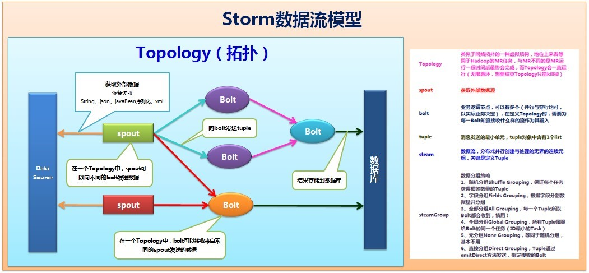
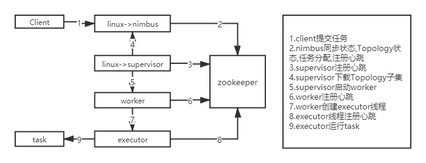

# Storm


# 概述


* Apache开源的分布式实时计算框架,擅长处理海量数据
* 可以轻松,可靠的处理无限数据流(流式计算),速度快,每秒可处理百万元组数据
* 对实时分析,机器学习,连续计算,分布式RPC,ETL等提供高效,可靠的支持
* 用于数据实时处理而非批量处理(Hadoop)
* Storm处理的数据保存在内存中,Hadoop的数据保存在HDFS中
* Storm的数据通过网络传输过来,Hadoop的数据保存在磁盘


# 运用场景

* Storm能用到很多场景中,包括:实时分析,在线机器学习,连续计算等

* 推荐系统:实时推荐,根据下单或加入购物车推荐相关商品
* 金融系统:实时分析股票信息数据
* 预警系统:根据实时采集数据,判断是否到了预警阈值
* 网站统计:实时销量,流量统计


# 特性


* Storm拥有低延迟,高性能,分布式,可扩展,容错等特性,可确保消息不丢失且严格有序
* 简单的编程:类似于MR降低并行处理的复杂性,Storm降低了进行实时处理的复杂性
* 实时性:系统不停运转等待任务到达,接受任务后迅速处理
* 可伸缩性:随时添加新的节点扩充集群的计算能力
* 容错性:管理所有工作进程和节点的故障,并且循环修复故障
* 水平扩展:计算是在多个线程,进程和服务器之间并行进行的
* 多语言支持:提供多语言协议支持.默认支持Clojure,Java,Ruby和Python.要增加对其他语言的支持,只需实现一个简单的Storm通信协议即可


# 核心


* 可靠的数据处理:Storm可以通过拓扑来确保每个发送的元组都能得到正确处理.通过跟踪由 Spout 发出的每个元组构成的元组树可以确定元组是否已经完成处理.每个拓扑都有一个“消息延时”参数,
  如果 torm在延时时间内没有检测到元组是否处理完成,就会将该元组标记为处理失败,并会在稍后重新发送该元组
* 为了充分利用Storm的可靠性机制,你必须在元组树创建新结点的时候以及元组处理完成的时候通知Storm.这个过程可以在Bolt发送元组时通过OutputCollector实现:在emit方法中实现元组的锚定(Anchoring),同时使用 ack 方法表明你已经完成了元组的处理
* Storm的tuple锚定和应答确认机制中,当打开可靠传输的选项,传输到故障节点上的tuples将不会受到应答确认,spout会因为超时重新发射原始的tuple.这样的过程会一直重复直到Topology从故障中恢复开始正常处理数据
* 在Storm集群中真正运行Topology的主要有三个实体:工作进程,线程和任务
* Storm集群中的每台机器上都可以运行多个工作进程,每个工作进程又可创建多个线程,每个线程可以执行多个任务,任务是真正进行数据处理的实体,我们开发的spout,bolt就是作为一个或者多个任务的方式执行的.因此,计算任务在多个线程,进程和服务器之间并行进行,支持灵活的水平扩展


## 数据流模型




* 见Storm.pptx-01


### Topology

* 拓扑,Storm分布式计算结构,是Storm中运行的一个实时应用程序

* 类似于Hadoop的MR任务,与MR不同的是MR运行一段时间就会完成,而Topology会一直运行直到手动kill掉


### Stream

* 数据流,分布式并行创建与处理的无界的连续元组,关键是定义Tuple


### Tuple

* 元组,Storm的核心数据结构,消息发送的最小单元
* Tuple是包含一个或多个键值对的列表
* Tuple中的字段可以是任何类型的对象
* Storm使用元组作为其数据模型,元组支持所有的基本类型,字符串和字节数组作为字段值,只要实现类型的序列化接口就可以使用该类型的对象
* 元组本来应该是一个key-value的Map,但是由于各个组件间传递的元组的字段名称已经事先定义好,所以只要按序把元组填入各个value即可,所以元组是一个value的List


### Spout

* Spout是拓扑的流的来源,是一个拓扑中产生源数据流的组件
* 通常情况下,Spout会从外部数据源中读取数据,然后转换为拓扑内部的源数据
* Spout可以是可靠的,也可以是不可靠的
* 如果Storm处理元组失败,可靠的Spout能够重新发射,而不可靠的Spout就尽快忘记发出的元组
* Spout可以发出超过一个流
* Spout的主要方法是nextTuple().NextTuple()会发出一个新的Tuple到拓扑,如果没有新的元组发出,则简单返回
* Spout的其他方法是ack()和fail().当Storm检测到一个元组从Spout发出时,ack()和fail()会被调用,要么成功完成通过拓扑,要么未能完成.Ack()和fail()仅被可靠的Spout调用
* IRichSpout是Spout必须实现的接口


### Bolt

* 业务逻辑运算节点
* 在拓扑中所有处理都在Bolt中完成,从一个拓扑接收数据,然后执行进行处理
* Bolt是一个被动的角色,接口中有一个execute()方法,在接收到消息后会调用此方法,用户可以在其中执行自己希望的操作
* Bolt可以完成简单流的转换,而完成复杂流的转换需要多个步骤,因此需要多个Bolt
* 可以有多个(并行与串行均可,以实际业务决定),选择性地输出一个或者多个数据流
* Bolt可以订阅多个Spout或者其他Bolt发射的数据流,这样可以建立多个复杂的数据流转换网络
* 在定义Topology时,需要为每一个Bolt指定接收什么样的流作为输入(通过Storm grouping)
* Bolt可以完成过滤,业务处理,连接运算,连接与访问数据库等任何操作
  * 过滤tuple
  * 连接(join)和聚合操作(aggregation)
  * 计算
  * 数据库读写


## 数据源

* Web或者移动程序的点击数据
* 应用程序的日志数据
* 传感器的输出


## 分组策略

* 数据流分组:Storm grouping,定义Stream如何分配给Bolts上面的多个Executors(多线程,多并发)
* 随机分组(Shuffle grouping):轮训,随机分配,平均分配.这种方式下元组会被随机地分配到bolt的不同任务(tasks)中,使每个任务所处理元组数量能够保持基本一致,以确保集群的负载均衡
* 按字段分组(Fields grouping):数据流根据定义的字段分组.例如,某个数据流是基于userId字段进行分组,那么所有包含相同userId的元组都会被分配到同一个task中,这样可以确保消息处理的一致性
* 广播发送(All grouping):将Tuple复制后分发给所有的Task,每个订阅的Task都会接收到Tuple
* 全局分组(Global grouping):所有数据流都会发送到Bolt的同一个Task中,也就是id最小的那个Task
* 不分组(NoneGrouping):不关心数据流如何分组.目前这种方式的结果与随机分组完全等效,不过未来Storm社区可能会考虑通过该分组方式来让Bolt和它所订阅的Spout或Bolt在同一个线程中执行
* 指向型分组(Direct grouping):指定Tuple应该由那个Task处理.只有被声明为DirectStream的消息流可以使用该分组,而且这种消息Tuple必须使用emitDirect方法来发射.消息处理者可以通过TopologyContext来获取处理它的消息的task的id(OutputCollector.emit方法也会返回task的id)
* Local or shuffle grouping:如果目标Bolt有一个或者多个task在同一个工作进程中,Tuple将会被随机发送给这些tasks,否则,和普通的Shuffle Grouping行为一致


## 核心组件



* 见Storm.pptx-02
* Storm集群由一个主节点(Nimbus)和一个或者多个工作节点(Supervisor)组成
* Nimbus分配任务,zk监督执行(心跳监控,worker,supurvisor的心跳都归它管),supervisor下载代码,创建worker和线程等,worker,executor就干活,task就是具体要干的活


### Nimbus

* Storm主节点,类似于Hadoop中的jobtracker,管理,协调和监控在集群上运行的Topology.包括Topology的发布,事件处理失败时重新指派任务


### Supervisor

* 每个工作节点运行一个Supervisor守护进程
* 负责监听工作节点上已经分配的主机作业,启动和停止Nimbus已经分配的工作进程
* 定时从ZK获取拓补信息topologies,任务分配信息assignments及各类心跳信息,以此为依据进行任务分配
* Supervisor同步时,会根据任务分配情况启动新worker或者关闭旧worker并进行负载均衡
* 一个Storm集群可以包含一个或者多个supervisor


### Zookeeper

* Storm主要使用ZK来协调集群中的状态信息,比如任务的分配情况,Worker的状态,supervisor之间的nimbus的拓扑质量.nimbus和supervisor节点的通信主要是结合zookeeper的状态变更通知和监控通知来处理的


### Worker

* 一个Supervisor上相互独立运行的JVM进程,包含一个或多个线程
* 具体处理Spout/Bolt逻辑的进程,根据提交的拓扑中conf.setNumWorkers()方法定义分配每个拓扑对应的worker数量,Storm会在每个Worker上均匀分配任务,一个Worker只能执行一个Topology的任务子集.worker进程会占用固定的可由配置进行修改的内存空间(默认768M)
* 每个supervisor可以配置一个或多个worker,由配置文件的supervisor.slots.ports控制
* 一个supervisor配置了几个端口,其可运行的最大worker数就是几
* 一个topology会被分配在一个或多个worker上运行
* 默认情况下一个Worker对应一个Ack线程


### Executor

* 指一个worker在JVM中运行时开启的Java线程.多个task可以指派给同一个executer来执行,除非明确指定,Storm默认给每个executor分配一个task


### Task

* 可以简单的理解为spout或bolt的实例,它们的nextTuple和execute方法会被executors执行
* 常见实时流式计算架构图:后台系统->Flume集群->Kafka集群->Storm集群->Redis集群


## 并发度

* 用户指定一个任务,可以被多个线程执行,并发度的数量等于线程executor的数量
* Task就是具体的处理逻辑对象,一个executor线程可以执行一个或多个tasks,但一般默认每个executor只执行一个task,所以我们往往认为task就是执行线程,其实不是
* Task代表最大并发度,一个component的task数是不会改变的,但是一个componet的executer数目是会发生变化的(Storm Rebalance命令),task数>=executor数,executor数代表实际并发数


## 任务分配

* client:提交Topology
* nimbus:这个角色所做的操作相对较多,具体如下:
  * 将提交的jar包放到nimbus所在服务器的storm.local.dir/nimbus/inbox目录下
  * submitTopology方法会负责Topology的处理;包括检查集群是否有active节点,配置文件是否正确,是否有重复的Topology名称,各个bolt/spout名是否使用相同的id等
  * nimbus任务分配,根据Topology中的定义,给spout/bolt设置task数,并分配对应的task-id
  * nimbus在zookeeper上创建workerbeats目录,要求每个worker定时向nimbus汇报
  * 将分配好的任务写入到zookeeper的storm/assignments目录下,此时任务提交完毕
  * 将Topology信息写入到zookeeper的/storm/storms目录
* supervisor
  * 建立Topology的本地目录,storm.local.dir/supervisor/stormdist/topology-uuid,该目录包括三个文件:
    * stormjar.jar:从nimbus/inbox目录拷贝
    * stormcode.ser:此Topology对象的序列化
    * stormconf.ser:此Topology的配置文件序列化
  * 定期扫描zookeeper上的storms目录,看看是否有新的任务,有就下载
  * 删除本地不需要的Topology
  * 根据nimbus指定的任务信息启动worker
* worker
  * 查看需要执行的任务,根据任务id分辨出spout/bolt任务
  * 计算出所代表的spout/bolt会给哪些task发送信息
  * worker根据分配的tasks信息,启动多个executor线程,同时实例化spout,bolt,acker等组件,此时,等待所有connections(worker和其它机器通讯的网络连接)启动完毕执行spout任务或者blot任务
  * 在slot充沛的情况下,能够保证所有topology的task被均匀的分配到整个机器的所有机器上
  * 在slot不足的情况下,它会把topology的所有的task分配到仅有的slot上去,这时候其实不是理想状态,所以在nimbus发现有多余slot的时候,它会重新分配topology的task分配到空余的slot上去以达到理想状态
  * 在没有slot的时候,它什么也不做


# 安装

* 搭建3节点的集群:master->master,slave->slave1,slave2
* 节点之间的时间要保持一致
* 安装Zookeeper集群,安装JDK,配置Java环境变量,安装Python
* 下载解压Storm压缩包到/app/storm中
* 进入conf目录,修改storm.yaml

```yaml
# 运行zookeeper的设置,可以使用hostname和IP地址两种方式
storm.zookeeper.servers: 
- "master"
- "slave1"
- "slave2"
# 指定nimbus的节点机器,使用服务器的hostname
nimbus.seeds: ["master"]
# 指定storm web UI的启动端口
ui.port: 9999
# 保存storm数据的路径
storm.local.dir: "/app/storm"
#指定work(spout和bolt)的运行端口,也是一个supervisor能并行的work的最大数量(能够开启的最大进程数),每个work占用1个端口,我这里每台supervisor设置的是可以并行4个work,端口可以任意指定不重复的端口
supervisor.slots.ports:
- 6700
- 6701
- 6702
- 6703
```

* 配置Storm环境变量,vi /etc/profile,完成之后重启环境变量:source /etc/profile

```shell
export STORM_HOME=storm安装路径
export PATH=.:$STORM_HOME/bin:$PATH
```

* 其他服务器配置相同配置
* 在nimbus主节点启动storm

```shell
# 启动nimbus,jps出现nimbus
storm nimbus &
# 启动web ui守护进程,jps出现core
storm ui &
```

* 启动从节点

```shell
storm supervisor &
```

* 查看web页面:ip:port


# 日志查看

* 查看nimbus的日志信息,在nimbus的服务器上

```shell
tail -100f storm/logs/nimbus.log
```

* 查看ui运行日志信息,在ui的服务器上,一般和nimbus一个服务器

```shell
tail -100f storm/logs/ui.log
```

* 查看supervisor运行日志信息,在supervisor服务上

```shell
tail -100f storm/logs/supervisor.log
```

* 查看supervisor上worker运行日志信息,在supervisor服务上

```shell
tail -100f 	torm/logs/worker-6702.log
```

* logviewer,可以在web页面点击相应的端口号即可查看日志,分别在supervisor节点上执行:

```shell
# 每个节点上执行
bin/storm logviewer &
```


# Storm Shell

* storm nimbus:在nimbus节点上,启动nimbus守护进程
* storm supervisor:启动supervisor守护进程
* storm ui:启动UI守护进程
* storm list:列出正在运行的拓扑及其状态
* storm logviewer:Logviewer提供一个web接口查看Storm日志文件
* storm jar  jar路径  拓扑包名.拓扑类名  拓扑名称:启动某个jar
* storm kill topology-name [-w wait-time-secs]:结束名为Topology-name的拓扑
  * -w:等待多久后杀死拓扑
* storm activate topology-name:激活指定的拓扑Spout
* storm deactivate topology-name:禁用指定的拓扑Spout
* storm help [command]:打印一条帮助消息或者可用命令的列表
* storm rebalance topolotyName []:在不停机的情况下修改Storm中的Worker数量
  * -w wait-time-secs:等待时长
  * -n new-num-workers:新的workers数量
  * -e component=parallelism:调整bolt的数量


# Java Api


## 基本接口

* IComponent接口
* ISpout接口
* IRichSpout接口
* IStateSpout接口
* IRichStateSpout接口
* IBolt接口
* IRichBolt接口
* IBasicBolt接口


## 基本抽象类

* BaseComponent抽象类
* BaseRichSpout抽象类
* BaseRichBolt抽象类
* BaseTransactionalBolt抽象类
* BaseBasicBolt抽象类


## Spout水龙头

* Spout的最顶层抽象是ISpout接口
* open:是初始化方法,只会调用一次
* close:在该spout关闭前执行,但是并不能得到保证其一定被执行,kill -9时不执行,Storm kill {topoName} 时执行
* activate:当Spout已经从失效模式中激活时被调用,该Spout的nextTuple()方法很快就会被调用
* deactivate:当Spout已经失效时被调用.在Spout失效期间,nextTuple不会被调用,Spout将来可能会也可能不会被重新激活
* nextTuple:该方法是会一直被调用.调用该方法时,Storm要求Spout发射(emit)元组到输出收集器OutputCollecctor.该方法应该是非阻塞的,所以,如果Spout没有元组可以发射,该方法应该返回.
* nextTuple,ack和fail方法都在Spout任务的单一线程内紧密循环被调用.当没有元组可以发射时,可以让nextTuple去sleep很短的时间,例如1毫秒,这样就不会浪费太多的CPU资源
* ack:成功处理tuple回调方法
* fail:理失败tuple回调方法
* 通常情况下(Shell和事务型的除外),实现一个Spout,可以直接实现接口IRichSpout,如果不想写多余的代码,可以直接继承BaseRichSpout


## Bolt转接头

* Bolt的最顶层抽象是IBolt接口
* prepare:prepare方法在集群的工作进程内被初始化时被调用,提供了Bolt执行所需要的环境
* execute:该方法会一直被调用.接受一个tuple进行处理,也可emit数据到下一级组件
* cleanup:Cleanup方法当一个IBolt即将关闭时被调用,不能保证cleanup()方法一定会被调用
  * 因为Supervisor可以对集群的工作进程使用kill -9命令强制杀死进程命令,此时不被调用
  * 如果在本地模式下运行Storm,当拓扑被杀死的时候,可以保证cleanup()方法一定会被调用
* 实现一个Bolt,可以实现IRichBolt或继承BaseRichBolt,如果不想处理结果反馈,可以实现IBasicBolt接口或继承BaseBasicBolt,相当于自动做了prepare方法和collector.emit.ack(inputTuple)


## Spout的tail特性

* Storm可以实时监测文件数据,当文件数据变化时,Storm自动读取


# 运行模式

* 本地模式:即Topology(相当于一个任务)运行在本地机器的单一JVM上,这个模式主要用来开发,调试
* 远程模式:Topology提交到集群,该模式中,Storm的所有组件都是线程安全的

* 本地模式和远程模式只是在Topology的运行主类的代码上有所差别
  * 远程模式:集群提交方法,StormSubmitter.submitTopology
  * 本地模式:本地提交方法,LocalCluster.submitTopology
* 运行模式和spout与bolt的编码没有关系,实际上编写一个Storm程序值需要2步即可
  * 编写spout,bolt,定义一个Topology把spout,bolt关联起来,对Topology进行配置
  * 编写Topology的提交方法,确定Topology的运行模式是本地还是远程
* 将写好的Java程序打成jar包,丢到nimbus上,执行命令运行即可

```shell
# storm jar jar包名称 执行主类的包名.类名 当前Topology命名名称
storm jar wordcount.jar com.wy.wordcount.cluster.WordCountTopology wordcount
```

  

# DRPC